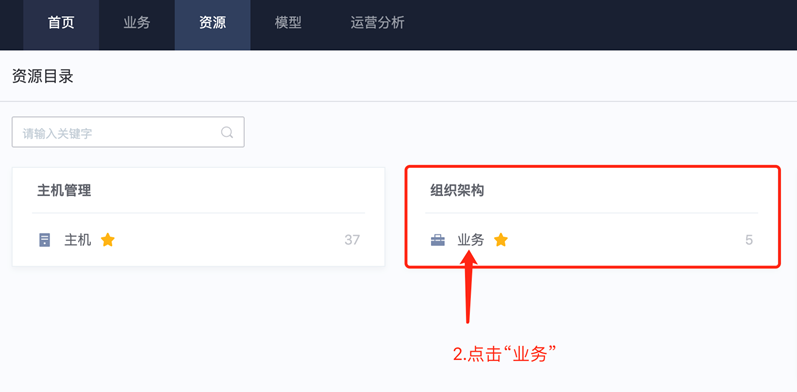

# **蓝鲸入门使用文档**

## **1. 创建一个用户**
蓝鲸环境中的用户信息相关的增删改查，可在“用户管理”中进行操作。如下图：

### **1.1 添加用户**

### **1.2 修改用户信息**

相关学习资料：
- 文档：https://bk.tencent.com/docs/document/6.0/146/7330（该文档为社区版，与企业版功能基本一致）

- 视频：https://ke.qq.com/course/3101748?taid=10600778153546804

## **2. 创建一个业务**

进入“配置平台”，这里主要进行“业务-主机”的管理

### **2.1 创建业务**

### **2.2 查看业务的模块、主机**

如果没有看到刚创建的业务，点击页面左下角的“刷新应用”，再重复「步骤2」、「步骤3」即可
然后就看到我们刚才创建的业务的信息了。

## **3. 创建一个权限组，用来关联用户与平台内业务的操作权限**

这里，需要admin账户给业务进行权限添加，为了方便后续该业务的相关操作，建议使用“创建权限组”，然后将“用户”关联至“权限组”。

### **3.1 创建一个“业务权限的配置平台模板”**

切换身份后，进入“超级管理员”模式，只有超级管理员可以创建高权限级别的“业务权限组”

后续会推出“对应角色(如：运维、开发)推荐默认配置”的版本，现用版本需要手动勾选
然后为刚才选择的“权限”关联对应的“资源实例”

### **3.2 创建一个”业务权限组“**

