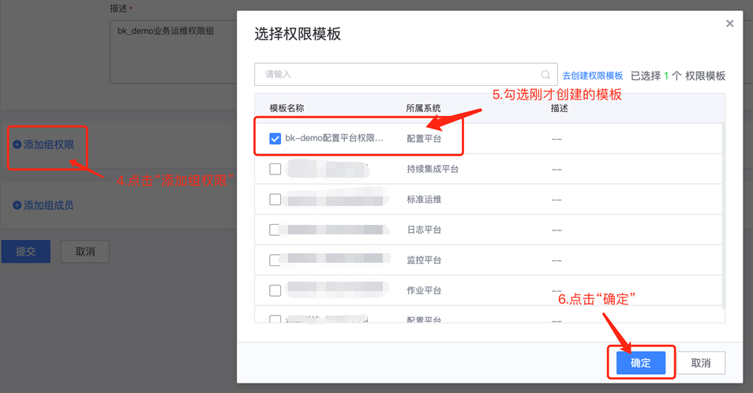
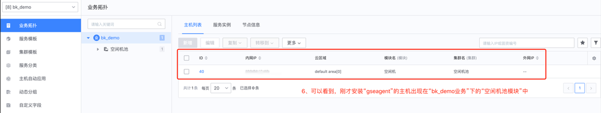
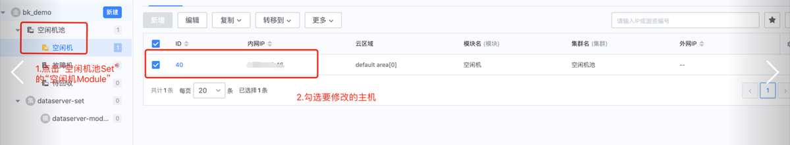
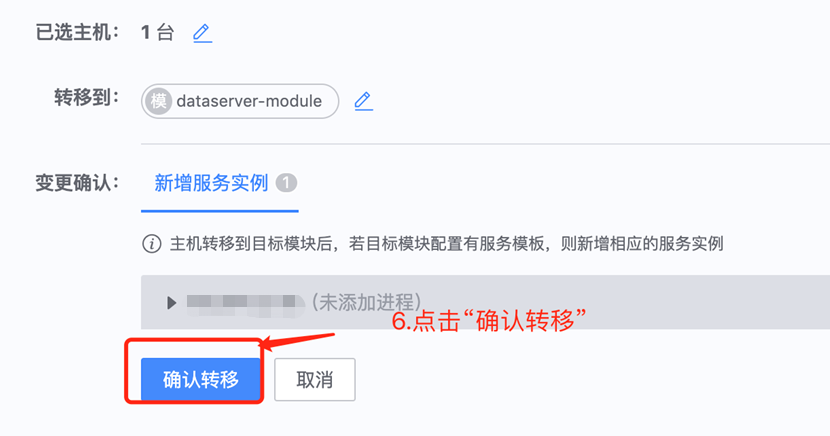
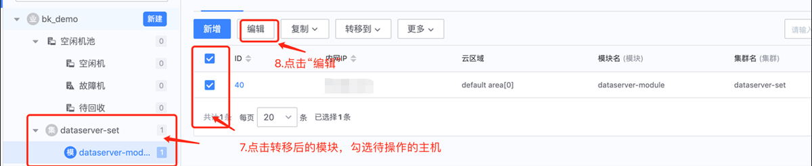
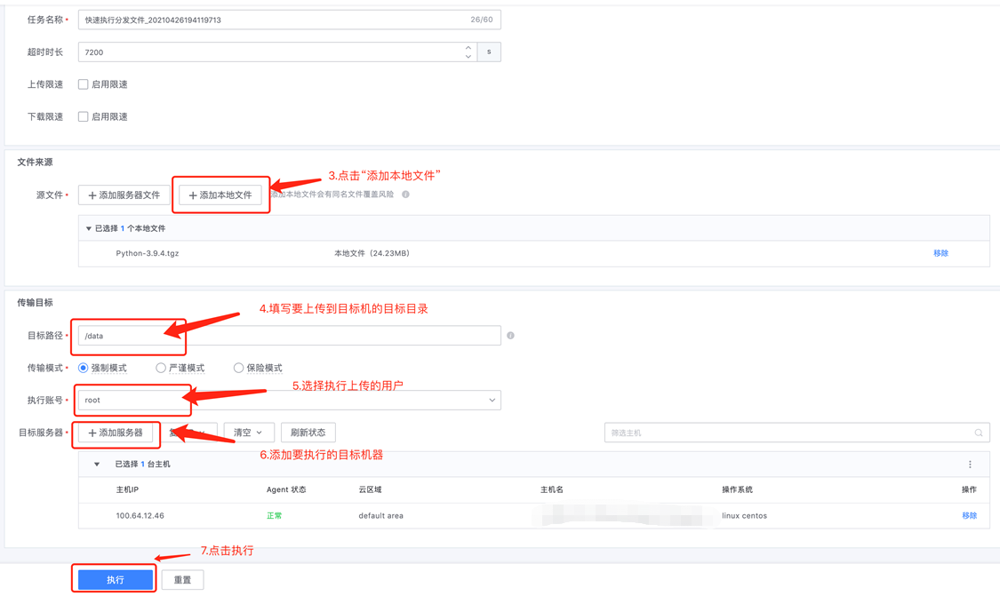
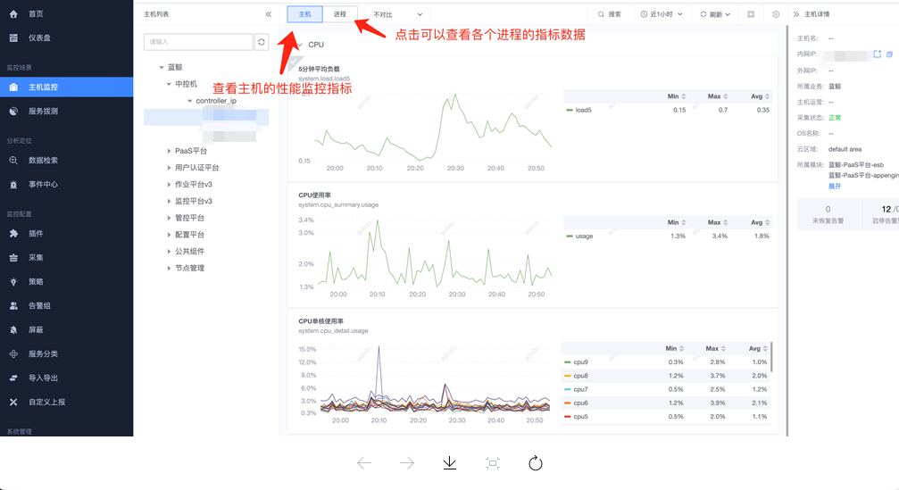

## **BK Getting Started Using Documentation**

## **1. Create a user**

The user information in BK environment can be added, deleted, and checked in "User Management". The following figure shows.

### **1.1 Adding users**

### 1.2 Modify user information

Related study materials.
- document：https://bk.tencent.com/docs/document/6.0/146/7330(This document is the community version, and the enterprise version is basically the same function)

- video：https://ke.qq.com/course/3101748?taid=10600778153546804

## **2. Create a business**

Enter the "Configuration Platform", where you can manage the "Business-Host".

### **2.1 Creating a business**

### **2.2 View the modules and hosts of the business**

如果没有看到刚创建的业务，点击页面左下角的“刷新应用”，再重复「步骤2」、「步骤3」即可
然后就看到我们刚才创建的业务的信息了。

## **3. Create a permission group to associate users with the operation rights of the business in the platform**

Here, you need the admin account to add permissions to the business, in order to facilitate the subsequent operations related to the business, we recommend using "Create permission group", and then associate the "user" to the "permission group ".

### **3.1 Create a "Configuration Platform Template for Business Permissions "**

切换身份后，进入“超级管理员”模式，只有超级管理员可以创建高权限级别的“业务权限组”

后续会推出“对应角色(如：运维、开发)推荐默认配置”的版本，现用版本需要手动勾选
然后为刚才选择的“权限”关联对应的“资源实例”

### **3.2 Create a "business permission group "**

## **4. Add a host for your business**

Go to the home page and click "Node Management".

## **5. Managing hosts in the Configuration Platform**

Next, we will deploy a service called "dataserver" on the newly added host. To make it easier to manage it, we will create some information on the "configuration platform" first.

### **5.1 Create a set (cluster) and module**

### **5.2 Moving hosts to modules and modifying host-related information**

## **6. Deploy dataserver service using "Job Platform"**

### **6.1 Upload local files to the host**

https://www.python.org/ftp/python/3.9.4/Python-3.9.4.tgz

### **6.2 Deploying services using "script execution"**

    cd /data
    yum install -y gcc python39-devel bzip2-devel sqlite-devel openssl-devel readline-devel xz-devel tk-devel gdbm-devel
    
    mkdir -p /data/corefile
    chmod 777 /data/corefile
    echo 'ulimit -c unlimited' >> /etc/profile
    sed -i "/^kernel.core_pattern =/d" /etc/sysctl.conf 
    echo 'kernel.core_pattern = /data/corefile/core_%e_%t' >> /etc/sysctl.conf
    sysctl -p /etc/sysctl.conf
    
    tar zxvf Python-3.9.4.tgz 
    cd Python-3.9.4
    ./configure
    make && make install
    make clean && make distclean
    
    mkdir -p /data/app
    pip3 install Flask
    pip3 freeze > /data/app/requirements.txt
    cat > /data/app/app.py <<EOF
    from flask import Flask
    app = Flask(__name__)
    
    @app.route('/')
    def hello_world():
        return 'Hello, World'
    EOF
    
    cd /data/app
    nohup python3 -m flask run >/dev/null 2>&1 &

## **7. Monitoring hosts and processes using the "Monitoring Platform "**

### **7.1 Create process-related information in the "Configuration Platform "**

### **7.2 Monitoring platform configuration alarms**

