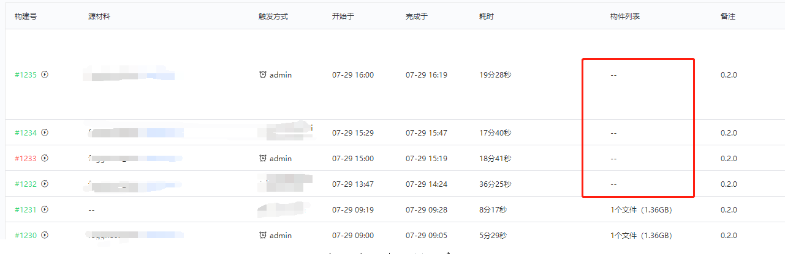
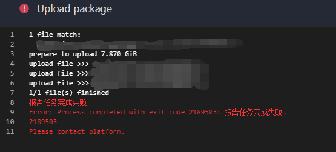
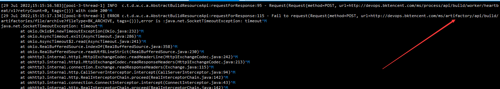
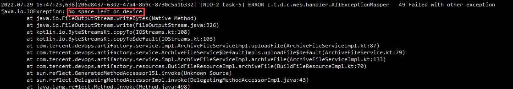
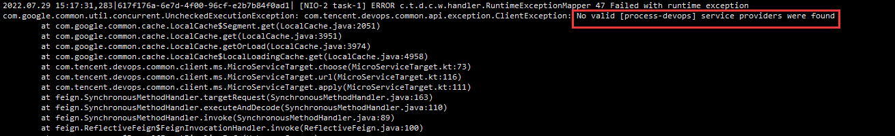

# Service corresponding function

Each microservice of BKCI corresponds to each function. If a function is abnormal, check the corresponding service logs first. Service log paths refer to [basic concepts](./user-guide.md)

| microservice    | function                                               |
| --------------- | ------------------------------------------------------ |
| gateway         | BKCI gateway                                    |
| artifactory     | Artifact Services, the default artifact repository     |
| dockerhost      | Common builder                                         |
| environment     | Private builder service. Import and manage the builder |
| process         | pipeline                                               |
| project         | Project management                                     |
| plugin          | The plug-in of the service extends the service         |
| repository      | Code base                                              |
| ticket          | Certificate management                                 |
| store           | Research and development store                         |
| image           | Public builder image                                   |
| dispatch        | Private builder scheduling                             |
| dispatch-docker | Common builder scheduling                              |
| agentless       | Non-compile environment                                |
| auth            | authentication                                         |
| log             | Build log                                              |
| notify          | BKCI has built-in notification services         |
| openapi         | BKCI API service                                |

For detailed component descriptions and associations, see [bkci Components](../../overview/components)

# Troubleshooting example

#### Problem background

1. The upload product cannot be displayed when the pipeline is executing
2. And plugins occasionally report errors

#### Troubleshooting idea

① : Check build logs

Obtain build logs corresponding to the build and rectify the fault. For details about how to obtain logs, see [Basic Concepts](./user-guide.md)

When checking build logs, you can search by the plug-in name that reports an error to locate the fault. For example, if the Upload package plug-in reports an error, we can try to query the upload field in the log to search the corresponding log executed by the upload. Then, the following error logs are displayed:

2: Check service logs

According to the build log, you can see that the build request artifactory service times error, so check the artifactory log.

1. Check service logs. Check the error logs first. If obvious errors are reported, rectify them directly. If no error is reported, continue to check service logs.
2. Service logs are located based on the time when a build log error occurs

When checking logs, two obvious errors are found:

In this case, continue to check the process service. Subsequent checks show that during the construction of the process service, the load pressure of the CI machine is too high, resulting in an exception of the service.

#### solve

1. According to the log, the process service is restarted.
2. If No Space left on device was reported, the space of CI machine was cleared.
