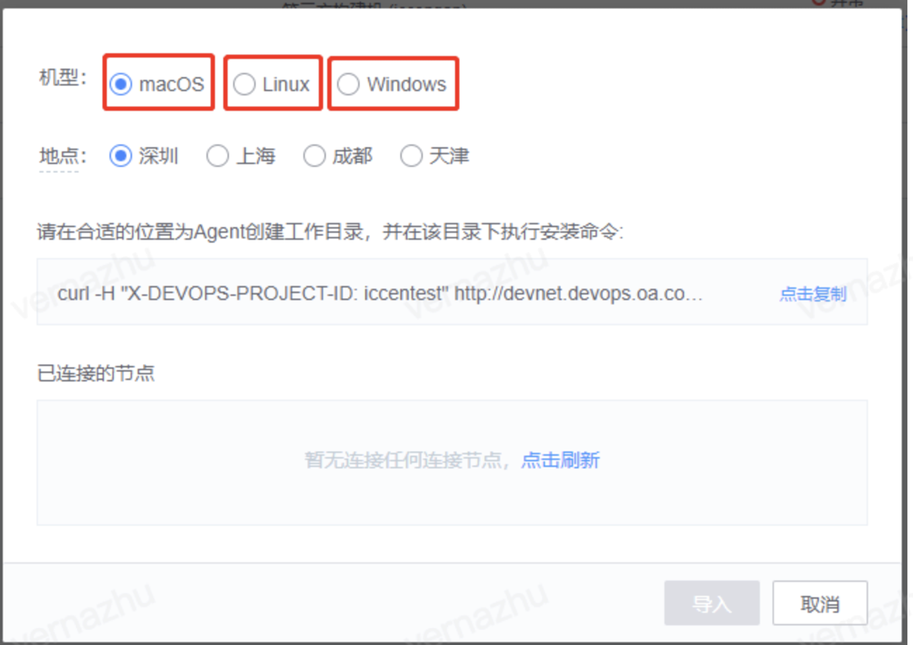

# 环境管理

# 节点/构建机异常

## Q1 构建机节点导入报错 

报错：cannot execute binary file

​	解决方案：开发环境与命令不相符，不同环境会对应不同的命令。不能在 windows 机器上执行 macOS 或 Linux的命令。


---

## Q2 agent 异常

第三方机器agent异常
1. 登录机器查看是否存在devops进程：

   + Windows下打开进程管理查看devopsDaemon和devopsAgent进程；

   + MAC或者Linux直接在机器上执行命令ps -ef | grep devops 查看是否有两个devops进程

     

2. 

   + 如果devops进程不存在，cd到agent目录(agent目录就是当初执行安装的目录)执行start脚本；
   + 如果devops 进程存在，手动杀掉进程以后，确保没有devops进程了，再执行start脚本

---

## Q3 windows构建机上安装蓝盾agent失败，子目录或文件已经存在，拒绝访问


这种情况一般是由于用户重复安装蓝盾agent导致，可以先执行uninstall脚本，卸载当前agent，然后删除该agent的安装目录，然后重新下载agent包，再次安装

## Q4 安装agent后，蓝盾读取不到节点

如果执行agent安装命令后，点击刷新仍无法刷出节点，请按以下步骤排查：


1. 检查agent是否安装成功，如果失败：

- 1.1 确保目标机器是devnet机器，或者可以测试网络连通性，看下是否能连通。

- 1.2确保去掉机器代理

 

2. 检查复制的命令是否与目标机器的系统一致



3. 确保安装命令是通过点击下图红框按钮复制的


**如果目标机器已导入过agent，并且安装命令是从已导入的agent节点页面内复制的，也会导致无法刷出节点的问题。**

---

## Q5 机器访问第三方内网报错

问题详情：机器访问第三方内网报错 Failed to connect to 内网.com port XX: Connection refused

示例：

1. Failed to connect to xx.oa.com port XX: Connection refused

2. 机器无法访问内网

解决方案：若机器配置了外网代理，则访问第三方内网服务需要设置noproxy的值，试打印出no_proxy的值，将需要访问的内网添加到值中


---

## Q6 Windows机器启动agent提示“由于登录失败而无法启动服务”


解决方案：

请更新一下登录服务的密码

更新方法如下：

执行命令services.msc打开windows服务管理界面，找到服务landun_devops_agent


---

## Q7 环境节点属性不断在变化

用户将相同agent安装命令安装在多台不同的机器上了，导致环境管理页面会不断上报两个不同的机器信息。

安装agent注意需要使用新的唯一安装命令。

---

## Q8 无法正确获取构建机内网IP

蓝盾获取不到构建机的内网IP，显示为 127.0.0.1


在蓝盾流水线下拉构建机也显示127.0.0.1


原因：这个IP是agent从本机IP里面随机选择的一个IP、可能是有使用其他代理然后获取到了这个IP，可以检查下机器代理问题，关闭掉一些代理软件
**内网地址的显示12.7.0.0.1本质对构建机使用没有影响， 用户可正常使用**

---

# agent操作

## Q1 如何卸载 agent

目前蓝盾 agent 没有限定安装目录，在 windows 系统上，agent安装包解压目录即为 agent 安装目录；在 linux 和 mac 系统上，执行 agent 安装脚本的目录即为agent安装目录。

因为没有限定安装目录，在执行agent卸载脚本（windows为 uninstall.bat, linux 和 mac 为 uninstall.sh）后，为防止误删除重要的系统文件，卸载脚本没有删除agent相关程序文件，需要用户自行清理。

**agent卸载需要清理的文件/文件夹如下：**
文件：
.agent.properties → agent配置文件
agent.zip → agent安装包
jre.zip → jre 压缩包
devopsAgent → agent程序
devopsDaemon → agent守护程序
worker-agent.jar → worker 程序
install.sh → 安装脚本
uninstall.sh → 卸载脚本
start.sh → 启动脚本
stop.sh → 停止脚本

**文件夹：**
jre → jre
logs → 日志
workspace → 工作空间，流水线文件操作默认存储目录
runtime → 运行时目录
tmp → 临时目录


如果 agent 安装在独立目录下，在执行卸载脚本后，删除 agent 安装目录即可。如果安装在非独立目录，可以参照上面的文件/文件夹说明自行删除文件。

**linux & mac 清理脚本参考：**
<font color="red">**注意：清理文件夹需要确认各文件夹下没有存储非agent的数据，需要确认workspace下的内容是否需要保留**</font>

```
CD $安装目录
./UNINSTALL.SH
RM -F .AGENT.PROPERTIES AGENT.ZIP JRE.ZIP DEVOPSAGENT DEVOPSDAEMON WORKER-AGENT.JAR INSTALL.SH UNINSTALL.SH STOP.SH START.SH TELEGRAF.CONF
RM -RF JRE LOGS RUNTIME
RM -RF WORKSPACE```
```

---

## Q2 如何重装 agent

**1.**   **用户数据安全注意事项：**

请安装Agent的同学注意安装目录，在执行安装命令时，会直接把 当前执行安装命令的位置作为Agent安装目录。所以我们建议您：

<font color="red">**不要随意在任意目录下安装，创建一个专门给Agent安装的目录，与用户数据，根目录，数据盘分开，避免Agent产生的日志数据对您的磁盘空间造成影响**</font>

 

**2.**   **Linux&MacOS系统：**

1. 进入agent安装目录。agent安装目录可以在 **环境管理 → 节点 → 点击“别名”链接进入构建机详情页面 → 下方基本信息 → 安装路径**查到。agent GO_20190612 之前版本因为没有采集agent安装目录信息，需要通过在构建机上查看进程来推测安装路径，命令为**ps -ef | grep devops**

2. 执行 **./uninstall.sh**  卸载agent(更老的版本命令为./agent_uninstall.sh) ，同时**删除agent.zip**文件。卸载后确认agent进程已退出，如果没有退出可以手动杀掉进程

3. 从上面步骤1的构建机详情页右上角**复制安装命令**，在agent安装目录执行安装命令

4. 确认agent进程（devopsDaemon，devopsAgent）已存在，页面查看agent状态处于正常状态。

 

**3.**   **Windows系统**

1. 进入agent安装目录。agent安装目录可以在 **环境管理 → 节点 → 点击“别名”链接进入构建机详情页面 → 下方基本信息 → 安装路径**查到。agent GO_20190612 之前版本因为没有采集agent安装目录信息，需要打开Windows任务管理器，查看devopsAgent.exe的程序路径来确认安装路径。

2. 执行 **./uninstall.sh** 卸载agent (更老的版本命令为./agent_uninstall.bat) 。卸载后任务管理器上确认agent进程（devopsDaemon.exe，devopsAgent.exe）已退出，如果没有退出可以手动结束进程。

3. 从上面步骤1的构建机详情页右上角链接**下载安装包**

4. 清理agent安装目录只保留**workspace**文件夹，将安装包解压到安装目录（也可以另建空目录安装agent）

5. 执行./install.sh安装agent

6. 确认agent进程（devopsDaemon.exe，devopsAgent.exe）已存在，页面查看agent状态处于正常状态

7. 切换agent安装用户

---

## Q3 如何重启构建机agent

可以到蓝盾agent的安装目录下，先执行stop.sh脚本（在windows上是stop.bat批处理文件），再执行start.sh（在windows上时start.bat文件）

---

# 构建机相关信息

## Q1 私有构建机，一台mac只能装一个agent吗

可以多个, 在不同目录启动agent即可. 每个agent实例需要全新安装, 不能直接复制已有agent目录.

## Q2 私有构建机必须是物理机吗？可以是docker容器吗?

私有构建机和项目绑定, 且需安装agent并注册. 建议使用物理机/虚拟机等变动少的场景. 容器化使用公共构建机即可.