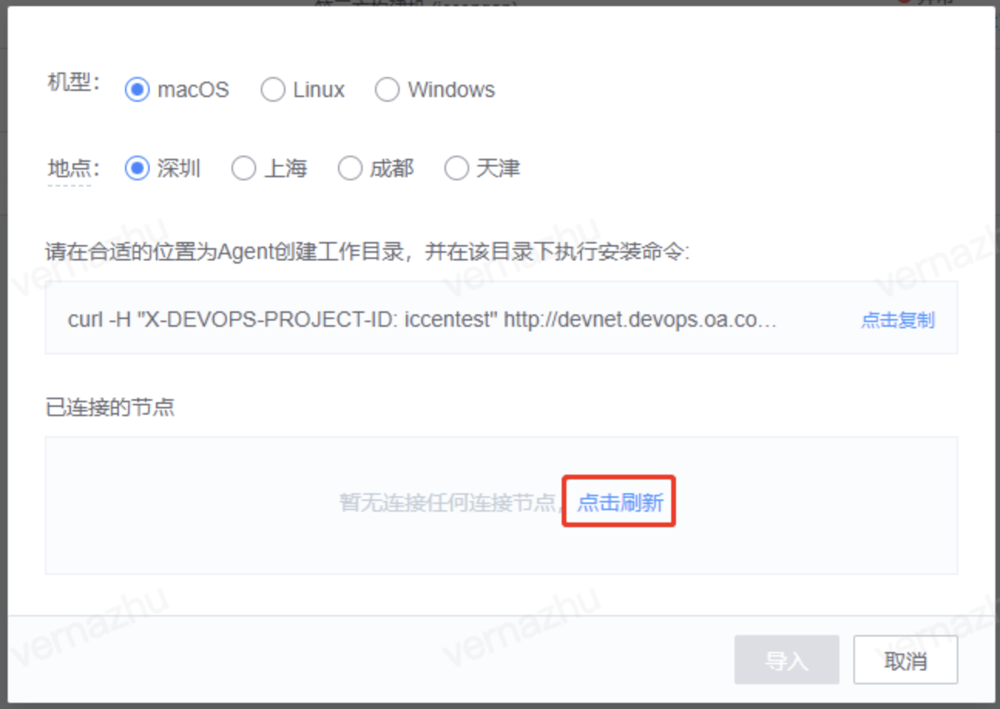

## Q1 An error is reported when the builder node is imported

Error message: cannot execute binary file

Solution: The development environment does not match the command. Different environments correspond to different commands. You cannot execute macOS or Linux commands on a windows machine.

------

## Q2 environment agent anomalies

The agent of the third-party machine is abnormal

1. Log in to the machine to see if the devops process exists:
   - In Windows, open Process Management to view the devopsDaemon and devopsAgent processes.
   - Execute the command ps MAC or Linux directly in the machine - ef | grep conversation to see whether there are two process of the conversation
2. - If the devops process does not exist, go to the agent directory (the agent directory is where the installation was performed) and execute the start script.
   - If the devops process exists, execute the start script after manually killing the process to ensure that there are no devops processes left

------

## Q3 BKCI agent fails to be installed on the windows builder because the subdirectory or file already exists and access is denied

In this case, the agent is repeatedly installed. To uninstall the agent, run Uninstall script, delete the installation directory of the agent, download the agent package, and install the Agent again

## Q4 After the agent is installed, BKCI cannot read nodes

If the node cannot be flushed after you click Refresh after running the agent installation command, perform the following steps:

1. Check whether the agent is successfully installed. If the installation fails:

- 1.1 Make sure the target machine is a devnet machine, or you can test the network connectivity to see if it can be connected.
- 1.2 Ensure that the machine agent is removed

1. Check that the copied command is consistent with the system of the target machine

1. Make sure the installation command is copied by clicking the button in the red box below

**If the agent has been imported to the target machine and the installation command is copied from the imported agent node page, the node cannot be spawned.**

------

## Q5 An error occurs when the machine accesses the third-party Intranet

Fault details: When the machine accesses the third-party Intranet, an error message fails to connect to the Intranet.com port XX: Connection refused

Example:

1. Failed to connect to xx.oa.com port XX: Connection refused
2. The machine cannot access the Intranet

Solution: If an Internet proxy is configured on the machine, you need to set the value of noproxy to access the third-party Intranet service. Print the value of no_proxy and add the Intranet to the value

------

## Q6 Failed to start the Service due to Login Failure is Displayed when the agent is Started on a Windows Machine.

Solution:

Please update your password for logging into the service

Update method is as follows:

Run services.msc to open the windows service management page and locate the service landun_devops_agent

------

## Q7 Environment node attributes are constantly changing

The same agent installation command is installed on multiple different machines. As a result, the environment management page continuously reports two different machine information.

Note When installing the agent, you need to use the new unique installation command.

------

## Q8 Failed to obtain the Intranet IP address of the builder

BKCI fails to obtain the Intranet IP address of the builder and displays 127.0.0.1

The BKCI Pipeline pull-down builder also shows 127.0.0.1

Cause: This IP address is randomly selected by the agent from the local IP address. It may be obtained by using other agents. You can check the machine agent problem and turn off the **display of the Intranet address** of some agent software