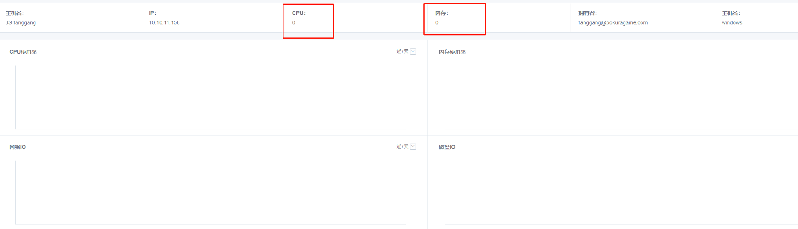

## Q1: How to uninstall the agent

Currently, there is no limited installation directory for BlueShield agent. On windows system, the directory where the agent installation package is extracted is the agent installation directory; on linux and mac systems, the directory where the agent installation script is executed is the agent installation directory.

Because there is no limited installation directory, after executing the agent uninstall script (uninstall.bat for windows, uninstall.sh for linux and mac), the uninstall script does not delete the agent related program files to prevent accidental deletion of important system files, so you need to clean it up by yourself.

**The files/folders to be cleaned for agent uninstallation are as follows:**
Files.
.agent.properties → agent configuration file
agent.zip → agent installation package
jre.zip → jre zip package
devopsAgent → agent program
devopsDaemon → agent daemon
worker-agent.jar → worker program
install.sh → install script
uninstall.sh → uninstall script
start.sh → start script
stop.sh → stop script

**Folder:**
jre → jre
logs → logs
workspace → workspace, the default storage directory for pipeline file operations
runtime → runtime directory
tmp → temporary directory


If the agent is installed in a separate directory, just delete the agent installation directory after executing the uninstall script. If the agent is installed in a non-separate directory, you can delete the files yourself by referring to the file/folder instructions above.

**linux & mac cleanup Script Reference：**
<font color="red">**Note: To clean up the folders, you need to make sure that no non-agent data is stored under each folder, and you need to make sure that the content under workspace needs to be retained.**</font>

```
CD $install_dir
./UNINSTALL.SH
RM -F .AGENT.PROPERTIES AGENT.ZIP JRE.ZIP DEVOPSAGENT DEVOPSDAEMON WORKER-AGENT.JAR INSTALL.SH UNINSTALL.SH STOP.SH START.SH TELEGRAF.CONF
RM -RF JRE LOGS RUNTIME
RM -RF WORKSPACE```
```

---

## Q2：how to Reload agent

**1.**   **User Data Security Considerations：**

Please pay attention to the installation directory when you install Agent. When you execute the installation command, the location where you are currently executing the installation command will be directly used as the Agent installation directory. Therefore, we recommend that you.：

<font color="red">**Do not install in any random directory, create a special directory for Agent installation, separate from user data, root directory, data disk, to avoid the impact of log data generated by Agent on your disk space**</font>

 

**2.** **Linux&MacOS system:**

1. The agent installation directory can be found in **Environment Management → Node → Click the "Alias" link to enter the builder details page → Basic Information → Installation Path**. agent GO_20190612 Previous versions do not collect the agent installation directory information. The command is **ps -ef | grep devops**.

2. execute **. /uninstall.sh** to uninstall the agent (older versions of the command are . /agent_uninstall.sh**) and **delete the agent.zip** file. After uninstallation, make sure the agent process has exited, if not, you can manually kill the process.

3. Copy the installation command** from the top right corner of the builder details page in step 1 above, and execute the installation command in the agent installation directory.

4. Make sure the agent process (devopsDaemon, devopsAgent) already exists, and check the agent status in the normal state on the page.

 

**3.** **Windows system** 

1. The agent installation directory can be found in **Environment Management → Node → Click the "Alias" link to enter the builder details page → Basic Information → Installation Path**. agent GO_20190612 Previous versions do not collect the agent installation directory information. You need to open Windows Task Manager and check the program path of devopsAgent.exe to confirm the installation path.

2. Execute **. /uninstall.sh** to uninstall the agent (older versions of the command are . /agent_uninstall.bat). After uninstallation, make sure the agent processes (devopsDaemon.exe, devopsAgent.exe) have exited on Task Manager, if not you can end the processes manually.

3. Download the installation package** from the link in the upper right corner of the builder details page in step 1 above.

4. clean up the agent installation directory to keep only the **workspace** folder, extract the installation package to the installation directory (you can also create another empty directory to install the agent)

5. Execute . /install.sh to install the agent

6. Make sure the agent process (devopsDaemon.exe, devopsAgent.exe) already exists, and check the agent status in the normal state on the page

7. switch agent installation user

---

## Q3: How to restart the builder agent

You can go to the installation directory of BlueShield agent and execute the stop.sh script (stop.bat batch file on windows) and then execute start.sh (start.bat file on windows).


## Q4：Private builder, a mac can only install one agent, a builder can be used for multiple projects?

You can have more than one, just start the agent in different directory. Each agent instance needs to be freshly installed, you can't copy the existing agent directory directly.


## Q5: Does a private builder have to be a physical machine? Can it be a docker container?

The private build machine is tied to the project, and the agent must be installed and registered. It is recommended to use physical machine/virtual machine for scenarios with few changes. For containerization, a public build machine is sufficient.


## Q6: The details of the build machine are not shown



1. Not enabled. This monitoring does not make sense, and does not affect scheduling. It is recommended to use a dedicated monitoring system such as Blue Whale Monitoring to take care of it.

   If you must enable it

   1. configure bin/03-userdef/ci.env 

   2. add BK_CI_ENVIRONMENT_AGENT_COLLECTOR_ON=true
   3. Then add the influxdb related configuration items
   4. Reinstall the ci-environment. You can directly use . /bk_install ci
   5. Modify the existing agent: edit .agent.properties , configure devops.agent.collectorOn=true, restart the agent