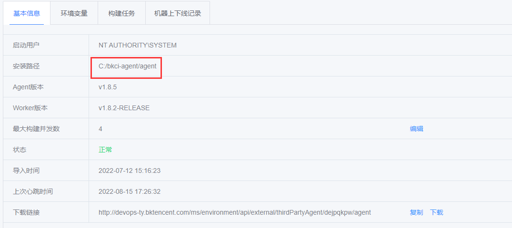
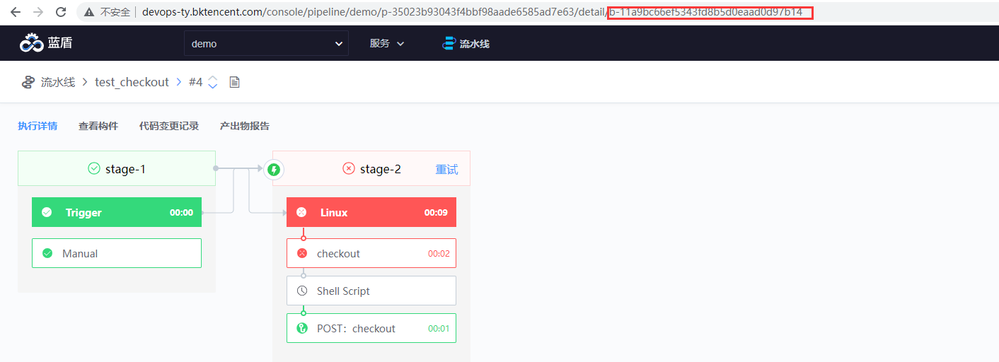
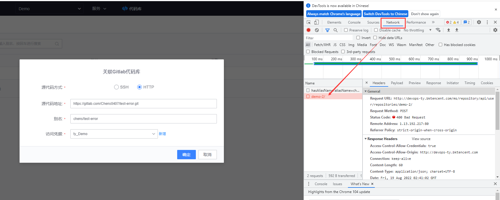
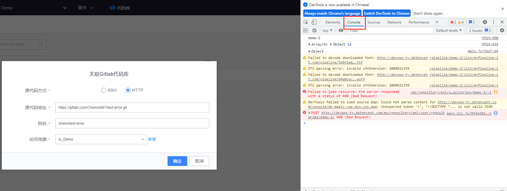

## This is the key information for troubleshooting

1. Current CI version number

2. Operation description of problems and error screenshots reported.

If an error occurs on the page, collect the error information.

3. Can the problem be repeated? Is the question occasional or inevitable?

4. Is the problem always present or does it crop up? Did you do anything before it appeared?

5. Service logs.

6. Build logs.

------

## Build log collection

The build log is stored in the builder. The path for storing the build log is:

**Private builder**: {agent installation directory}/logs/{build number}

**Public building machine**: / data/bkce/logs/ci/docker / {build number}

The **installation directory of the agent on a private builder**

BKCI - Environmental Management - Node - {corresponding to the builder used} - Installation path



**How to view the build number**:

In the pipeline URL, the last string starting with b- is the build number



## Service log collection

Enter CI machine

```
find /data/bkce/logs/ci/ -name \*-devops.log -o -name \*-devops-error.log |xargs tar zcvf /root/bkci-log.tar.gz
```

Then send the packaged **/root/bkci-log.tar.gz** log

## Page error information collected

If a page error occurs, browser F12 opens the console and repeats the request again, and:

①. Open the network TAB, click the incorrect request and take a screenshot.



②. Open the console TAB and take a screenshot.


