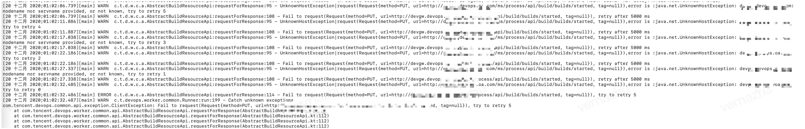

# 关联代码库

## Q1:关联GitLab代码库报错常见原因


1、应该使用 Personal Access Tokens 而非项目令牌。

2、确认Access_Tokens生成时是否给予了对应权限。必须要包含对应的API权限。

3、如果是自建的 GitLab，请确认”repository/branches“API接口是否能通。

https://docs.gitlab.com/ee/api/branches.html

4、如果GitLab为https访问。请确认代码库是否有做 http-->https 跳转。蓝盾默认以 http 方式进行代码库访问。

若未做跳转，请按此临时方案，修改蓝盾文件：

```bash
vim /data/bkce/etc/ci/application-repository.yml

#修改application-repository.yml文件，把apiUrl 修改为 https
#gitlab v4.
gitlab:
apiUrl: https://devops.bktencent.com/api/v4
```

重启 bk-ci-repository.service 服务

systemctl restart bk-ci-repository.service

---

# 构建机

## 公共构建机

## Q1:公共构建机启动失败

no available Docker VM


没有可用的ci-dockerhost，需要检查:

1\. 在ci-dispatch节点执行 /data/src/ci/scripts/bkci-op.sh list 查看是否有状态为true的行.

2\. 如果依旧无法调度, 需要检查ci-dispatch的日志有无异常. 或者涉及dockerhost ip的日志.

原因是当时部署蓝盾的时候因为服务器资源有限，把构建机 微服务 网关都放到一台机器上 导致构建机内存使用率过高，构建环境的时候找不到可用构建机，现在把构建机单独部署到别的机器上 之前的那些报错就都没了。

3、主机资源不足时也会导致启动失败。请确认公共构建机节点 DISK_LOAD<95%，CPU_LOAD<100%，MEM_LOAD <80%

## Q2: 有多个公共构建机时，流水线调度策略是什么？

算法会优先选择上一次构建的机器（亲和性），上一次构建的机器的某一项资源超过以下阈值，就会寻找另一台构建机进行构建任务

```
 内存阈值：80% 磁盘IO：85% 磁盘空间：90%
```

## Q3：是否可以修改调度策略的阈值？

目前只支持调整内存阈值，默认是80%，即当公共构建机的内存使用率达到80%时，如果其他构建机还有空闲资源，任务会被调度到其他构建机，这个阈值是可以修改的，修改方法如下，登录到蓝盾dispatch-docker服务的机器上， 执行：

```
 # threshold的值即为阈值百分比，这里以将内存阈值调整为70%为例 curl -H 'Accept:application/json;charset="utf-8"' -H 'Content-Type:application/json;charset="utf-8"' -H "X-DEVOPS-UID: admin" -X POST --data '{"threshold":"70"}' http://127.0.0.1:21938/api/op/dispatchDocker/docker/threshold/update
```

## Q4: 公共构建机挂载如何使用？


这个需要维护一个NFS共享存储服务，不太推荐使用了，后续有可能移除

最好的做法是，将依赖工具打包到镜像里，有2个阶段

阶段A 里面的 job 有个 task-A ：是克隆git 代码后构建编译打包jar

阶段B 里面的 job 有个 task-B：是把 task-A 中构建好的 jar scp 到部署发布到服务器 。

验证下来的结果是 这两个阶段的 workspace 是不共通的。目前的做法是我都放到一个 Job里面才行，这样才能共用一个 workspace 里面构建生产的 jar文件。

设计如此，CI的产物如果要部署出去，必须走到制品库，用maven私服的思路没错

## Q5:公共构建机，支持哪些系统？


公共构建机依赖docker, 只能运行linux. 目前只能运行基于我们 bkci/ci:alpine (debian系统)制作的构建镜像.

---

## Q6:机器无法连网，公共构建机/无编译环境无法下载镜像

目前公共构建机可以使用任意镜像, 无编译环境需要联网下载镜像.

目前需要你将无编译环境部署到可联网的区域, 并放行访问docker hub的地址.

公共构建机填写镜像地址为你们的私有docker registry.

并人工转存docker hub上的bkci/ci:latest到私有docker registry.

## Q7: 公共构建机可以使用自己的镜像吗？

可以，参考[https://docs.bkci.net/store/ci-images](https://docs.bkci.net/store/ci-images)

## Q8: 偶现启动构建机启动失败

**Get credential failed**

已知问题，将dispatch-docker/lib/bcprov-jdk15on-1.64.jar删除，这是个软链，删除即可，然后重启dispatch-docker服务`systemctl restart bk-ci-dispatch-docker.service`

## Q9: 如何删除公共构建机

登录到蓝盾dispatch-docker服务的机器上，执行`/data/src/ci/scripts/bkci-op.sh list`获取所有的公共构建机，执行`/data/src/ci/scripts/bkci-op.sh del`操作

---

## 私有构建机

## Q1：私有构建集群的调度策略是什么？

如果有多台私有构建机，可以构成私有构建集群，选择这个集群后，蓝盾流水线按照一定的算法选择其中一台进行构建：

**算法如下：**

**最高优先级的agent:**

1. 最近构建任务中使用过这个构建机
2. 当前没有任何构建任务

**次高优先级的agent:**

1. 最近构建任务中使用过这个构建机
2. 当前有构建任务，但是构建任务数量没有达到当前构建机的最大并发数

**第三优先级的agent:**

1. 当前没有任何构建任务

**第四优先级的agent:**

1. 当前有构建任务，但是构建任务数量没有达到当前构建机的最大并发数

**最低优先级：**

1. 都没有满足以上条件的


## Q2: 蓝盾脚本启动gradle daemon进程，每次构建完会关闭，是由devops agent管控的吗？


是的。蓝盾agent执行完构建任务后，会自动停止所有由agent启动的子进程，如果不需要结束子进程，可以在启动进程前设置环境变量：set DEVOPS\_DONT\_KILL\_PROCESS\_TREE=true，在bash脚本里设置`setEnv "DEVOPS_DONT_KILL_PROCESS_TREE" "true"`


## Q3: 偶现启动构建机启动失败

**Get credential failed**

已知问题，将dispatch-docker/lib/bcprov-jdk15on-1.64.jar删除，这是个软链，删除即可，然后重启dispatch-docker服务`systemctl restart bk-ci-dispatch-docker.service`


---

## 公共&私有

## Q1:使用docker build生成镜像是不是只能使用私有构建机才行？

建议使用私有构建机, 公共构建机DinD方案存在安全隐患, 所以需要私有构建机制作镜像.

如果蓝盾使用者是受信任的话，可以使用我们交付团队的DinD**方案**

---

## Q2: 构建步骤卡在准备构建环境中


如果是**公共构建机**，优先考虑公共构建机bk-ci-dockerhost.service服务是否正常

这种情况多见于**私有构建机**，多为agent安装异常导致，这里列举一些已知的原因：

1. 网络原因，如无法解析蓝盾域名、蓝盾服务不可达等
2. agent版本安装错误，如在mac上安装linux的agent包，这种情况，将蓝盾agent安装包删除，重新安装对应版本agent即可
3. 在蓝盾agent安装目录的logs下的agentDaemon.log日志里可见`too many open files`,在机器上执行`ulimit -n`结果显示，可打开的文件数值太小，默认为1024，将其数值调大，重新安装蓝盾agent即可


4. 如果查看构建日志发现如下报错：

   UnknownHostException|request(Request{method=PUT,url=http://devgw.xxxx.xxx.com/ms/process/api/build/builds/started,tag=null}),error is :java.net.UnknownHostException: devgw.devops.oa.com: nodename nor servname provided, or not known, try to retry 5

   

   

   原因：说明本地应该是安装了Proxifier之类的代理软件，拦截了构建机启动任务时的网络请求。

   解决办法：停止代理软件。


---

# 流水线日志

## 使用问题

## Q1: 如何让自己的流水线日志显示带上不同颜色

在流水线日志组件中，我们定义了以下关键字供插件开发者使用。

| 关键字          | 作用                             | 备注                                           |
| --------------- | -------------------------------- | ---------------------------------------------- |
| ##\[section]    | 一个Job或者插件的开头            | 如果是插件开头，必须包含在一个Job的Starting内  |
| ##\[endsection] | 一个Job或者插件的结尾            | 如果是插件结尾，必须包含在一个Job的Finishing内 |
| ##\[command]    | 将后面的字符串以ShellScripts高亮 | #0070BB                                        |
| ##\[info]       | 将后面的字符串标记为info颜色     | #48BB31                                        |
| ##\[warning]    | 将后面的字符串标记为warning颜色  | #BBBB23                                        |
| ##\[error]      | 将后面的字符串标记为error颜色    | #DE0A1A                                        |
| ##\[debug]      | 将后面的字符串标记为debug颜色    | #0D8F61                                        |
| ##\[group]      | 一个折叠的开始                   |                                                |
| ##\[endgroup]   | 一个折叠的结束                   |                                                |

**以Bash插件为例：**

```bash
echo "##[command]whoami"
whoami
echo "##[command]pwd"
pwd
echo "##[command]uptime"
uptime
echo "##[command]python --version"
python --version

echo "##[info] this is a info log"
echo "##[warning] this is a warning log"
echo "##[error] this is a error log"
echo "##[debug] this is a debug log"

echo "##[group] Print SYSTEM ENV"
env
echo "##[endgroup]"
```

你将看到如下图所示效果


## Q2: 流水线在执行中，unity的构建日志不会实时显示

其原因是「脚本中先执行unity编译构建操作，同时将日志写入文件，但在该操作结束前，不会执行后续的cat命令，导致日志无法实时在web页面上显示」。 针对此场景，可尝试以下解决方式：

```
 nohup $UNITY_PATH -quit -batchmode -projectPath $UNITY_PROJECT_PATH -logFile $UNITY_LOG_PATH -executeMethod CNC.Editor.PackageBuilderMenu.BuildPC "${isMono} ${isDevelop} $UNITY_OUT_PATH" & echo $! > /tmp/unity_${BK_CI_BUILD_ID}.pid unity_main_pid=$(cat /tmp/unity_${BK_CI_BUILD_ID}.pid) tail -f --pid ${unity_main_pid} $UNITY_LOG_PATH
```

## 

## 系统报错

## Q1:ci不显示日志


查看对应微服务日志 /data/bkce/logs/ci/log/


一个index占了12个shards，超过了es7 设置的shards最大值，这是es7的限制

解决方法：清理一些无用的索引

```
查看目前所有的索引
source /data/install/utils.fc
curl -s -u elastic:$BK_ES7_ADMIN_PASSWORD -X GET http://$BK_ES7_IP:9200/_cat/indices?v
删除索引 # index 是索引名称
curl -s -u elastic:$BK_ES7_ADMIN_PASSWORD -X DELETE http://$BK_ES7_IP:9200/index
# 注意：不能删除 .security-7
```


**另一种可能是用户未安装es7**
