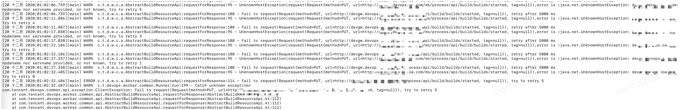

## Q1: The common builder failed to start

no available Docker VM

No ci-dockerhost available, need to check:

1. In the ci - dispatch nodes perform/data/SRC/ci/scripts/bkci - op. Sh list check whether there is a condition is true.

2. If the dispatch still fails, check whether the ci-dispatch logs are abnormal. Or log involving dockerhost ip.

The reason was that when BKCI was deployed, due to limited server resources, the construction machine microservice gateway was placed on one machine, resulting in high memory usage of the construction machine. When building the environment, the construction machine could not be found. Now those errors before the construction machine was deployed on another machine are gone.

3. The startup fails if host resources are insufficient. Make sure that the common builder node DISK_LOAD<95%, CPU_LOAD<100%, and MEM_LOAD <80%

------

## Q2: The common builder occasionally fails to start

**Get credential failed**

If the problem is known, delete dispatch-docker/lib/bcprov-jdk15on-1.64.jar. This is a soft chain. Just delete it and restart the dispatch-docker service`systemctl restart bk-ci-dispatch-docker.service`

------

## Q3: Pipeline construction fails because Agent heartbeat times out /Agent Dead. Please check the status of the builder

**Reason ①**It is common to run memory-consuming compilation tasks on a common build machine, resulting in an oom container.

Execute on a common build machine`grep oom /var/log/messages`The matching record is usually displayed. If oom is caused by multiple tasks running on the same builder, you can adjust the memory threshold of the scheduling algorithm to prevent multiple tasks from running on a single builder. If a single compilation task triggers oom, you are advised to increase the memory of the builder or use a private builder with a higher memory

**Cause 2**: The load on the CI machine is too high. As a result, the service response times out or the service is abnormal

The BKCI page is stuck. During pipeline execution, go to CI machine using top to see that the machine load is very high.

This problem often occurs when a file upload body is too large. The size that can be uploaded depends on the configuration, IO, and network of the BKCI machine. Therefore, it is not recommended to upload a package larger than 8 GB.

------

## Q4: The machine could not be connected to the network, the public build machine/no build environment could not download the image, the build failed to start

Currently, any image can be used by the public builder. No build environment requires the Internet to download the image.

It is currently required that you deploy the non-compile environment to a network accessible area and grant access to the docker hub address.

The public builder fills in the image address for your private docker registry.

And manually transfer bkci/ci:latest on the docker hub to the private docker registry.

------

## Q5: Public/private build steps are stuck in the ready to build environment

If it is a **public builder**, check whether the service of the public builder bk-ci-dockerhost.service is normal

This is common on **private build machines.** It is usually caused by agent installation exceptions. Here are some known causes:

1. For example, the BKCI domain name cannot be resolved or the BKCI service is unreachable
2. The agent version is incorrectly installed. For example, if the linux agent package is installed on the mac, delete the BKCI agent installation package and reinstall the agent of the corresponding version
3. It can be found in the agentDaemon.log file under logs in the BKCI agent installation directory`too many open files`, execute on the machine`ulimit -n`The result shows that the number of files that can be opened is too small. The default value is 1024. You can increase the value and reinstall the BKCI agent

1. If you view the build log, the following error occurs:

   UnknownHostException|request(Request{method=PUT,url=http://devgw.xxxx.xxx.com/ms/process/api/build/builds/started,tag=nu ll}),error is :java.net.UnknownHostException: devgw.devops.oa.com: nodename nor servname provided, or not known, try to retry 5

   

   Cause: Proxy software such as Proxifier is installed on the local PC, blocking network requests when the builder starts tasks.

   Solution: Stop the agent software.
