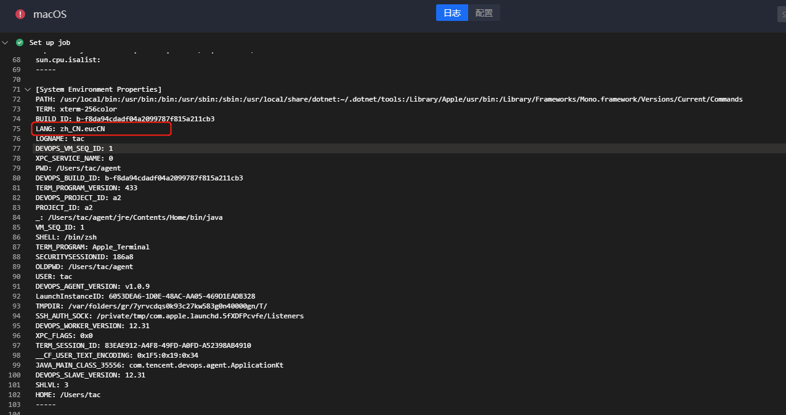

# General problem

## Q1: The plug-in cannot be used after installation

There are roughly two cases

① : After the plug-in is installed, there is no corresponding plug-in when you select the plug-in:

The plug-in also needs to be installed in the corresponding project before you can select the plug-in in the project. For details, please refer to:

[Plug-in installation](https://docs.bkci.net/store/plugins/plugin_install_demo#liu-an-zhuang-cha-jian)

② : After the plug-in is installed, the plug-in is gray and cannot be selected


Plug-ins are classified into compiled plug-ins and uncompiled plug-ins. The compiler plug-in is divided into three environments: Linux, windows, macOS

When creating a stage, select the stage of the environment corresponding to the plug-in to select the corresponding plug-in.

The job plug-in is a plug-in without a compilation environment. You need to select a stage without a compilation environment.

## Q2: The plugin reported an error bk_username can not empty


The private configuration of the plug-in is not configured. For details about private configuration, see

[Plug-in private configuration](https://docs.bkci.net/store/plugins/plugin_install_demo#si-cha-jian-pei-zhi)

## Q3: plugin execution error download plugin fail


This is commonly seen in mongodb exceptions.

Central control machine execution `/data/install/bkcli restart mongod`

Then check whether the mongodb status is normal `/data/install/bkcli status mongod`

------

# checkout

## Q1: failed to connect to gitlib.xxx.com port 443:connection timed out Q1: Failed to connect to gitlib.xxx.com port 443: Connection Timed out


The reason for the network disconnection is that after dockerhost is started, a sysctl -p equivalent command is executed. As a result, net.ipv4.ip_forward is reset to 0, resulting in network disconnection of the container.

```
Sysctl -p | grep -f net. Ipv4. Ip_forward net. Ipv4. Ip_forward = 0 start a test container alone: docker run - it - rm centos should see WARNING: IPv4 forwarding is disabled. Networking will not work. consul then run the systemctl restart bk-ci-docker-dns-redirect command to start a test container separately: curl -m 3 -v paas.service.consul then run the systemctl restart bk -ci-docker-DNs-redirect command: docker run-it --rm run commands in the centos container to view network recovery: curl -v paas.service.consul
```

## Q2: the card dies Fetching the repository


The build machine uses Ugit

BKCI needs to use native git pull code. If the builder uses Ugit, the BKCI checkout will fail. You need to reinstall native git.

## Q3: Failed to obtain credentials


This is because the old git pull code plug-in is not supported for use on the windows build machine. The latest version of the Git pull code plug-in is supported

## Q4: An error is occasionally reported while pulling the code

Such issues can arise if a bad key is used during decryption.


① This is the old version of the checkout plug-in problem, has been fixed.

② If an error occurs, the error is caused by the inconsistency between the bcprov-jdk version on the BKCI server and that on the builder.

Please check whether the version is consistent:

Builder: agent directory

BKCI server: / data/bkce/ci/ticket/lib /

If not, reinstall the construction machine agent to solve the problem.

# Upload artifacts

## Q1: No files to be archived are matched


Cause: No file is matched

This is a common error caused by file path problems. By default, the upload starts with BKCI's ${WORKSPACE} and matches artifacts with a relative path.

Therefore, if the corresponding artifact is in the lower directory of ${WORKSPACE}, you need to fill in the path/file

Q2: The build list does not display artifacts


Troubleshooting log error: Insufficient space.

1. The /tmp directory is used during uploading. The /tmp disk space is insufficient. Therefore /tmp also needs to keep enough space.

------

# python plugin

## Q1: After the python environment variable is added, it does not take effect during job execution. (job error "System cannot find the specified file")

Since BKCI agent and BK agent use the system account, the environment variables added to the administrator account do not take effect. You need to add python.exe and pip3.exe to the system environment variables and restart the operating system

## Q2: windows builder pipeline execution failed to open exe using python

Symptom In windows, the agent cannot pull up the UI exe

This is the windows session 0 limit

## Q3: windows builder, python printing workspace failed

If the builder specifies a working path, such as **D:*, printing the workspace directly in python will fail.

Because python will escape as an escape character. It needs to be printed as r"

```
print(r'${workspace}') 
```

------

# executeJobScript

## Q1: private configuration of key JOB_HOST is missing


The job script execution plug-in link: https://github.com/TencentBlueKing/ci-executeJobScript

The JOB_HOST field is missing in the private configuration. Configure the job_host field as shown in the preceding figure


# sendmail

## Q1: The sending email plug-in succeeds, but no email is received

1. First configure the ESB email information, refer to: https://bk.tencent.com/s-mart/community/question/2532
2. Configure the plug-in private configuration, refer to: https://github.com/TencentBlueKing/ci-sendEmail

## Q2: The sender configuration of the sending mail plug-in is not the sender configured by me


sender needs to be set in the plug-in's "private configuration", independent of the ESB mail_sender

1. First configure the ESB email information, refer to: https://bk.tencent.com/s-mart/community/question/2532
2. Configure the plug-in private configuration, refer to: https://github.com/TencentBlueKing/ci-sendEmail

## Q3: Plugin execution errors lack dependencies not recognized


When the plug-in executes, the machine lacks the pip and needs to install the corresponding dependencies on the builder selected at the corresponding stage.

# batchscript

## Q1: The batchscript plug-in cannot execute the bat file. The bat file contains variables read from the system, which are set by the current user


To change the startup user of the agent service to the current user, run the following command`services.msc`Open the windows Service management page and locate the service`devops_agent_${agent_id}`(Note: each agent_id is different and the value of agent_id can be found in the configuration file.agent.properties)

Right-click -> Properties and select this account on the login TAB

In the case of the domain builder, enter the account name`Domain name \ User name`, for example`tencent\zhangsan`; If there is no in-domain builder, enter the account name`.\ User name`, for example`.\admin,.administrator,.bkdevops`After entering the password, click the Confirm button


Right-click -> Restart to restart the service


Open the task Manager, and check whether the devopsDaemon.exe and vopsAgent.exe processes exist, and check whether the startup user name of the two processes is the current login user

## Q2: The command path in batchscript has Spaces, and execution fails


You can enclose commands with Spaces in quotation marks

## Q3: An error occurs when the Unity bat script is successfully executed on the builder

View the **script execution log.** It is found that UnityShaderCompiler with 88 threads is enabled during local execution. However, some UnityShaderCompiler fails to be mounted when BKCI is executed.

Failed to get ipc connection from UnityShaderCompiler.exe shader compiler!

Cause: BKCI needs to start the exe process to collect errors and logs. If the number of created processes exceeds the limit, the process fails to be started and the flow fails.

Solution: Increase the number of processes that can be started by the system.

------

## Q4: Unable to execute programs with UI interface

Specific performance: The bat script can be executed on the target machine with the same script, but cannot be executed on BKCI or job platform

The BKCI team explains:

windows agent, the third-party builder of BKCI, starts as a system service by default. When programs with UI are started through the agent, an error occurs or the interface is invisible

Cause: All processes started by the Windows Service run in Session0. Session0 cannot display information or UI Windows to desktop users.

In this case, you can start the agent in another way as follows:

1. If the agent has been installed as a system service, run uninstall.bat to uninstall the agent service
2. Double-click devopsDaemon.exe to start the agent, being careful **not to close the popup window**

**Note 1: The agent started in this way does not have the startup function.**

**Note 2: After the BKCI agent completes the build task, it automatically stops all sub-processes started by the agent. If you do not need to end the sub-processes, you can set the environment variable set DEVOPS_DONT_KILL_PROCESS_TREE=true before starting the process**

**This is the only temporary solution, because that's how the agent was originally designed**

------

## Q5:batch plug-in, unable to identify the text box variables brought back to the car

BKCI is variable-rendered in a prerendered manner. The variable has been rendered to replace the contents of the plugin.

batch plug-in simulation command line execution, encountered back to the car text box, it will be identified as execution.


For example:

The batch plug-in runs echo ${{a}}.

The result will be equal to typing the following on the command line:

echo a b c

------

## Q6: The local coscmd is running properly. An error occurs when the plug-in is used


This problem occurs when the user used for local execution is different from that used for agent execution. You can view agent execution users on Environment management


You need to use the account that was successfully executed locally and reinstall the agent to ensure that its users are the same.

------

# Shell script

## Q1: The macos machine cannot execute shell and python plug-ins

The problem is as follows: The macOs private builder generates an error when executing commands using shell plug-ins


The following error occurs when using the python plugin:


Troubleshooting:

1. Check whether the default shell environment of the macOs, cat /etc/shells and echo $SHELL, is normal


1. View builder logs set up job logs to view environment variables and check whether all environment variables are normal


In this case, environment variable LANG is abnormal. The setting of character set LANG to zh_CN.eucCN is incorrect. Instead, zh_CN.UTF-8 should be set



Cause: The LANG character set affects the export variable of the Chinese value, causing an error in the entire sh script

Solution: Change the character set to the correct character set

## Q2: The shell script is abnormal

Error: java.io.IOException: No such file or directory


Troubleshooting:

1. Check whether the workspace is set. If the workspace setting is removed, then the shell is executed to check whether the workspace setting is successful
2. Check whether the workspace directory is created in the user directory. Otherwise, the pipeline cannot access the directory

Cause: The workspace permission is incorrect

Solution: Create the workspace location correctly and set the permissions correctly
