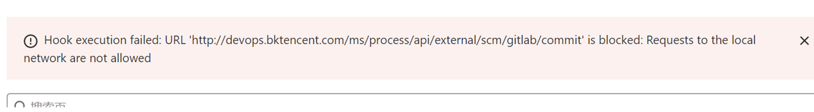
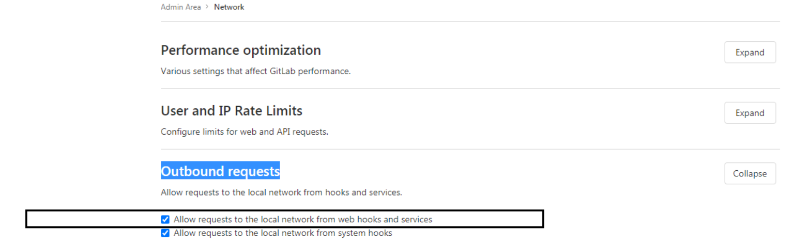
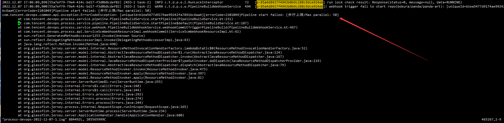

## Q1: gitlab trigger plugin can't trigger pipeline

1. check if the branch matches

T\_PIPELINE\_WEBHOOK table to see if this pipeline is registered, SELECT \* FROM devops\_ci\_process.T\_PIPELINE\_WEBHOOK WHERE pipeline\_id = ${ pipeline\_id}, ${pipeline\_id} can be obtained from the url address

3. if not registered

   1. check whether the network from the repository service to gitlba can pass, for example, whether the domain name resolution of gitlab is configured

   2. check whether the permissions of the gitlab repository are master permissions. The user generating the accesstoken needs to be the repository's `maintainer` role, and the accesstoken's scopes need to have `api` permissions.

   3. On the machine where the repository service is deployed, execute grep "Start to add the web hook of " $BK\_HOME/logs/ci/repository/repository-devops.log to find the reason for the registration failure, $BK\_HOME defaults to /data/ bkce

4. If it is registered and still not triggered

   1. Go to the gitlab webhook page and check if the registration is successful, as in Figure 1

   2. If there is a registered url in gitlab, the url is [http://域名/external/scm/codegit/commit](http://xn--eqrt2g/external/scm/codegit/commit) and then click edit to view the View detail. As in Figure 2

   3. check the error details sent, as in Figure 3. check if the network from gitlab to the BKCI machine is reachable, such as if the gitlab server can resolve the BKCI domain name. 5.

If all the above is OK, on the machine where the process service is deployed, run grep "Trigger gitlab build" $BK\_HOME/logs/ci/process/process-devops.log and search the logs for the triggered entry log to see the request body that gitlab pushed over. body.

   Note that when you look at the request body that gitlab pushed over, compare the `http_url` field in the request body with the address of the code repository in the codebase to see if it **exactly** matches, if one is a url in the form of a domain name and the other is a url in the form of an ip, it does not match. As in Figure 4 and Figure 5

 (1).png>)

.png>)

.png>)

6. gitlab's hook record reports an error Hook execution failed.

This is because gitlab 10.6 does not allow webhooks to be sent to the local network by default for security reasons, so you need to unlock gitlab's security restrictions.

## Q2：gitlab webhook error

URL '[**http://devops.bktencent.com/ms/process/api/external/scm/gitlab/commit**](http://devops.bktencent.com/ms/process/api/external/scm/gitlab/commit)' is blocked: Host cannot be resolved or invalid

gitlab cannot resolve the domain name of BlueShield.

Need to configure hosts resolution of devops.bktencent.com on the gitlab machine

## Q3：Occasionally webhook trigger does not work 

After troubleshooting the logs, I found that the number of pipeline parallelism exceeded the limit of 50 concurrent tasks.

You can modify the database
update devops_process.T_PIPELINE_SETTING set MAX_CON_RUNNING_QUEUE_SIZE=100 where PIPELINE_ID='${pipeline_id}'; 
It is recommended that the maximum be no more than 100

## Q4: Timing triggered pipeline, the time display is not correct, and the trigger time is not correct

Please check if the time of BKCI server is normal