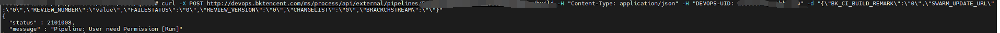

# Pipelined execution common errors

## Q1: unity's build log is not displayed in real time while pipelined

The cause is that "the unity compilation and construction operation is performed in the script and logs are written to the file. However, the subsequent cat command is not executed before the operation is complete. As a result, logs cannot be displayed on the web page in real time. For this scenario, try the following solutions:

```
 nohup $UNITY_PATH -quit -batchmode -projectPath $UNITY_PROJECT_PATH -logFile $UNITY_LOG_PATH -executeMethod CNC.Editor.PackageBuilderMenu.BuildPC "${isMono} ${isDevelop} $UNITY_OUT_PATH" & echo $! > /tmp/unity_${BK_CI_BUILD_ID}.pid unity_main_pid=$(cat /tmp/unity_${BK_CI_BUILD_ID}.pid) tail -f --pid ${unity_main_pid} $UNITY_LOG_PATH
```

------

## Q2:ci does not display logs


View microservice logs/ data/bkce/logs/ci/log/


One index accounts for 12 shards, exceeding the maximum set by es7, which is the limit for es7

Solution: Clean up some useless indexes

```
# View all current indexes
source /data/install/utils.fc
curl -s -u elastic:$BK_ES7_ADMIN_PASSWORD -X GET http://$BK_ES7_IP:9200/_cat/indices?v
# Delete index # index is the name of the index
curl -s -u elastic:$BK_ES7_ADMIN_PASSWORD -X DELETE http://$BK_ES7_IP:9200/index
# Note: You cannot delete .security-7
```


**Another possibility is that the user does not have es7 installed**

## Q3: Plugins get stuck for a long time during a build task

The default plug-in timeout period is 900 minutes. If the plug-in does not terminate within the timeout period, the process or project service is usually abnormal.

Log in to the BKCI machine and restart the service

```
systemctl status bk-ci-project.service
systemctl status bk-ci-process.service
```

------

## Q4: After manually canceling the build, the build is not canceled or the response time is too long

Common reasons are:

1. If the Agent version of the client is not updated after the BKCI version is updated. This may cause this problem.
2. Verify that the variable DEVOPS_DONT_KILL_PROCESS_TREE is added to the machine.
3. If an occasional fault occurs, the process of BKCI may occasionally fail due to high resource usage. You can try restarting the process process.
4. The builder receives process termination signals slowly due to network and resource problems. Builder resources and networks can be checked.

## Q5: remote API remote trigger pipeline, display no permission 2101008



Remote triggers execute pipelining by the last user to save the pipelining.

Finally, the user who saved the pipeline is canceled in the rights center, and the pipeline cannot be executed using remote. Another authorized user is required to re-save the pipeline.

## Q6: pipeline start failed upper limit of parallel execution


If more than 50 tasks are running concurrently in a single pipeline, performance will be affected and the pipeline may fail. So the limit.

update devops_process.T_PIPELINE_SETTING set MAX_CON_RUNNING_QUEUE_SIZE=100 where database restrictions can be changed PIPELINE_ID = '${PIPELINE_ID}; A maximum of 100 is recommended
