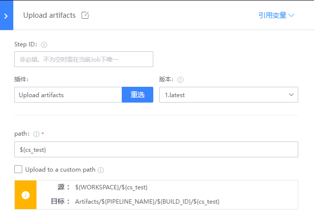

# General problem

## Q1: plug-in variable value acquisition and reference

Click on the reference variable in the top right corner, then click on the right to copy the variable and paste it wherever you want


For how to define and reference custom variables, refer to the following documents:

[Variable definitions and references](https://docs.bkci.net/overview/terminology/variables)

## Q2: Definition and acquisition of variables

Question 1: How do I use BKCI variables in my program

```
var is the name of the variable defined by the user in this and other steps. BK_CI_START_USER_NAME is the global variable of BKCI. python -c "import os; print(os.environ.get('var'))" python -c "import os; print(os.envion.get ('BK_CI_START_USER_NAME'))" # If you know the name of the variable you defined, You can also obtain cat << EOF > test.py import os print(os.envion.get('var')) EOF python test.py in your own python file
```

Question 2: How do I write variables back to BKCI

```
# If it is constant, the shell can use setEnv, bat can use call:setEnv to write back to BKCI setEnv "var_name" "var_value" # shell call:setEnv "var_name" "var_value" # bat # To write python script output back to BKCI var_value= 'python script.py' # script.py requires print output, print("test") setEnv "var_name" "${var_value}" # var_name="test" # Write the variable to a file and read the file in the shell. sh # file_name="test.txt" source env.sh setEnv "var_name" "${file_name}"
```

Problem 3: python is called in the bat script and the python output is written back to BKCI

```
for /F %%i in('python3 D:\mytest.py') do (set res=%%i) echo %res% call:setEnv "var_name" %res%
```

------

## Q3: Use builder system variables in plug-ins

System variables of the builder can be obtained directly in batch or shell. However, other plug-ins cannot read system variables directly, so you need to convert system variables to BKCI custom variables, and then use BKCI variables in the plug-in.

windows example:

① Assign the system variable cs_test to the BKCI variable using batch plug-in

```
call:setEnv "cs_test" "%cs_test%"
```

② Use ${cs_test} to reference variables in other plug-ins



## Q4: How do I conditionally execute plug-ins

Each plug-in is a task, and through advanced process control, you can define the running logic of the plug-in.

[task description](https://docs.bkci.net/overview/terminology/task)

------

# python

## Q1: How does python set BKCI variables

python plug-ins cannot set BKCI variables directly. Variables can only be written by calling shell or bat.

```
# Write python script output back to BKCI var_value= 'python script.py' # script.py requires print output, print("test") setEnv "var_name" "${var_value}" # var_name="test" # Write the variable to a file and read the file in the shell. sh # file_name="test.txt" source env.sh setEnv "var_name" "${file_name}"
```

------

# Upload artifacts

## Where does the file go after upload?

After upload, the file is uploaded to the BKCI server.

## Q2. What Artifacts are?

Artifacts are the path of the BKCI server.

/ data/bkce/public/ci/artifactory/bk - archive / ${item name}

## Q3, What is the absolute path of the product upload?

For example, the project name is vincotest, 114514.txt and the actual location is on the BKCI machine:

/ data/bkce/public/ci/artifactory/bk - archive/vincotest/*line* id / {build id} / 114514. TXT

The project name, pipeline ID, and build ID can all be read from the pipeline url


------

# batchscript

## Q1: bat script calls python and writes python output back to BKCI

```
for /F %%i in('python3 D:\mytest.py') do (set res=%%i) echo %res% call:setEnv "var_name" %res%
```

------

# shell

## Q1: echo $HOME is empty in the plugin

1. Reboot the BKCI agent, depending on the boot order of the system.
2. You can also write this environment variable temporarily in environment management.


# checkout

## Q1: Why is the checkout plugin not fetching the latest code

After checking, the plug-in has retry operation.

The first checkout pull confirms the commit version. When the plug-in is retried later, the same version of the code is pulled. Even if there has been a subsequent commit, it will not be detected when retried.

Once the build needs to restart, the latest commit is redetected and the latest code is pulled.
