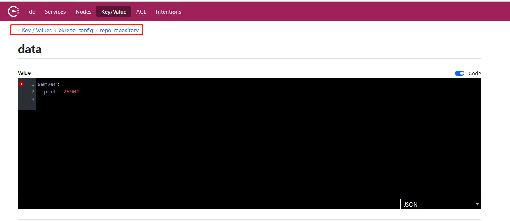

## Q1 in the page deleted artifacts, the space is not released

Deleted files in the artifact library do not immediately clean up the actual stored files, and there is a time delay for a scheduled task to free up disk space. By default, the disk space is cleared 14 days after a file is deleted.

If you want to modify the release time, edit the file/data/bkce/etc/repo/repository. Yaml, write

```
server: port: 25901 repository: deletedNodeReserveDays: 2
```

The repository service is then restarted.

In addition, check whether the configuration is successfully modified on the consul page. If not, please modify the configuration

