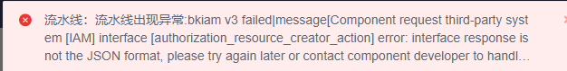

## Q1: The machine needs to be restarted. How do I turn off the service

Generally speaking, there is no special operation before the restart.

## Q2: How do I confirm that the service is restored after the restart

For details about how to check the recovery after the restart, see the document

[Machine restart](https://bk.tencent.com/docs/document/6.0/127/7582)

## Q3: bkiam v3 failed

The most common error reported during machine restart. BK BKCI services are usually automatically pulled up upon restart, but SaaS services are not automatically started and need to be manually started.

Central control machine execution `/data/install/bkcli start saas-o`

You are advised to write the restart command into the startup script.

### Q4: The machine is restarted after power failure, but some services of BK are not up. Are these services not set to start after power on?

There are dependencies between services. For example, some BK services depend on mysql. If these services are started before mysql, they will fail to start.

Check and restore by referring to [machine restart](https://bk.tencent.com/docs/document/6.0/127/7582)
