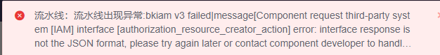

## Q1: bkiam v3 failed

This error is usually caused by the rights center SaaS not starting after the machine is restarted. You need to manually pull up the SaaS

Central control machine execution `/data/install/bkcli start saas-o`

For other operations required for machine restart, see [Machine Restart](https://bk.tencent.com/docs/document/6.0/127/7582)

## Q2: Click on the plug-in and error message is displayed: The service is being deployed. Please wait

This is commonly seen in mongodb exceptions.

Central control machine execution `/data/install/bkcli restart mongod`

Then check whether the mongodb status is normal `/data/install/bkcli status mongod`

## Q3: Navigation bar view display exception

The data was not written to redis when the project started, so the pipeline could not read it.

This can be done by restarting the project service.

systemctl restart bk-ci-project.service

## Q4: BKCI CI machine, space occupation is too high

You can check specifically what files are taking up space.

Usually the build takes up a lot of space, so you can use the BK work platform to clean the build regularly.

## Q5: The bandwidth usage between BKCI machines and BK MySQL is very high

The bk-ci-misc.service process is sending and receiving traffic.

This is a regular BKCI task, and every 12 seconds it will do a scan cleanup. The reason for the high traffic is mainly to run the logic of data cleaning.

If too much bandwidth effect use, can build. Data. Clear. MaxThreadHandleProjectNum this configuration to clean up the number of threads to reduce a little mysql operation.
