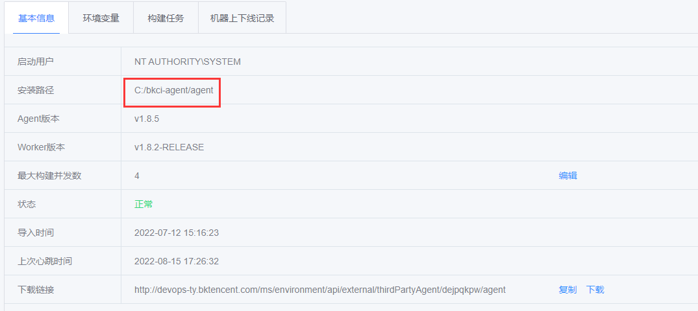
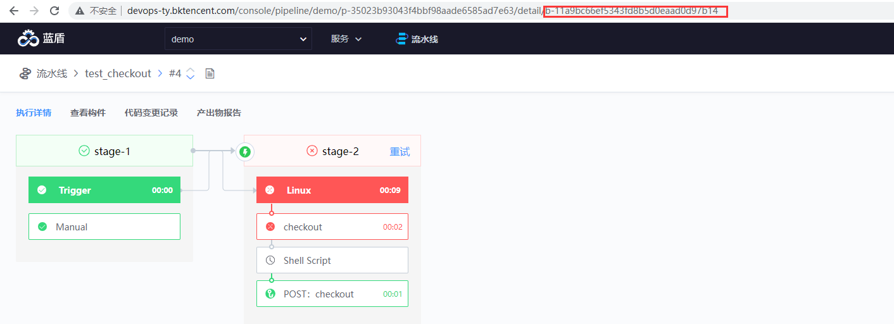

# Central control machine

Central control machine equivalent to BK, BKCI console. The bkcli command can be executed only on the central controller. Execute on any BK/BKCI machine `cat /data/install/.controller_ip` You can obtain the IP address of the central controller

------

# Pipeline ID

In the pipeline url, the parameters after the pipeline are the project id and pipeline id respectively. Such as: http://devops.bktencent.com/console/pipeline/iccentest/p-8f3d1b399897452e901796cf4048c9e2/history, iccentest for project id, p-xxx indicates the pipeline id.

# Build log

The build log is stored in the builder. The path for storing the build log is:

**Private builder**: {agent installation directory}/logs/{build number}

**Public building machine**: / data/bkce/logs/ci/docker / {build number}

The **installation directory of the agent on a private builder**

BKCI - Environmental Management - Node - {corresponding to the builder used} - Installation path

agent installation directory

**How to view the build number**:

In the pipeline URL, the last string starting with b- is the build number



# Service log

BKCI logs are stored by service.

The log directory is /data/bkce/logs/ci/

------

### Obtain all service logs:

Access the BKCI background service machine

```
find /data/bkce/logs/ci/ -name \*-devops.log -o -name \*-devops-error.log |xargs tar zcvf /root/bkci-log.tar.gz
```

Then send the packaged **/root/bkci-log.tar.gz** log

# The page displays an error message

If a page error occurs, browser F12 opens the console and repeats the request again, and:

①. Open the network TAB, click the incorrect request and take a screenshot.


②. Open the console TAB and take a screenshot.


