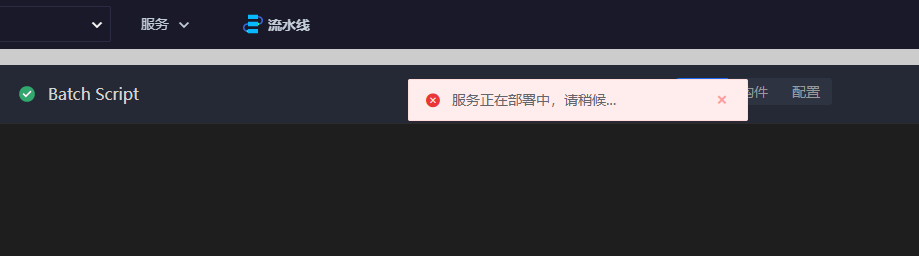
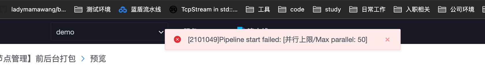
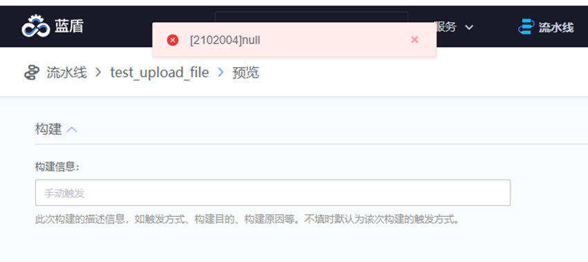

## Q1: bkiam v3 failed


This error is usually caused by the rights center SaaS not starting after the machine is restarted. You need to manually pull up the SaaS

Central control machine execution `/data/install/bkcli start saas-o`

For other operations required for machine restart, see [Machine Restart](https://bk.tencent.com/docs/document/6.0/127/7582)

## Q2: Click on the plug-in and error message is displayed: The service is being deployed. Please wait



This is commonly seen in mongodb exceptions.

Central control machine execution `/data/install/bkcli restart mongod`

Then check whether the mongodb status is normal `/data/install/bkcli status mongod`

## Q3: Plugin pack upload failure (R&D store)


Can check artifactory blueking users whether normal, speaking, reading and writing data directory: / data/bkce/public/ci/artifactory /

Then check the artifactory log file for errors.

## Q4: Error bkiam v3 failed (Environment Management) (Builder) occurred when BKCI was adding nodes.


Then check the log according to the given documentation

/data/bkce/ci/environment/logs/environment-devops.log

/data/bkce/ci/environment/logs/auth-devops.log


The T_AUTH_IAM_CALLBACK table in the ci auth library is empty

The initial cluster configuration failed, but the script did not terminate

```
ci initialization
reg ci-auth callback.
[1] 19:29:00 [SUCCESS] 172.16.1.49
{
  "timestamp" : 1626291190535,
  "status" : 500,
  "error" : "Internal Server Error",
  "message" : "",
  "path" : "/api/op/auth/iam/callback/"
}Stderr: * About to connect() to localhost port 21936 (#0)
Solution: You can try to manually register the ci-auth callback.
source /data/install/load_env.sh
iam_callback="support-files/ms-init/auth/iam-callback-resource-registere.conf"
./pcmd.sh -H "$BK_CI_AUTH_IP0" curl -vsX POST "http://localhost:$BK_CI_AUTH_API_PORT/api/op/auth/iam/callback/" -H "Content-Type:application/json" -d @${BK_PKG_SRC_PATH:-/data/src}/ci/support-files/ms-init/auth/iam-callback-resource-registere.conf
```

## Q5: JOOQ; uncategorized SQLException for SQL (R&D Store) (Plugin)


The old sql is not cleaned up

```
# Clean up the flag file, re-import all sql files
for sql_flag in $HOME/.migrate/*_ci_*.sql; do
chattr -i "$sql_flag" && rm "$sql_flag"
done
# Import database SQL to be executed only in the central control
cd ${CTRL_DIR:-/data/install}
./bin/sql_migrate.sh -n mysql-ci /data/src/ci/support-files/sql/*.sql
```

## Q6: pipeline start failed the upper limit of concurrency



If more than 50 tasks are running concurrently in a single pipeline, performance will be affected and the pipeline may fail. So the limit.

update devops_process.T_PIPELINE_SETTING set MAX_CON_RUNNING_QUEUE_SIZE=100 where database restrictions can be changed PIPELINE_ID = '${PIPELINE_ID}; A maximum of 100 is recommended

------

## Q7: Error 2102004 using pipeline file variable



When uploading, you need to fill in the full path of the variable containing the file name. This functionality relies on the BKCI artifact Library.