# **bkchat usage instructions**

BkCHAT provides two versions for use

1、No skill creation mode, i.e. no authentication version, users can execute all the BKCI pipeline in Enterprise WeChat

2、Custom skills mode, users can configure custom operation instructions and executor rights on the page, which can limit the execution rights of specific users in the pipeline

## **free skill creation mode**

1. Directly open the configured application number, enter "1" or "help", click on the upper right corner of the message, the corresponding operation will pop up, and the business can be bound.

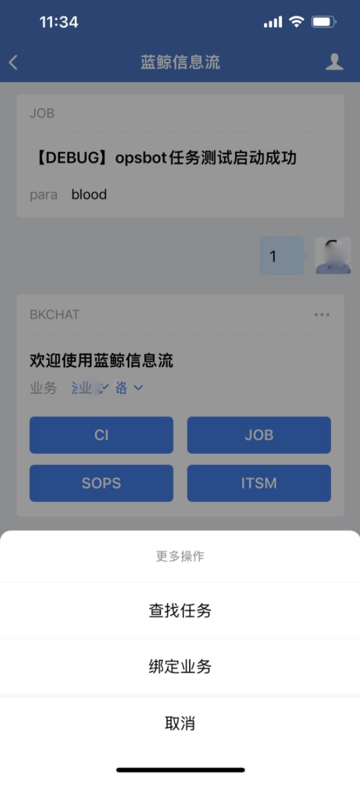

2. To execute BKCI CI, click on "CI", then select "BKCI Project", then continue to select the "pipeline" of BKCI to the final execution.

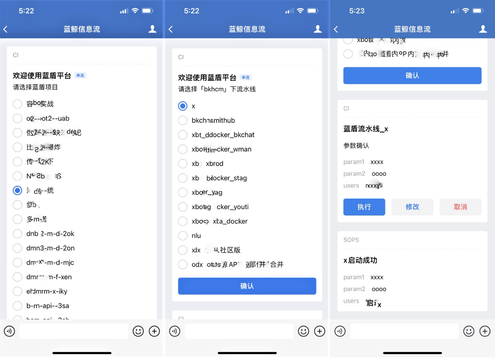

3、Standard operation and maintenance execution, support "group" mode selection.

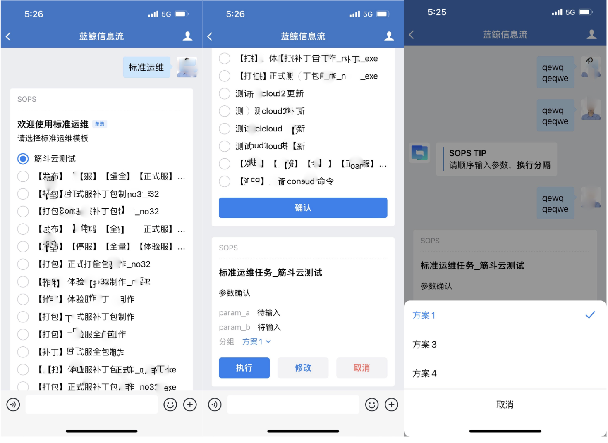

4. We also support the task finder function, as follows, you can freely enter the task you want to perform, and the backend will match you to the best task.

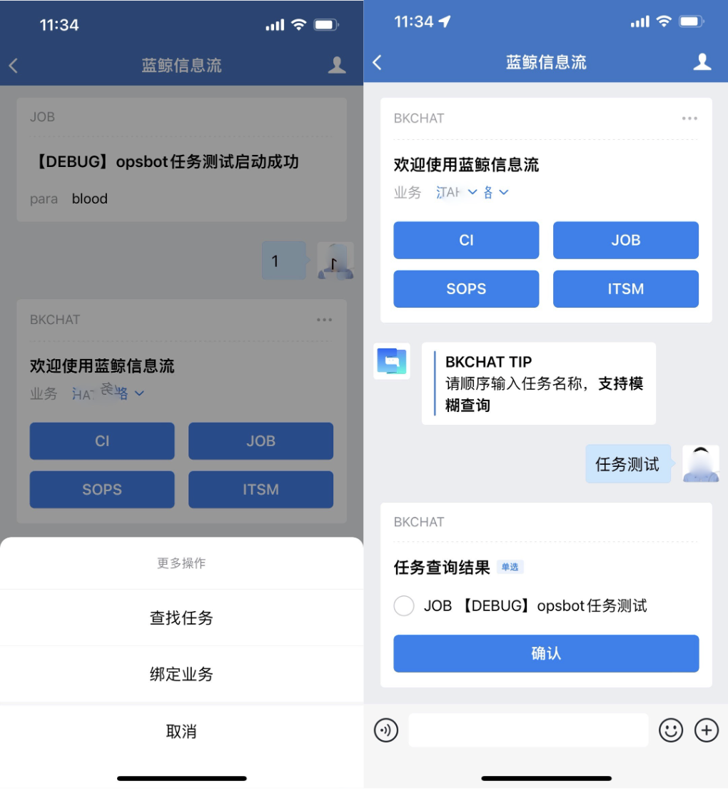

5、Sample demonstration of voice interaction

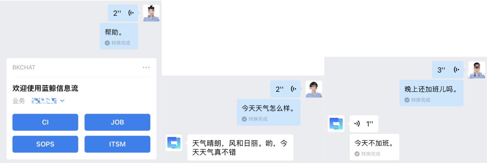

## **Custom skill mode**

1. Configure the skill (open the bk-chatbot app on the blue whale page)

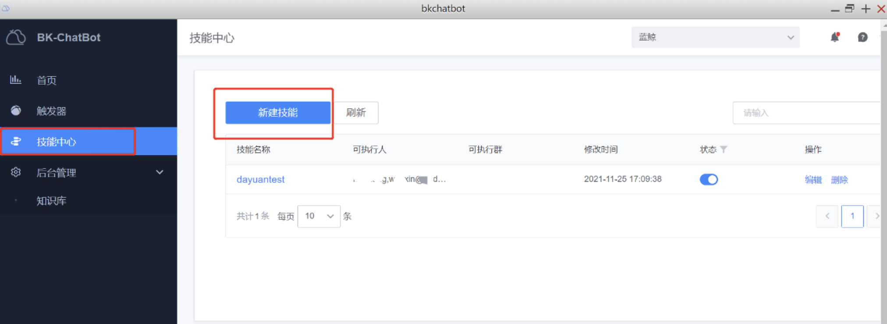

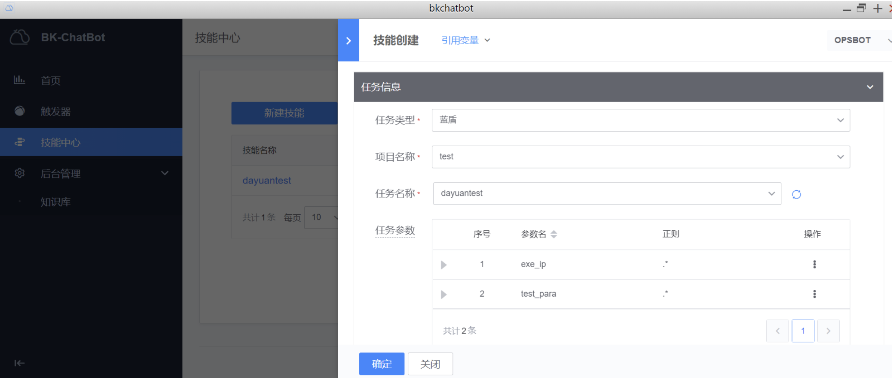

We can specify a regular match for the parameters and the bkchat conversation will extract the parameters for the regular.

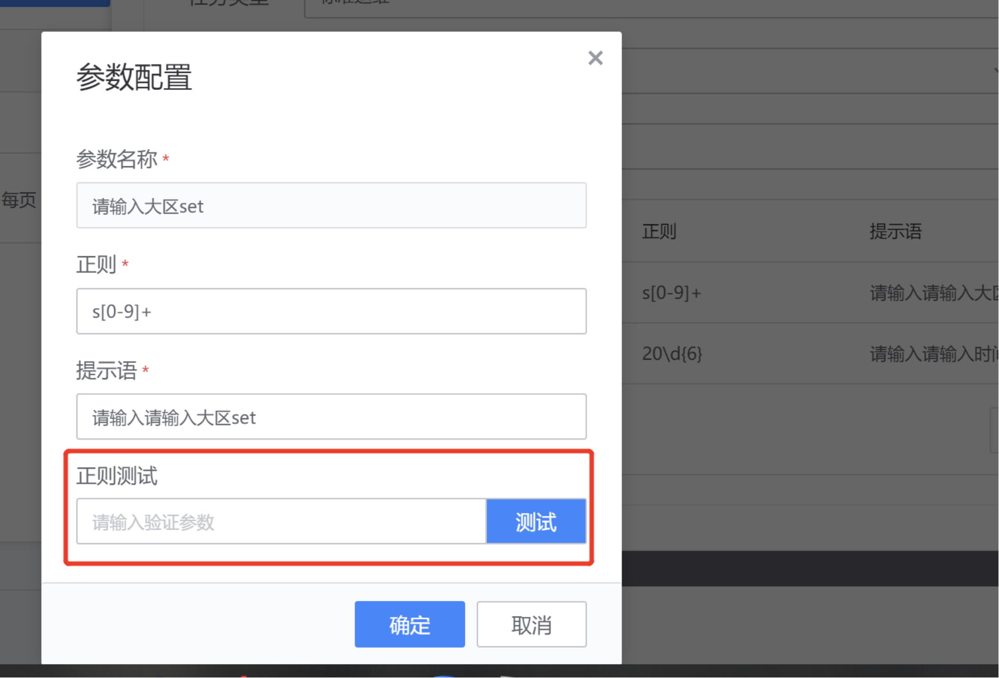

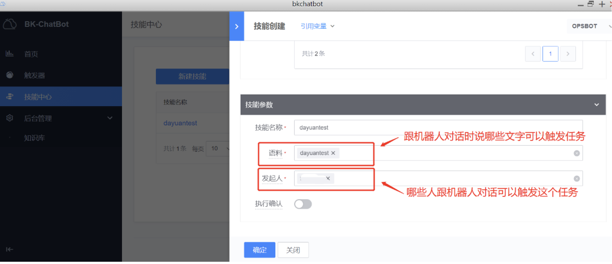

2、Trigger the task

Search for the bot "bottom message notification" in Enterprise WeChat (Enterprise WeChat configuration), and have a private conversation with it.

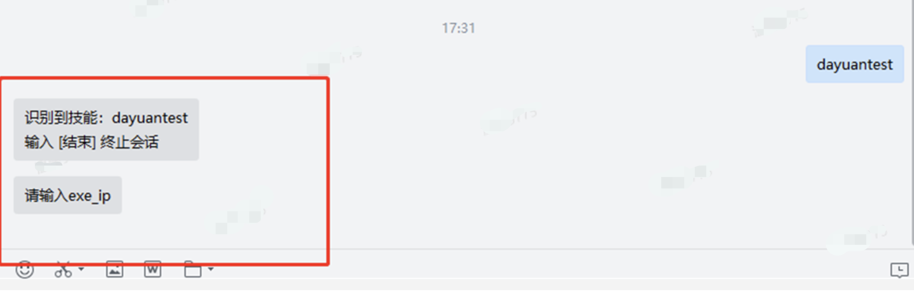

Then follow the prompts to enter the task parameters in turn, and the task will be automatically triggered to start after the input is completed. Also BKChat supports inputting skills and parameters together, so that the bot will extract the parameters to start the task according to the previously configured regular.

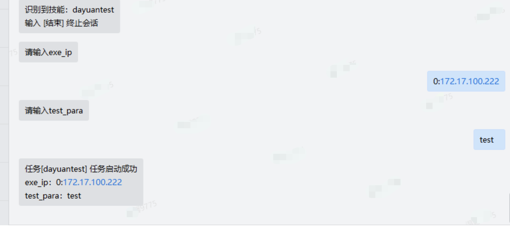