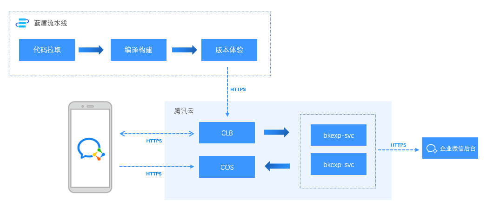
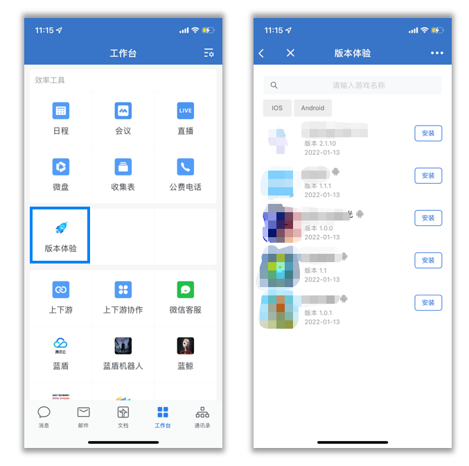
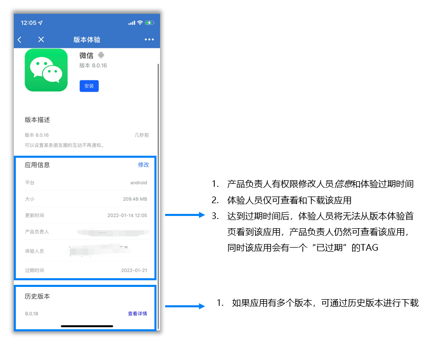
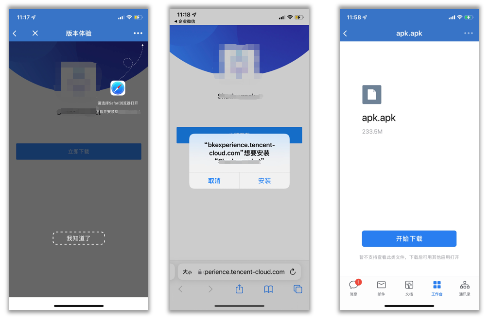
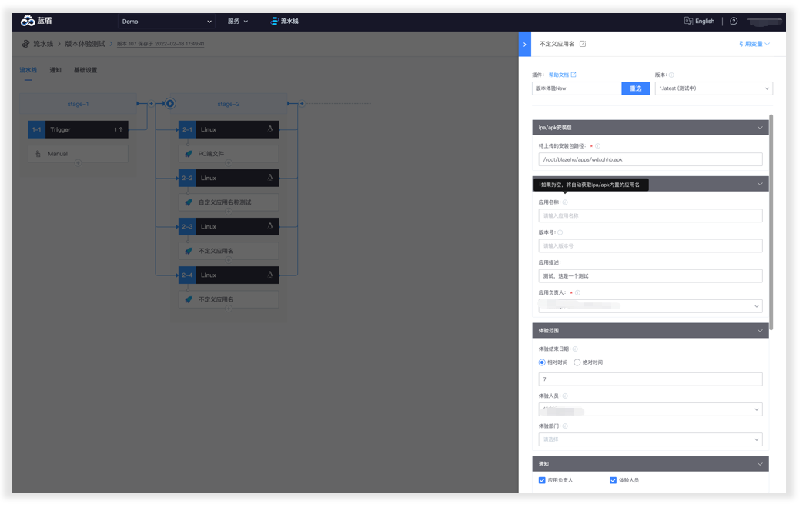
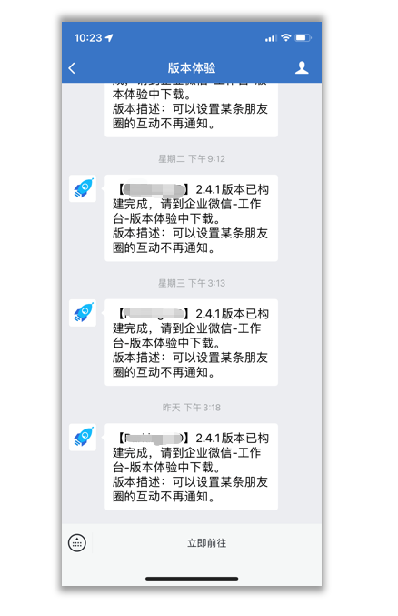

# **Introduction to Version Experience on Mobile**

Version experience service can publish the ipa/apk packages built out of the pipeline to the version experience application on enterprise WeChat, which facilitates the product, testing team, and other members in the company to assist your business in verifying new product features and discovering potential product defects, allowing your product to close the loop on the internal verification process.

## **Features of the mobile version experience**
- Application integration with enterprise WeChat, while inheriting enterprise WeChat authentication, more convenient and secure to use
- Provide BKCI plug-in, integrated with the compilation and construction pipeline
- Support download and installation of ipa and apk
- Support historical version download
- Download links are dynamically generated, and access management can be performed according to the effective time of links
- File storage support for Tencent Cloud COS
- Support version experience personnel and time management, experience personnel from enterprise WeChat address book synchronization
- Support message notification of new versions
- Backend service supports horizontal expansion

## **Technical Architecture**

## **Application Management**

- Through Enterprise WeChat "Workbench" (version experience), you can quickly experience and manage applications

## **Application Download**

- Click "Download", you can quickly download the application, ipa will prompt to jump safari for download, the download link is dynamically generated, can be configured by the number of downloads or valid time for access restrictions management

## **Pipeline Plugin**

- The "Version Experience Plugin" integrates with the build pipeline and provides management of experience permissions, new version notifications, and other features

## **Version Notification**

- The Version Experience plugin sends enterprise WeChat notification messages to people with permission after successful app uploads when "Notify" is checked

## **Deployment Costs**
- [Hardware resources needed to deploy the mobile version of the experience](client-experience-cost.md)
