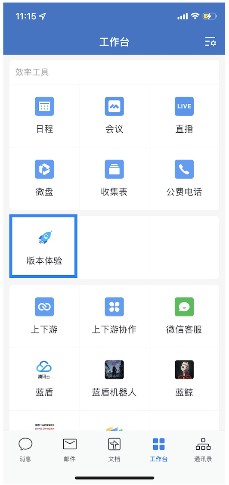
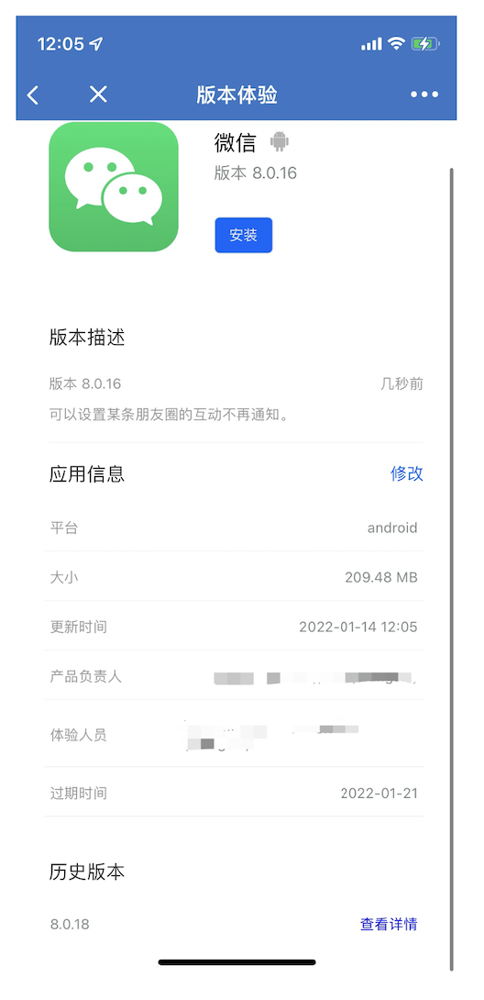
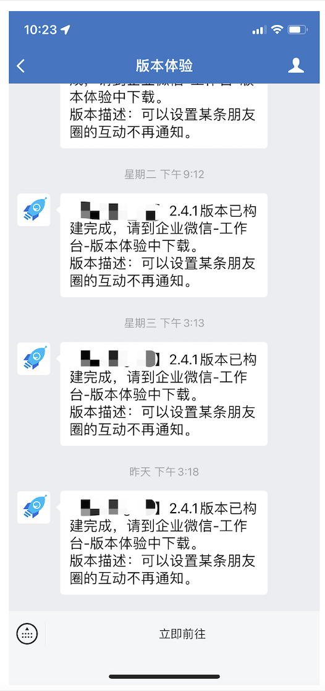

# **Mobile version experience access guide**

### **Version Experience Access**

### **Configuring the Blue Shield Pipeline**

#### **configure ipa/apk installer**

Path to the installation package to be uploaded.

- Select the installer package to be uploaded from the path of this build.
- Supports ipa files, apk files and zip packages.

#### **Configure application information**

- Application name.
  - The name of the application shown on the version experience..When this configuration item is empty, the plugin will automatically get the name of the application built into the ipa/apk package.
- Version number.
  - The version number shown on the version experience..When this configuration item is empty, the plugin will automatically get the version number built in the ipa/apk package.
- Application description.
  - A detailed description of the version of this experience..It can be completely customized by the business side..Common descriptions include: the application's profile; the version's changelog, etc.
- Product Owner.
  - Support pulling address book from enterprise WeChat, support multiple selection.

#### **Configure the scope of the experience**

- Experience end date.
  - Experience end date: After this date the experience will automatically expire and cannot be downloaded again.
  - Select relative time or absolute time
    - Relative time: The current build time of the pipeline plus the relative time in days, which is the end date of the experience.
    - Absolute Time: The date selected, which is the end date of the experience.
- Experience Person.
  - Support the selection of individual personnel.
  - Support the selection of experience personnel by part.

#### **Configuration notification method** 

- Notification method.
  - Send notifications through the application number after finishing the experience release.
  - Notification person supports to select application service person or experience person.

### **Version experience application use**

Select the "Version Experience" application from Enterprise Wechat Workbench.

Select the application you want to experience, click "Download" to quickly download the application, ipa will prompt to jump to safari to download.

 Clicking on the application title will take you to the application details, where the application owner can manage the application.

   - The product owner has permission to modify the person's information and experience expiration time.
   - Experience users can only view and download the app.

After the expiration time is reached, the app will not be visible from the version experience home page, but the product owner can still view the app, and the app will have an "expired" tag.

(If there are multiple versions of the app, you can download it through the history version.)

The Version Experience plugin sends an enterprise WeChat notification message to people with permission after the app is successfully uploaded when "Notify" is checked, and you can quickly access the "Version Experience" app by clicking Go Now.

Click on the "Go Now" button to quickly access the "Version Experience" app

