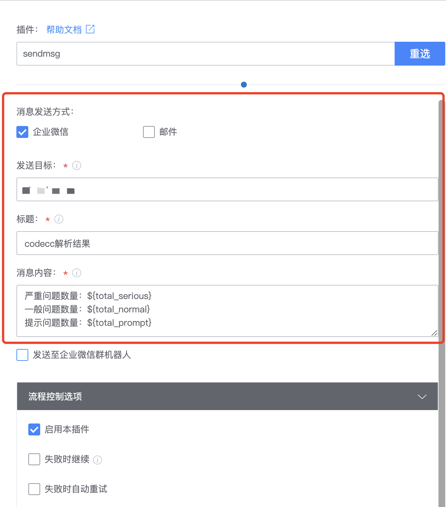

# sendmsg-Universal Messaging Plugin

## conception

Enterprise wechat messages and emails can be sent through the BK ESB interface. Group messages can also be sent text format information and markdown information through the webhook address of the group robot. text format information also supports @group members

## Front-end design

The enterprise wechat message, email, and group robot sending modes must be supported at the same time, and the three modes must be optional. You can select the check box.


Other input items, such as sending destination, message title, message content and other content that needs to be entered by the user, will be displayed when the user selects the message sending mode. For example, when "enterprise wechat" is selected, the input box of "sending target", "message title" and "message content" will appear. Email and enterprise wechat share the three input boxes of "send target", "message title", and "message content". Therefore, if you select either of the two options of "Enterprise wechat" and "Email", these input boxes will be displayed.



If "Send to enterprise wechat group robot" is selected, the following configuration items will appear. "@group Member" will appear only when the message type is selected as "text"


## Back-end design

### Basic concept

Plug-ins typically have three parts:

1. json: Defines front-end input components, output variables, and plug-in execution entry
2. sdk package: Provides various functions for plug-in development
3. User-defined code

For the python plug-in, see [plugin-demo-python](https://github.com/ci-plugins/plugin-demo-python)

```
|- demo # Plugin package name
    |- demo # Plugin package name
        |- __init__.py py # py package identifier
        |- command_line.py # command entry file, user-defined code section
        |- error_code.py # custom error code
    |- python_atom_sdk # Plugin development SDK package
    |- MANIFEST.in # Package file type declaration
    |- requirements.txt # dependency declaration
    |- setup.py # Execute package packaging configuration
    |- task.json # Define front-end input components, output variables, plugin execution portal
```

It is recommended to develop directly on the basis of plugin-demo-python code

Structure of this project:

```
|- plugin-sendmsg-demo # Plugin package name
    |- sendmsgDemo # plugin package name
        |- __init__.py py # py package identifier
        |- command_line.py # command entry file, user-defined code section
        |- error_code.py # custom error code
    |- python_atom_sdk # Plugin development SDK package
    |- MANIFEST.in # Package file type declaration
    |- requirements.txt # dependency declaration
    |- setup.py # Execute package packaging configuration
    |- task.json # Define front-end input components, output variables, plugin execution portal
```

### task.json

json contains the following fields:

1. atomCode: Describes the plug-in name
2. execution: Describes the plug-in package name, development language, plug-in run precommand, and plug-in command
3. input: Describes the input component
4. output: Describes the output variable

```
{
  "atomCode": "sendmsgDemo",
  "execution": {
    "packagePath": "sendmsgDemo-1.0.0.tar.gz", # package name, according to the actual package version, must be consistent with the definition in setup.py
    "language": "python", # development language
    "demands": [ # Preceding commands to run the plugin
        "pip install sendmsgDemo-1.0.0.tar.gz"
    ],
    "target": "sendmsg" # plugin command
  },
  "input":{}, # input component
  "output": {} # output variable, no output variable can be defined
}  
```

#### Input module

Message sending mode Select the checkbox. There are two types of checkbox components: Atom-checkbox-list and atom-checkbox. The difference between the two is that atom-checkbox-list arranges the options horizontally, while atom-checkbox options occupy a single line. Enterprise wechat and email can share message content, so Atom-checkbox-list is suitable for these two methods. Group message sending requires the message type (text/markdown) and does not require title, so atom-checkbox component is suitable for group message sending.

```
{
    ......
    "input":{
        "send_by":{
            "label": "Message Sending Method", # Component identifier
            "type": "atom-checkbox-list", # The component type is atom-checkbox-list
            "list": [ # The list of options, here there will be two options, enterprise weibo and email
                {
                    "id": "weixin", # option id
                    "name": "enterprise weixin", # the name of the option
                    "disable": false, # whether to set to unselectable
                    "desc": "The message will be sent to the enterprise Weixin application number, you need to configure the enterprise Weixin application number information in ESB first" # option description
                }, 
                {
                    "id": "mail",
                    "name": "mail",
                    "disable": false,
                    "desc": "send to mail"
                }
            ]
        },
        "send_by_robot":{
            "label": "", # may be left blank
            "type": "atom-checkbox", # component type is atom-checkbox
            "default": false, # default value, false means not checked by default
            "text": "Send to Enterprise WeChat Group Bot", # option function
            "desc": "" # option description
        }
    }
}
```

You can view the visual result of task.json in BKCI "R&D Store", "Console" and "Debug task.json"


Next, add three input components: "send target", "message title" and "message content". When the user selects "Enterprise wechat" and "Mail", these three input components will be displayed

```
{
    ......
    "input":{
        ......
        "send_to": {
            "label": "Send target",  
            "default":"",                   
            "placeholder": "username",
            "type": "vuex-input", # component type is vuex-input, single line textbox
            "desc": "Use semicolon; to separate multiple usernames",
            "required": true, # if or not it is required, true means it must have a value
            "rely":{ # indicates dependency on other components
                "operation": "OR", # depends on logical or, i.e. any of the following expressions can be displayed if the result matches
                "expression":[ # The name and value of multiple components that depend on it, meaning that the current component will be displayed when the send_by component has any of the following values
                    {
                        "key": "send_by",
                        "value": ["weixin", "mail"]
                    }
                ]
            }
        },
        "title": {
            "label": "title",
            "default":"",
            "placeholder": "title",
            "type": "vuex-input",
            "desc": "Enterprise WeChat message title or email title",
            "required": true,
            "rely":{
                "operation": "OR",
                "expression":[
                    {
                        "key": "send_by",
                        "value": ["weixin", "mail"]
                    }
                ]
            }
        },
        "content": {
            "label": "Message content",
            "default": "",
            "type": "vuex-textarea", # component type is vuex-textarea, multi-line textbox
            "disabled": false,
            "hidden": false,
            "isSensitive": false,
            "desc": "Message content, can use variable ${VAR}",
            "required": true,
            "rely":{
                "operation": "OR",
                "expression":[
                    {
                        "key": "send_by",
                        "value": ["weixin", "mail"]
                    }
                ]
            }
        },
    }
}
```

Visualization results:


Next, add the input component of enterprise wechat group robot

```
{
    ......
    "input":{
       ......
        "robot_key": {
            "label": "robot webhook key",
            "default":"",
            "placeholder": "robot webhook key",
            "type": "vuex-input",
            "desc": "Enterprise WeChat bot webhook key, suggest using credential management",
            "required": true,
            "rely": { # depends on the send_by_robot component value being true, i.e. "send to enterprise weibo bot" is checked
                "operation": "AND", # Depend on the logic with
                "expression": [
                    {
                        "key": "send_by_robot",
                        "value": true
                    }
                ]
            }
        },
        "msgtype": {
            "label": "Message type",
            "type": "selector", # type selector, dropdown option
            "default": "text",
            "desc": "Message type can be text/markdown",
            "options": [ # dropdown items
                {
                    "id": "text",
                    "name": "text",
                    "desc": "",
                    "disable": false
                },
                {
                    "id": "markdown",
                    "name": "markdown",
                    "desc": "",
                    "disable": false
                }
            ],
            "rely": {
                "operation": "AND",
                "expression": [
                    {
                        "key": "send_by_robot",
                        "value": true
                    }
                ]
            }
        },
        "mentioned": {
            "label": "@group-members",
            "type": "vuex-input",
            "default": "",
            "placeholder": "PonyMa;@all",
            "desc": "Use Enterprise WeChat UserId, available through admin backend, semicolon separates multiple UserId",
            "rely": {
                "operation": "AND", # dependency logic and, when the user checks "send to enterprise WeChat group robot", and the selected message type is text, the current component will only display
                "expression":[
                    {
                        "key": "send_by_robot",
                        "value": true
                    },
                    {
                        "key": "msgtype",
                        "value": "text"
                    }
                ]
            }
        },
        "robot_content": {
            "label": "Group Message Content",
            "type": "vuex-textarea",
            "default": "",
            "placeholder": "The markdown syntax is available when the message type is markdown",
            "desc": "The markdown syntax is available when the message type is markdown",
            "required": true,
            "rely": {
                "operation": "AND",
                "expression": [
                    {
                        "key": "send_by_robot",
                        "value": true
                    }
                ]
            }
        }
    }
}
```

Visualization results:


If the plug-in needs to set the output, you can add the Output field

```
{
    ......
    "output": {
        "TEST_OUTPUT": {
            "type": "string",
            "description": "test"
        }
    }
}
```

Visualization results:


### sdk

You can code the business logic by focusing on a few functions

1. sdk.get_input() gets the input of the component. The input component gets the values as strings

```
# Inputs
input_params = sdk.get_input()
send_to = input_params.get("send_to", None)

# Note that for components of type atom-checkbox-list, the strings obtained need to be converted into lists using json.loads
send_by_str = input_params.get("send_by", None)
send_by= json.loads(send_by_str)

# atom-checkbox gets the string 'true' or 'false' and needs to be converted to True/False by itself
send_by_robot_str = input_params.get("send_by_robot", None)
send_by = True if send_by_robot_str == 'true' else False
```

1. sdk.get_sensitive_conf(" key ") gets the private configuration variables

```
bk_app_code = sdk.get_sensitive_conf("bk_app_code")
```

1. sdk.log Log output

```
sdk.log.info("xxx") sdk.log.error("xxx")
```

1. exit_with_succ(data=data) sets the output variable

```
# exit_with_succ wraps sdk.set_output to make it easier for the user to set output variables
data = {
    "TEST_OUTPUT":{
        "type": sdk.output_field_type.STRING, # need task.json to set the same type
        "value": "test" # The value of the output variable, which needs to be the same as the declared type
    }
}

exit_with_succ(data=data)
```

## pack

1. Go to the plug-in code project root directory
2. Execute python setup.py sdist (or some other packaging command, sdist is used in this example)
3. Create a new folder anywhere, such as sendmsgDemo_release
4. Copy the execution package produced in Step 2 to sendmsgDemo_release
5. Add the task.json file to sendmsgDemo_release
6. Use sendmsgDemo_release`zip -r sendmsgDemo.zip sendmsgDemo_release`Pack in zip

setup.py

```
# -*- coding: utf-8 -*-

import os

from setuptools import setup, find_packages

BASE_DIR = os.path.realpath(os.path.dirname(__file__))


def parse_requirements():
    """
    @summary: get required
    """
    reqs = []
    if os.path.isfile(os.path.join(BASE_DIR, "requirements.txt")):
        with open(os.path.join(BASE_DIR, "requirements.txt"), 'r') as fd:
            for line in fd.readlines():
                line = line.strip()
                if line:
                    reqs.append(line)
    return reqs


if __name__ == "__main__":
    setup(
        version="1.0.0",
        name="sendmsgDemo",
        description="",

        cmdclass={},
        packages=find_packages(),
        package_data={'': ['*.txt', '*.TXT', '*.JS', 'test/*']},
        install_requires=parse_requirements(),

        entry_points={'console_scripts': ['sendmsgDemo = sendmsgDemo.command_line:main']},

        author="vincohuang",
        author_email="vincohuang@tencent.com",
        license="Copyright(c)2021-2022 vincohuang All Rights Reserved."
    )
```

## Project reference

plugin-demo-python: https://github.com/ci-plugins/plugin-demo-python

plugin-sendmsg-demo: https://github.com/wenchao-h/plugin-sendmsg-demo
