# UI component usage examples

**The system supports the following UI components**

| Component type                            | Component name               | remarks                                                      | Description of the value obtained by the plug-in background at execution time |
| :---------------------------------------- | :--------------------------- | :----------------------------------------------------------- | :----------------------------------------------------------- |
| [vuex-input](#vuex-input)                 | Single line text box         |                                                              | string                                                       |
| [vuex-textarea](#vuex-textarea)           | Multiline text box           |                                                              | string                                                       |
| [atom-ace-editor](#atom-ace-editor)       | Code edit box                |                                                              | string                                                       |
| [selector](#selector)                     | Drop down box                | This parameter can only be selected but cannot be entered    | string                                                       |
| [select-input](#select-input)             | Enter a drop-down box        | You can enter a value that is not in the drop-down list (including variables). If you select the value, you will see the id in the box | string                                                       |
| [devops-select](#devops-select)           | Enter a drop-down box        | The input value can only be a variable. If you select it, you will see name in the box | string                                                       |
| [atom-checkbox-list](#atom-checkbox-list) | Checkbox list                |                                                              | A character string, for example, [id1, id2]                  |
| [atom-checkbox](#atom-checkbox)           | Check box (Boolean)          |                                                              | string                                                       |
| [enum-input](#enum-input)                 | Single option                |                                                              | string                                                       |
| [cron-timer](#cron-timer)                 | Time selector                |                                                              | string                                                       |
| [time-picker](#time-picker)               | Date selector                |                                                              | string                                                       |
| [user-input](#user-input)                 | Name selector                |                                                              | string                                                       |
| [tips](#tips)                             | Prompt message               | Supports dynamic preview of user input parameters and hyperlinks | string                                                       |
| parameter                                 | Indeterminate parameter list | The parameter list can be obtained from the interface        | string                                                       |
| dynamic-parameter                         | Indeterminate parameter list | The value can be obtained from an interface, multiple columns per row, and dynamic addition and deletion | string                                                       |

**Each input field configuration supports the following common properties**

| Attribute name              | Attribute description                                  | Configuration format                                       | remarks                                                      |
| :-------------------------- | :----------------------------------------------------- | :--------------------------------------------------------- | :----------------------------------------------------------- |
| label                       | Chinese name                                           | string                                                     | Use to show and describe the purpose of the component. Null is allowed (scenarios combined with other fields) |
| type                        | Component type                                         | string                                                     | Specifies which component is used, i.e., the "System supports the following UI components" table above |
| [inputType](#inputtype)     | Input type                                             | string                                                     | Not required, useful only for some components                |
| default                     | Default value                                          | The default value format varies according to the component | Not required                                                 |
| placeholder                 | placeholder                                            | string                                                     | Not required, usually in the form of text when the user has not entered anything |
| [groupName](#groupname)     | Owning group                                           | string                                                     | This parameter is mandatory. If inputGroups are defined, use the groupName table name of the inputGroup to which the current component belongs |
| desc                        | Field description                                      | string                                                     | This parameter is not required. Field description is supported |
| required                    | Is it required?                                        | Boolean                                                    | Not required                                                 |
| disabled                    | Editable or not                                        | Boolean                                                    | Not required                                                 |
| hidden                      | Hidden or not                                          | Boolean                                                    | Not required                                                 |
| [isSensitive](#issensitive) | Sensitive or not                                       | Boolean                                                    | This parameter is not required. Sensitive information will not be displayed in plain text in the log |
| [rely](#rely)               | Show/hide the current field according to the condition | object                                                     | Not required                                                 |
| [rule](#rule)               | Value validity limit                                   | object                                                     | Not required The following attributes are supported: alpha: English characters only, Boolean, true/false numeric: Only numeric, Boolean, true/false is allowed alpha_dash: The value can contain English, digits, underscores (_), hyphens (-), Boolean, true, or false alpha_num: Can contain English and numeric, Boolean, true/false max: indicates the maximum length of a string, int min: The minimum length of a string, int regex: a string of regular expressions |

You can view the visual result of the example task.json in the R&D Store, Console, and Debugging task.json. For convenience, the following example only shows the input field. Other fields, such as atomCode, need to be completed before the plug-in is packaged.

## vuex-input

vuex-input is the most common one-line input text box used to obtain user text input. 

**Examples:**

```json
{
    "input": {
        "username": {
            "label":"username",
            "default":"",
            "placeholder":"please enter username",
            "type":"vuex-input",
            "desc":"username",
            "required": true
        }
    }
}
```
**Plugin gets input:**

```python
import python_atom_sdk as sdk
username = sdk.get_input().get("username")
```
**Component visualization:**

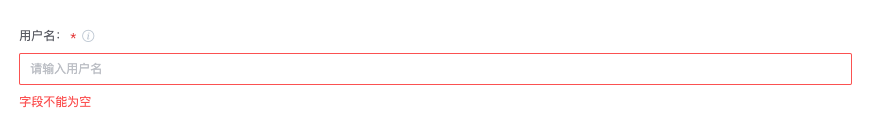

## vuex-textarea
vuex-textarea allows you to enter multiple lines of text in a multi-line text box. The multi-line text box supports drag and stretch in the lower right corner. **Example:**
```json
{
    "input": {
        "message": {
            "label":"message",
            "default":"",
            "placeholder":"please enter message",
            "type":"vuex-textarea",
            "desc":"message",
            "required": true
        }
    }
}
```
**Plugin gets input:**

```python
import python_atom_sdk as sdk
message = sdk.get_input().get("message")
```
**Component visualization:**

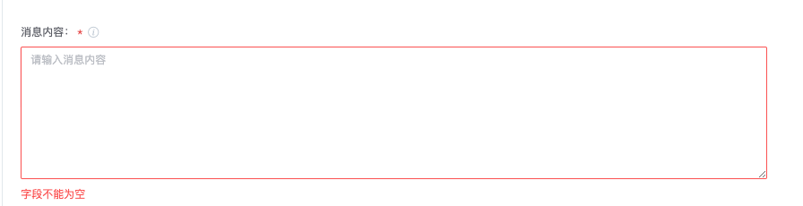

## atom-ace-editor
atom-ace-editor is a code editing box that can highlight user input code. Currently, it supports json, python, sh, text, powershell, and batchfile. **Example:**


```json
{
    "input": {
        "script": {
            "label":"script",
            "default":"",
            "placeholder":"please enter script",
            "type":"atom-ace-editor",
            "desc":"script",
            "required": true,
            "lang": "python"
        }
    }
}
```
**Plugin gets input:**

```python
import python_atom_sdk as sdk
username = sdk.get_input().get("script")
```
**Component visualization:**

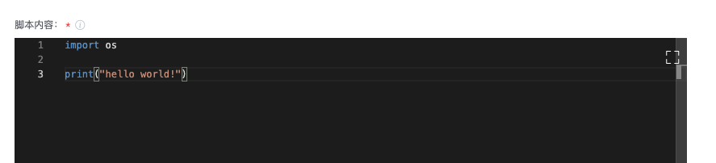

## selector
selector is a drop-down selector. The user cannot enter a selector, but can only select a selector. The selector can be a fixed list or can be obtained through an interface.
**demo 1：**

```json
{
    "input": {
        "credential": {
            "label":"ticket",
            "default":"",
            "placeholder":"please select ticket",
            "type":"selector",
            "desc":"user ticket",
            "required": true,
            "optionsConf": {
              "searchable": true,
              "multiple": false,
              "url": "/ticket/api/user/credentials/{projectId}/hasPermissionList?permission=USE&page=1&pageSize=10000&&credentialTypes=SSH_PRIVATEKEY",
              "paramId": "credentialId",
              "paramName": "credentialId",
              "itemTargetUrl": "/ticket/{projectId}/",
              "itemText": "add a new ticket",
              "hasAddItem": true
            }
        }
    }
}
```
**Plugin gets input：**

```python
import python_atom_sdk as sdk

# multiple set to false
credential = sdk.get_input().get("credential")

# multiple set to true，Need to parse the input into a python list
import json
credentials = sdk.get_input().get("credential")
credential_list = json.loads(credentials)
```
**Component visualization：**

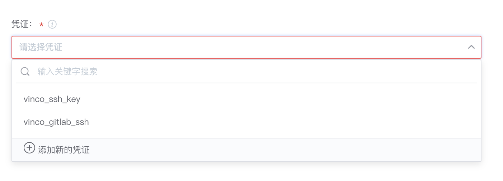

**demo2：**

```json
{
    "input": {
        "city": {
            "label":"city",
            "default":"",
            "placeholder":"please select city",
            "type":"selector",
            "desc":"city",
            "required": true,
            "optionsConf": {
              "searchable": true,
              "multiple": false
            },
            "options": [
                { 
                    "id": "sz",
                    "name": "shenzhen",
                    "desc": "shenzhen",
                    "disabled": false
                },
                {
                    "id": "sh",
                    "name": "shanghai",
                    "desc": "shanghai",
                    "disabled": false
                },
                {
                    "id": "gz",
                    "name": "guangzhou",
                    "desc": "guangzhou",
                    "disabled": false
                }
            ]
        }
    }
}
```
**Plugin gets input：**
```python
import python_atom_sdk as sdk

# options defines a fixed list, the user selection the plugin gets is the option id
# multiple set to false
city = sdk.get_input().get("city") # get is id

# multiple set to true, need to parse input into python list
import json
citys = sdk.get_input().get("citys")
city_list = json.loads(citys) # Get a list of ids: ["sz", "sh"]
```
**Component visualization：**

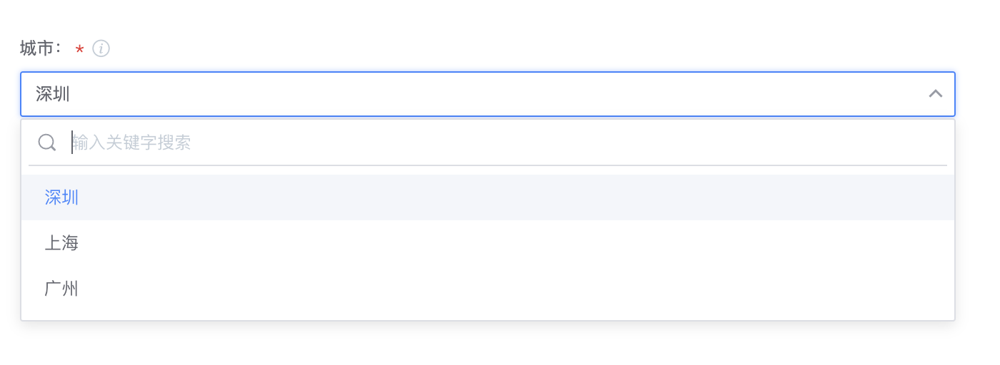

## select-input
select-input is a drop-down selector for user, the input value can be a value that is not in the drop-down list, you can input variables, such as the built-in variable `${{BK_CI_START_USER_NAME}}`, if the selected option is in the list, the id that is seen in the box after selection

**demo：**
```json
{
    "input": {
        "city": {
            "label":"city",
            "default":"",
            "placeholder":"please select city",
            "type":"select-input",
            "desc":"city",
            "required": true,
            "options": [
                { 
                    "id": "sz",
                    "name": "shenzhen",
                    "desc": "shenzhen",
                    "disabled": false
                },
                {
                    "id": "sh",
                    "name": "shanghai",
                    "desc": "shanghai",
                    "disabled": false
                },
                {
                    "id": "gz",
                    "name": "guangzhou",
                    "desc": "guangzhou",
                    "disabled": true
                }
            ]
        }
    }
}
```
**Plugin gets input：**
```python
import python_atom_sdk as sdk

city = sdk.get_input().get("city")
```
**Component visualization：**

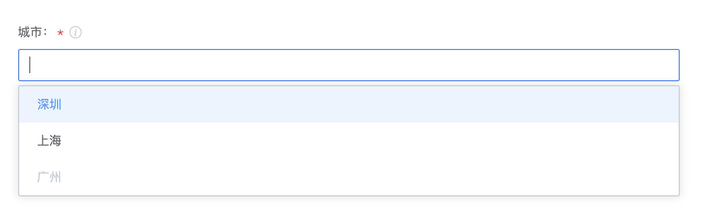

## devops-select
devops-select is an enterable drop-down box that only allows variables to be entered, and if an option is selected, the name of the option is displayed

**demo：**
```json
{
    "input": {
        "city": {
            "label":"city",
            "default":"",
            "placeholder":"please select city",
            "type":"devops-select",
            "desc":"city",
            "required": true,
            "options": [
                { 
                    "id": "sz",
                    "name": "shenzhen",
                    "desc": "shenzhen",
                    "disabled": false
                },
                {
                    "id": "sh",
                    "name": "shanghai",
                    "desc": "shanghai",
                    "disabled": false
                },
                {
                    "id": "gz",
                    "name": "guangzhou",
                    "desc": "guangzhou",
                    "disabled": true
                }
            ]
        }
    }
}
```
**Plugin gets input：**
```python
import python_atom_sdk as sdk

city = sdk.get_input().get("city")
```
**Component visualization：**

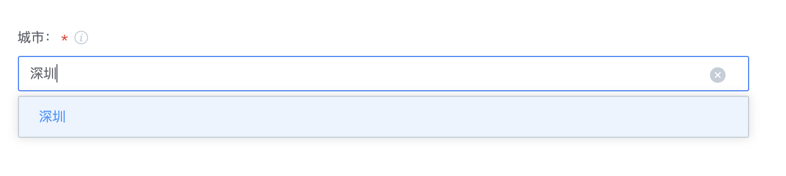

## atom-checkbox-list
atom-checkbox-list is a list of checkboxes, the options are arranged horizontally allowing the user to check multiple options and allowing default checkbox values
**demo：**

```json
{
    "input": {
        "city": {
            "label":"city",
            "default":["sz", "bj"],
            "placeholder":"please select city",
            "type":"atom-checkbox-list",
            "desc":"city",
            "required": true,
            "list": [
                { 
                    "id": "sz",
                    "name": "shenzhen",
                    "desc": "shenzhen",
                    "disabled": false
                },
                {
                    "id": "sh",
                    "name": "shanghai",
                    "desc": "shanghai",
                    "disabled": false
                },
                {
                    "id": "gz",
                    "name": "guangzhou",
                    "desc": "guangzhou",
                    "disabled": true
                },
                { 
                    "id": "nj",
                    "name": "nanjing",
                    "desc": "nanjing",
                    "disabled": false
                },
                {
                    "id": "bj",
                    "name": "beijing",
                    "desc": "beijing",
                    "disabled": false
                },
                {
                    "id": "cq",
                    "name": "chongqing",
                    "desc": "chongqing",
                    "disabled": false
                }
            ]
        }
    }
}
```
**Plugin gets input：**
```python
import python_atom_sdk as sdk
import json

citys = sdk.get_input().get("city")
city_list = json.loads(citys) # ["sz", "bj"]
```
**Component visualization：**

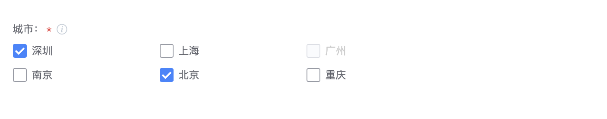

## atom-checkbox
atom-checkbox is a checkbox with only true and false states, true and false represent checked and unchecked respectively

**demo：**
```json
{
    "input": {
        "isEnabled": {
            "label":"enabled or not",
            "default":true,
            "type":"atom-checkbox",
            "text": "enabled or not",
            "desc":"enabled or not",
            "required": true
        }
    }
}
```
**Plugin gets input：**
```python
import python_atom_sdk as sdk
import json

isEnabled = sdk.get_input().get("isEnabled") # string'true'
is_enabled = True if isEnabled == 'true' else False  # to True
```
**Component visualization：**

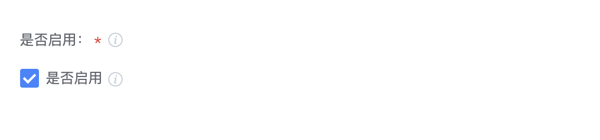

## enum-input
enum-input is a list of radio boxes

**demo：**
```json
{
    "input": {
        "lang": {
            "label": "language",
            "default": "python",
            "type": "enum-input",
            "required": true,
            "list": [
                {
                    "value": "php",
                    "label": "php"
                },
                {
                    "value": "python",
                    "label": "python"
                }
            ]
        }
    }
}
```
**Plugin gets input：**
```python
import python_atom_sdk as sdk
import json

lang = sdk.get_input().get("lang")
```
**Component visualization：**

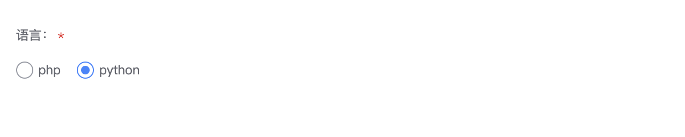

## cron-timer
cron-timer is a timing selector

**demo：**
```json
{
    "input": {
        "runtime": {
            "label":"timed trigger time",
            "type":"cron-timer",
            "desc":"timed trigger time",
            "required": true
        }
    }
}
```
**Plugin gets input：**
```python
import python_atom_sdk as sdk
import json

runtime = sdk.get_input().get("runtime") # The string is obtained and needs to be parsed into a list
runtime_list = json.loads(runtime) # ['0 0 9 ? * 2', '0 30 15 ? * 2']
```
**Component visualization：**

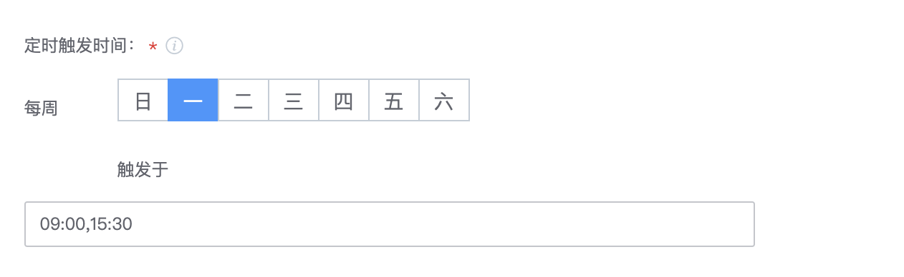

## time-picker
time-picker is a date-time picker

**demo：**

```json
{
    "input": {
        "uptime": {
            "label":"start time",
            "type":"time-picker",
            "desc":"start time",
            "required": true,
            "datePickerConf": {
                "type": "datetime",
                "format": "yyyy-MM-dd HH:mm:ss"
            }
        }
    }
}
```
**Plugin gets input：**
```python
import python_atom_sdk as sdk
import json

uptime = sdk.get_input().get("uptime") # The string is obtained and needs to be parsed into a int
uptime_int= int(uptime) # 1658509200000  unix timestamp in milliseconds 
```
**Component visualization：**

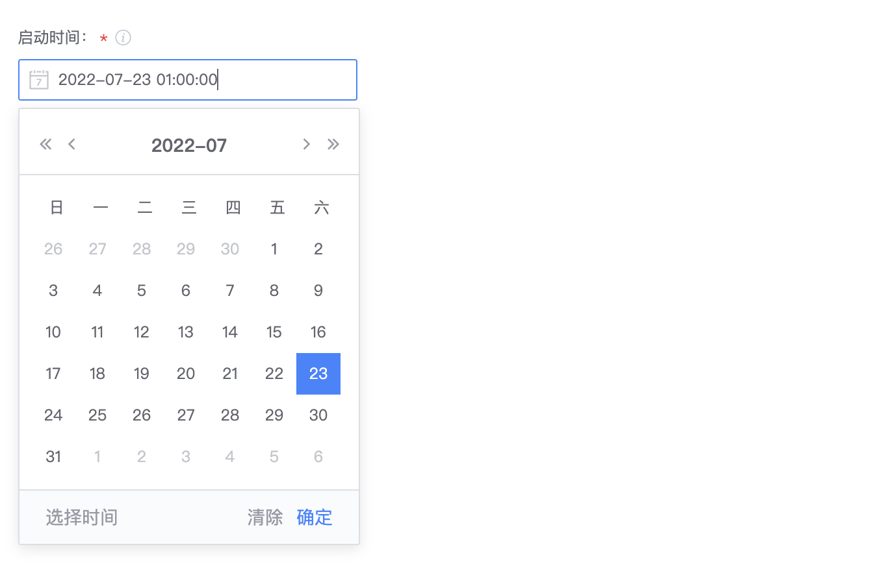

## user-input
user-input allows user input to be displayed as a label

**demo：**
```json
{
    "input": {
        "receiver": {
            "label": "receiver",
            "type": "user-input",
            "inputType": "all",
            "desc": "You can fill in any user of the company, including mail groups"
        }
    }
}
```
**Plugin gets input：**
```python
import python_atom_sdk as sdk
import json

receiver = sdk.get_input().get("receiver")  # string
receiver_list= json.loads(receiver)  # convert to list [ "ponyma", "jackma" ]
```
**Component visualization：**

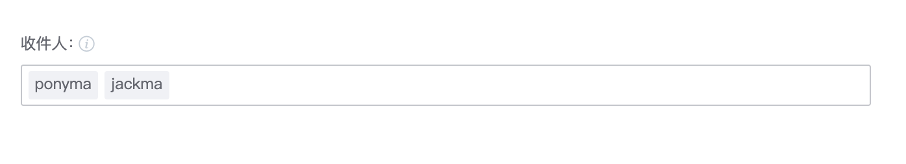

## tips
tips to the user to provide hints, support reference to the built-in variables of the plug-in, support dynamic preview of user input parameters, support hyperlinks

**demo：**
```json
{
    "input": {
        "username": {
            "label":" username",
            "default":"",
            "placeholder":"please enter username",
            "type":"vuex-input",
            "desc":" username",
            "required": true
        },
        "tiptext": {
            "label": "tips",
            "type": "tips",
            "tipStr": "Welcome {username} to the {projectId} project experience. [click to view](http://www.qq.com)",
            "desc": "tips"
        }
    }
}
```

**Component visualization：**

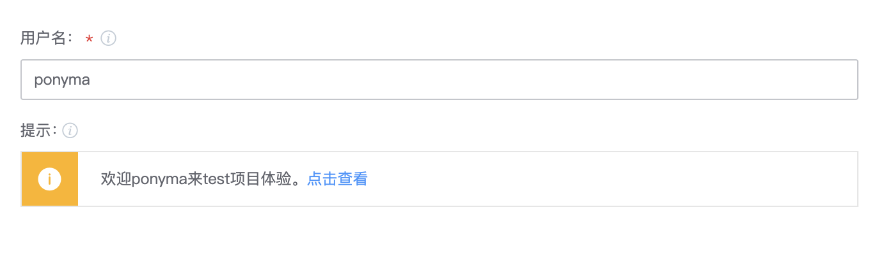


## Public Properties

### inputType
**vuex-input**
**demo：**
```json
{
    "input": {
        "password": {
            "label":" password ",
            "placeholder":"please enter password ",
            "inputType": "password",
            "type":"vuex-input",
            "desc":"please enter password ",
            "required": true
        }
    }
}
```
**Component visualization：**

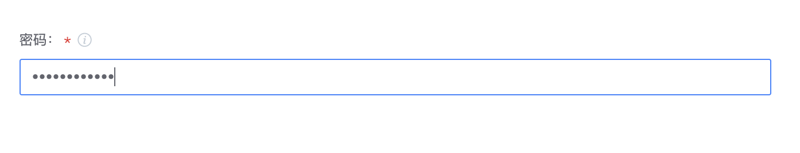

### groupName

Use inputGroup to group input components, and use the groupName field in the component to indicate which group the current component belongs to.

**inputGroup**

* Input field grouping, optional, after setting, input fields can be displayed by group, support expand by group put away
* The value format is array.
* Multiple groups can be set, each group is described using an object, including the following properties.

| Attribute Name | Attribute Description | Format | Remarks |
| :--- | :--- | :--- | :--- |
| name | groupName | string | required, configured in the groupName of the input field, identifies the group to which the field belongs |
| label | groupName | string | Required, the name of the group that the user sees directly |
| isExpanded | Whether to expand | boolean | Required, whether to expand the group by default |

**demo：**

```json
{
  "inputGroups": [
    {
      "name": "fetch",
      "label": "fetch",
      "isExpanded": true
    },
    {
      "name": "submodule",
      "label": "submodule",
      "isExpanded": true
    }
  ],
  "input": {
    "fetchDepth": {
      "label": "git fetch's depth parameter value",
      "default": "",
      "placeholder": "",
      "type": "vuex-input",
      "desc": "",
      "required": false,
      "disabled": false,
      "hidden": false,
      "isSensitive": false,
      "groupName": "fetch"
    },
    "enableSubmodule": {
      "label": "",
      "default": true,
      "placeholder": "",
      "type": "atom-checkbox",
      "text": "enable Submodule",
      "desc": "Check to enable external links, uncheck to not enable",
      "required": false,
      "disabled": false,
      "hidden": false,
      "isSensitive": false,
      "groupName": "submodule"
    },
    "submodulePath": {
      "label": "",
      "default": "",
      "placeholder": "Please fill in the Submodule path you want to pull, separate multiple paths with commas, or pull all Submodule by default.",
      "type": "vuex-input",
      "desc": "",
      "required": false,
      "disabled": false,
      "hidden": false,
      "isSensitive": false,
      "groupName": "submodule",
      "rely": {
        "operation": "AND",
        "expression": [
          {
            "key": "enableSubmodule",
            "value": true
          }
        ]
      }
    }
  }
}
```

**Component visualization：**

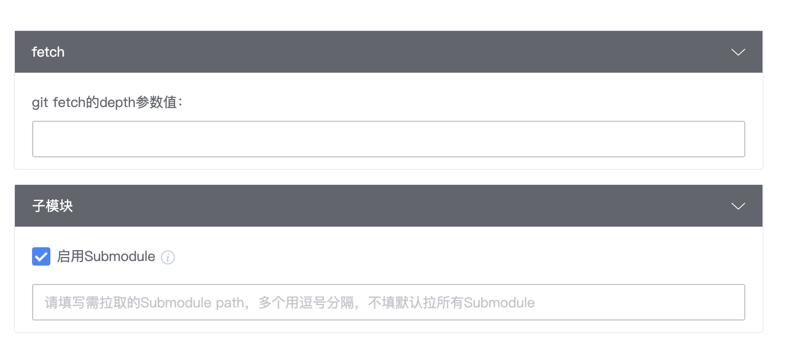

### isSensitive
If the user needs to enter sensitive information, using the isSensitive property, by default the plaintext will not be output in the log unless the user actively prints the input fields using sdk.log.info

**demo：**

```json
{
    "input": {
        "password": {
            "label":" password ",
            "placeholder":"please enter password ",
            "inputType": "password",
            "isSensitive": true,
            "type":"vuex-input",
            "desc":"please enter password ",
            "required": true
        }
    }
}
```

**Component visualization：**

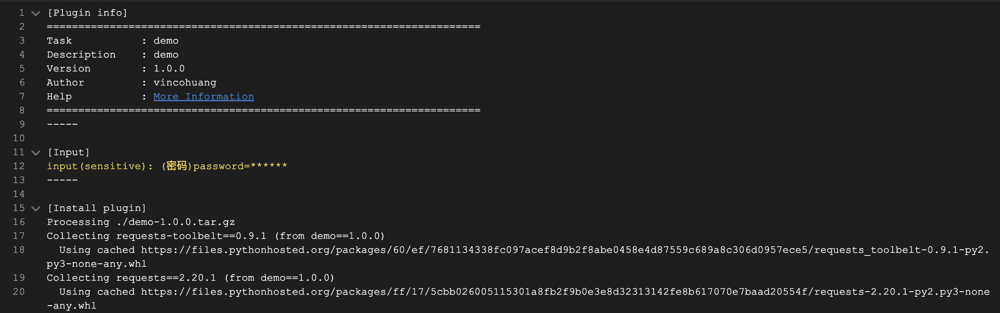

### rely
The dependency allows the user to show/hide the current component based on a condition, and is usually used for item dependencies between components. Dependencies are divided into AND and OR, representing logical AND and logical OR respectively. Logical AND indicates that all conditions must be satisfied to display, while logical OR indicates that any condition is satisfied.

**Examples of using AND:**

```json
{
  "input": {
    "repositoryType": {
      "label": " code base ",
      "default": "ID",
      "desc": "value is ID/NAME/URL",
      "type": "enum-input",
      "required": true,
      "disabled": false,
      "hidden": false,
      "isSensitive": false,
      "list": [
        {
          "label": "select by code base",
          "value": "ID"
        },
        {
          "label": "select by name",
          "value": "NAME"
        },
        {
          "label": "select by url",
          "value": "URL"
        }
      ]
    },
    "repositoryUrl": {
      "label": " code base URL",
      "default": "",
      "placeholder": "please enter code base URL",
      "type": "vuex-input",
      "desc": "",
      "required": false,
      "disabled": false,
      "hidden": false,
      "isSensitive": false,
      "rely": {
        "operation": "AND",
        "expression": [
          {
            "key": "repositoryType",
            "value": "URL"
          }
        ]
      }
    },
    "authType": {
      "label": "Authorization Type",
      "default": "TICKET",
      "type": "selector",
      "required": false,
      "disabled": false,
      "hidden": false,
      "isSensitive": false,
      "options": [
        {
          "name": "null",
          "id": "EMPTY"
        },
        {
          "name": "ticket",
          "id": "TICKET"
        },
        {
          "name": "access token",
          "id": "ACCESS_TOKEN"
        },
        {
          "name": "username/password",
          "id": "USERNAME_PASSWORD"
        },
        {
          "name": "start user token",
          "id": "START_USER_TOKEN"
        },
        {
          "name": "tgit personal_access_token",
          "id": "PERSONAL_ACCESS_TOKEN"
        }
      ],
      "rely": {
        "operation": "AND",
        "expression": [
          {
            "key": "repositoryType",
            "value": "URL"
          }
        ]
      }
    },
    "ticketId": {
      "label": " code base ticket",
      "placeholder": "please select ticket",
      "type": "select-input",
      "desc": "",
      "required": false,
      "disabled": false,
      "hidden": false,
      "isSensitive": false,
      "rely": {
        "operation": "AND",
        "expression": [
          {
            "key": "repositoryType",
            "value": "URL"
          },
          {
            "key": "authType",
            "value": "TICKET"
          }
        ]
      },
      "optionsConf": {
        "searchable": true,
        "multiple": false,
        "url": "/ticket/api/user/credentials/{projectId}/hasPermissionList?permission=USE&page=1&pageSize=10000",
        "paramId": "credentialId",
        "paramName": "credentialId",
        "itemTargetUrl": "/ticket/{projectId}/",
        "itemText": "add a new ticket",
        "hasAddItem": true
      }
    }
  }
}
```

**Component visualization：**

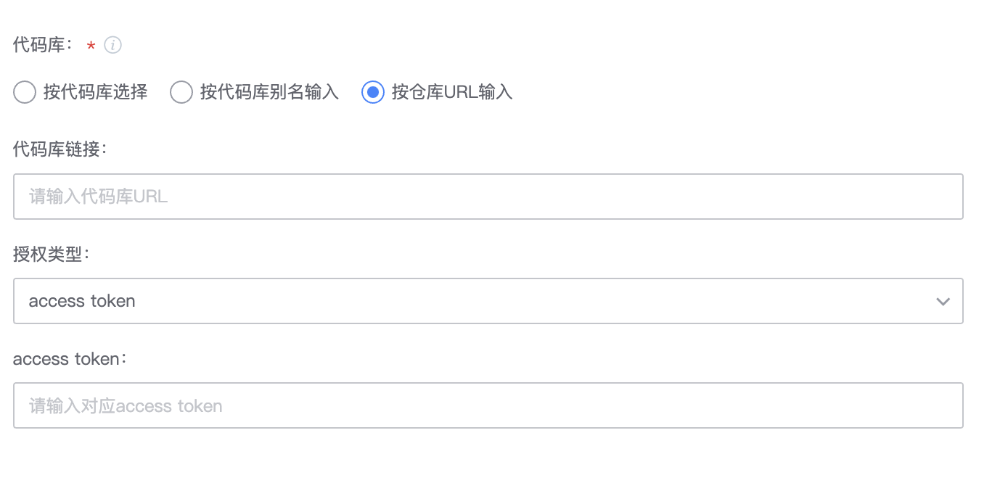

**Example of using OR：**

```json
{    
"input": {
        "send_by": {
            "label": "Message Sending Method",
            "type": "atom-checkbox-list",
            "list": [
                {
                    "id": "weixin",
                    "name": "enterprise weixin",
                    "disable": false,
                    "desc": "Message will be sent to Enterprise Weixin app number, need to configure Enterprise Weixin app number information in ESB first"
                }, 
                {
                    "id": "mail",
                    "name": "mail",
                    "disable": false,
                    "desc": "Send to mail, supports BK users as well as non-BK users "
                },
                {
                    "id": "dingtalk",
                    "name": "pinned",
                    "disable": false,
                    "desc": "Send a single chat message to the nail number corresponding to the BK user, you need to configure the nail notification properly first, refer to: https://github.com/wenchao-h/ding-blueking"
                }
            ]
        },
        "send_to": {
            "label": "Send to",
            "default":"",
            "placeholder": "The BK username that receives enterprise WeChat/Pin messages",
            "type": "user-input",
            "inputType": "all",
            "desc": "Enter a carriage return to separate multiple usernames",
            "required": true,
            "rely":{
                "operation": "OR",
                "expression":[
                    {
                        "key": "send_by",
                        "value": ["weixin","dingtalk"]
                    }
                ]
            }
        }
    }
}
```

**Component visualization：**

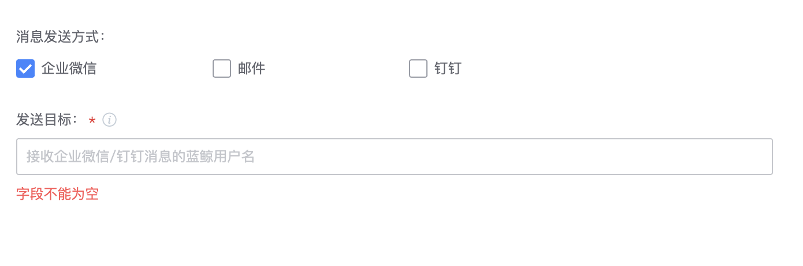

### rule

The rule attribute restricts user input and supports the following attributes.

|Attribute Name|Attribute Description|Configuration Format|Remarks|
|--|--|--|--|
|alpha|Only English characters are allowed| Boolean  | demo：<br/>// Only letters are allowed, and the string length is 3-7<br/>"rule": {<br/>    "min": 3,<br/>    "max": 7,<br/>    "alpha": true<br/>} |
|numeric|Only Number characters are allowed|Boolean| |
|alpha_dash|Can contain English, numbers, underscores, and underscores|Boolean| |
|alpha_num|Can contain English and numbers|Boolean| |
|max|string max length|int||
|min|string min length|int||
|regex|Regular expressions|string|Example:<br/>// Regular matches string starting with a number <br/>"rule": { "regex": "\^[0-9]" }|

**demo：**
```json
{
    "input": {
        "username": {
            "label":" username",
            "placeholder":"please enter username",
            "type":"vuex-input",
            "desc":"please enter username",
            "required": true,
            "rule": {
                "alpha_num": true,
                "max": 25,
                "min": 3,
                "regex": "^[a-zA-Z]"
            }
        }
    }
}
```

**Component visualization：**

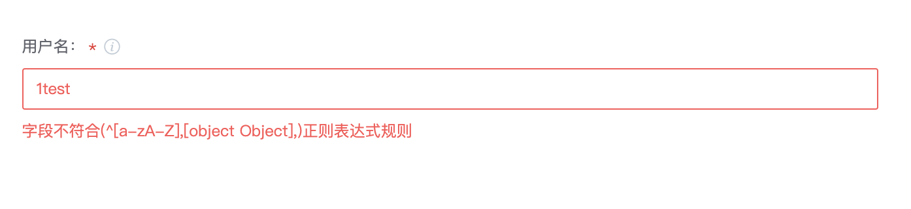