# Common Plugin Installation

This article will guide you on how to install plugins in bk-ci.

## Commonly used plugins download address

* **pushJobFile**

> Distribute products to the target server using the job platform

https://github.com/ci-plugins/pushJobFile

Compile environment: No compile environment

Development language: java


* **executeJob**

> call the job platform to execute a job

https://github.com/ci-plugins/executeJob

Compile environment: no compile environment

Development language: java


* **executeJobScript**

> call the job platform to execute a script

https://github.com/ci-plugins/executeJobScript

Compile environment: no compile environment

Development language: java


* **sendEmail**

> Send notification emails

https://github.com/ci-plugins/sendEmail

Compiler environment: no compiler environment

Development language: java


* **checkout**

> git pull code

https://github.com/TencentBlueKing/ci-checkout

Compile environment: Compile environment (Linux + macOS + Windows)

Development language: java


* **sendmsg**

> 1. send enterprise weibo messages (requires ESB configuration)
> 2. send email messages (requires ESB configuration)
> 3. send enterprise WeChat group messages

https://github.com/wenchao-h/bkci-plugin-sendmsg

Compiler Environment: (Linux + Windows + MacOS)

Development language: Python

---

## Installation steps

Take the installation of **pushJobFile** plugin as an example, the installation steps are basically the same.

### I. Download the installation package

According to the plugin download address, download the installation package first.

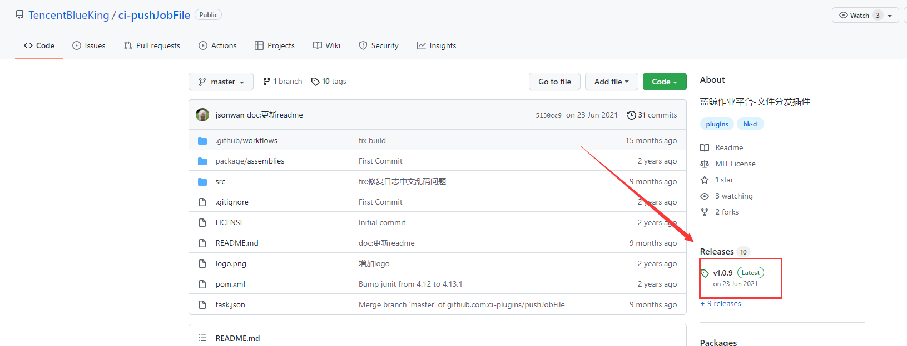

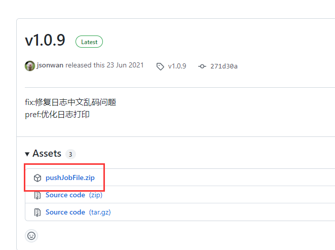

---

### II. Accessing the workbench

Path.

BlueShield ----->R&D Store ---->Workbench

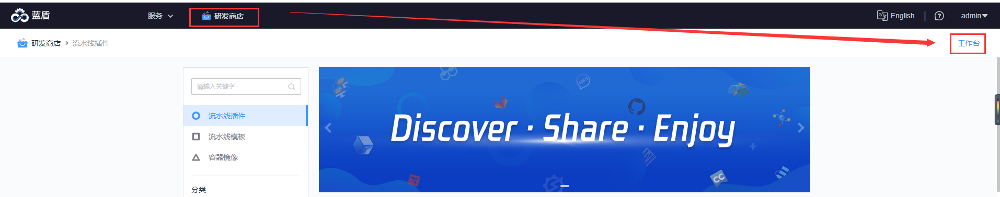

---

### III. New plugins

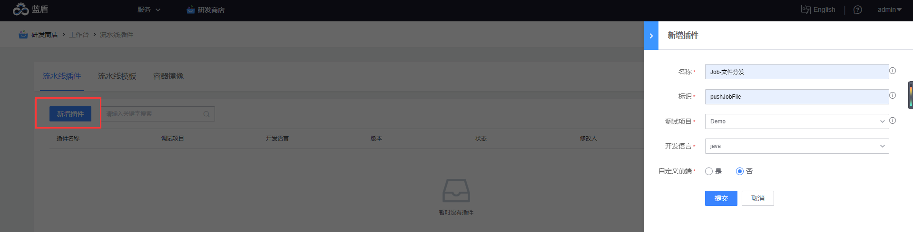

Name: can be filled in custom.

Identifier: must be the same as the name of the plugin installer file to be installed. The case must also be the same.

Debug project: Select the project for debugging the plug-in.

Development language: Select the language for the plug-in development.

Custom front-end: If you do not need to customize the front-end, you can choose No.

---

### IV. Plugin configuration

plug-ins need to do the configuration, GitHub page are introduced. https://github.com/TencentBlueKing/ci-pushJobFile

pushJobFile need to configure.

1. plug-in configuration
When the plug-in on the shelf, you need to configure the relevant parameters of BK Smart Cloud, the path: Settings -> Private Configuration

2. Job platform configuration
Please add all the IPs of the machines where artifactory is located in the backend of BK continuous integration platform to the IP whitelist of the job platform, and configure them in the "Platform Management->IP Whitelist" of the job platform. IP update to the whitelist.


**Plug-in configuration**

When the plug-in is on the shelf, you need to configure the relevant parameters of BK Smart Cloud, the path: Settings->Private Configuration

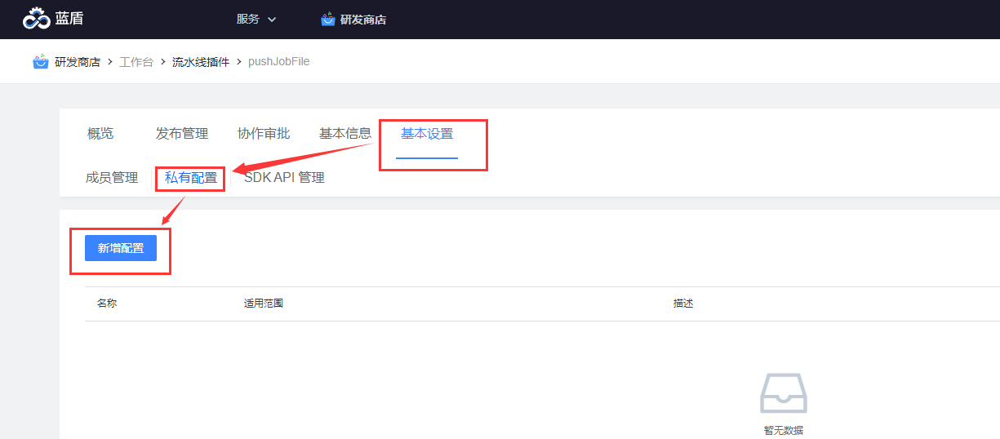

In the BK Central Controller, follow the GitHub guidelines to get the relevant variables.

```
source ${CTRL_DIR:-/data/install}/load_env.sh

echo "BK_APP_ID $BK_CI_APP_CODE"
echo "BK_APP_SECRET $BK_CI_APP_TOKEN"
echo "ESB_HOST $BK_PAAS_PRIVATE_URL"
echo "JOB_HOST $BK_JOB_PUBLIC_URL"

# Reference output
BK_APP_ID bk_ci
BK_APP_SECRET slightly
ESB_HOST http://paas.service.consul:80
JOB_HOST http://job.bktencent.com:80
```

After getting the variables, **add configuration** fill in each variable

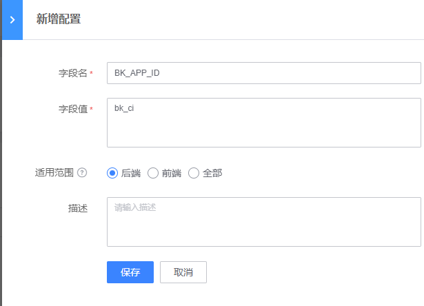


**Working platform configuration**

Please add all the IPs of the microservice artifactory in the backend of BK Continuous Integration Platform to the IP whitelist of the job platform, and configure them in the "Platform Management->IP Whitelist" of the job platform. IP update to the whitelist.


1、Get the IP of the artifactory machine in the central control machine first

cat /data/install/install.config| grep artifactory


2、In the operation platform, add the IP to the whitelist

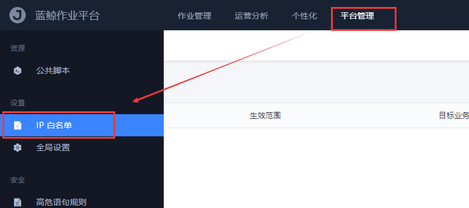

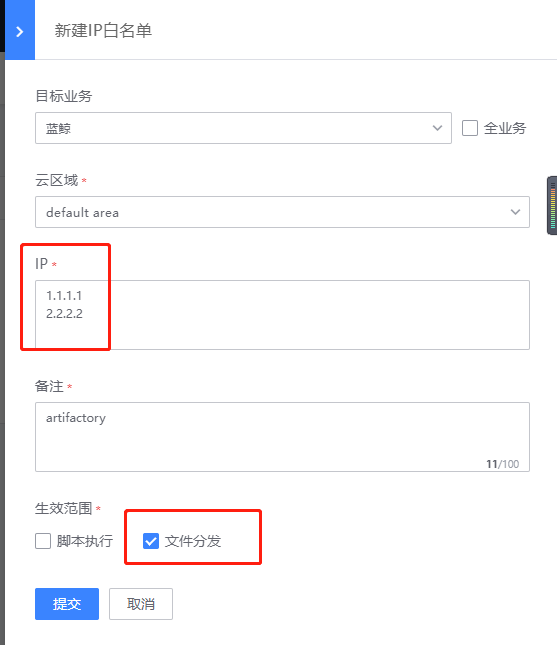

---

### V. Racking plugins

After the configuration is complete, return to the workbench and select Shelf Plugin

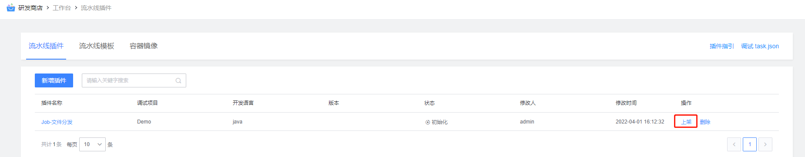

Follow the instructions to fill in the information and upload the plugin installation package you got from GitHub

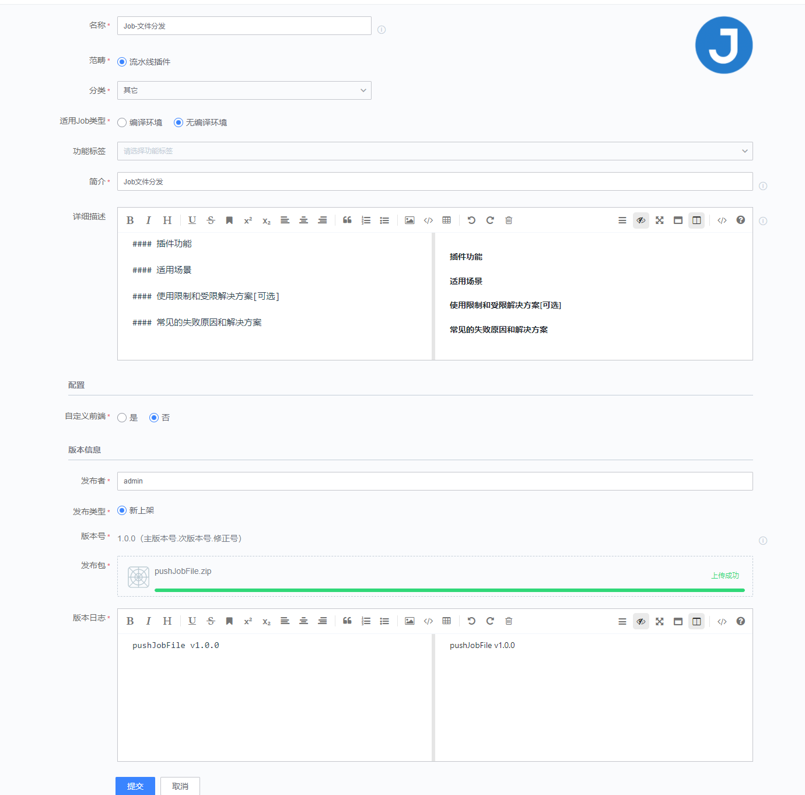

When you click Submit, you will be taken to the plugin testing phase. Here the plugins are already developed, just click **Continue** to skip the test.


The plugin **pushJobFile** was successfully shelved to the R&D store and is ready for plugin installation.


---

### VI. Installation of plug-ins

After the plug-in is successfully shelved, you can install the plug-in. Only projects that have installed the corresponding plug-ins can use the corresponding plug-ins.

"R&D Store" - "Click on the corresponding plug-ins" - "Installation" - "Select the corresponding project" - "installation"


**Enter the R&D store and select the corresponding plug-in**

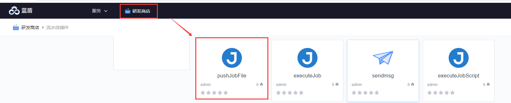

**Select the plugin to install**

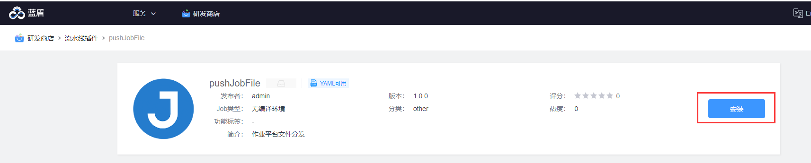

**Select the project the plugin is to be installed to**

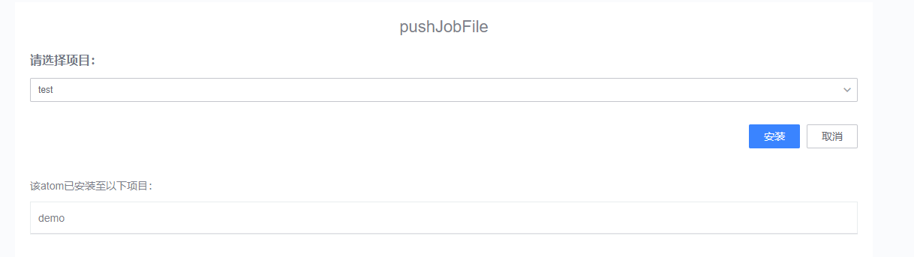

---

### VI. Installation of plug-ins

After the plug-ins are successfully installed on the shelves, you can install the plug-ins. Only the project with the corresponding plug-in installed can use the corresponding plug-in.

"R&D Store" - "Click the corresponding plug-in" - "Installation" - "Select the corresponding project" - "Installation"


**Enter the R&D store and select the corresponding plug-in**


**Select the plug-in to install**

**Select the project to which the plugin is to be installed**


So far the plugin **pushJobFile** has been successfully installed, you can follow this method to install other plug-ins.