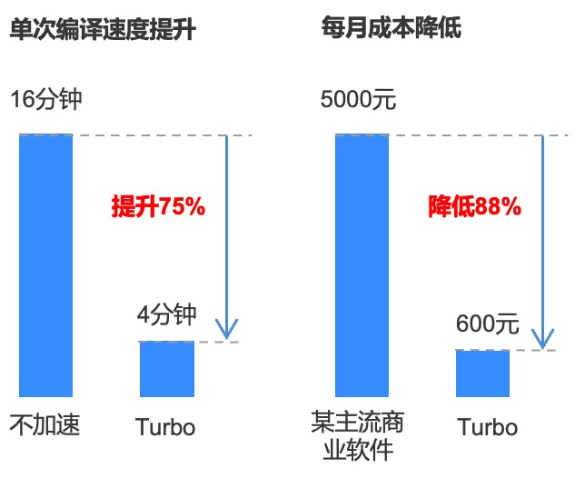

# **bokura - boosts server-side compilation speed by 75% with volume-based compilation acceleration solution**

||
|:-|
|**Products covered:** BKCI Pipeline; Compile Acceleration Turbo|
|**Scenario Tags:** Compile Acceleration Solution by Volume; C++ Code Compilation; Compile Acceleration in Windows Subsystem for Linux Scenario|
|**Problem solved:** C++ code compilation slow|

1. Ltd. was founded in 2021 in Shanghai by well-known producer Chen Min. The company focuses on large scale high precision MMORPG/ARPG field, CEO Chen Min was in charge of "Dragon Valley Handheld" and "The Legend of Fairyland - Love as First Sight" (RagnarokOringin in Korean) handheld game, with two consecutive successful pop-up project experience.
   During our communication with bokura, we learned that as the development progressed, bokura's development efficiency on the server side began to be gradually affected by the compilation efficiency of.

   1. a single full compilation on the server side (C++) took nearly 16 minutes, **taking up development machine resources during compilation**
   2. high software license fees** for mainstream** commercial compilation acceleration software on the market, **limited support for compilation acceleration in Windows Subsystem for Linux scenarios**

   **Based on the description of bokura, we recommend BKCI Compile Acceleration (Turbo) to bokura, which can be billed on a per-volume basis. BKCI Compile Acceleration is a compilation solution implemented by BKCI based on distributed compilation technology, caching technology, and container technology.** After the delivery of the compilation acceleration solution, bokura tested its server-side (C++) builds and found that both in terms of compilation speed and cost of use, the solution had a significant effect on.

   1. **The single compilation time was reduced from 16 minutes to 4 minutes, with an acceleration ratio of 75%.**.
   2. **The cost of use is only 600 RMB/month (see appendix for calculation, actual cost fluctuates according to the monthly compilation volume), which has a huge cost advantage over a mainstream commercial software.**

In response to the results of compilation acceleration, bokura's server-side developer said, "Compared to the commercial software we tried, BlueShield's compilation acceleration better supports the acceleration of compilation tasks in the WSL environment. At the same time, the compilation acceleration is based on actual usage, so we can accelerate our server-side compilation work at a very low cost, which has greatly improved our back-end development work efficiency!"

Next, BKCI will continue to optimize the compilation effect and cost of C++ and start exploring the option of accelerating the compilation of client-side UE4 code, so stay tuned!

**Appendix: Usage Cost Estimate**

Cost of compile-accelerated Turbo computing resources (4C8G*24 copies).

CPU $0.055/hour per core * 4C * 24 copies / 60 minutes = $0.088/minute

Memory $0.032/hour per G * 8G * 24 copies / 60 minutes = $0.1024/minute

Cost of a single acceleration for a total of 4 minutes (0.088 + 0.1024) * 4 = $0.76 

Estimated monthly cost of compile acceleration Turbo.

20 builds/day * 20 days/month * $0.76/time + $300/month (VPN fee) = $600/month

Monthly cost estimate for a major commercial software.

$10/core/month * 16 cores * 5 development machines ≈ $5000/month

Translated with www.DeepL.com/Translator (free version)