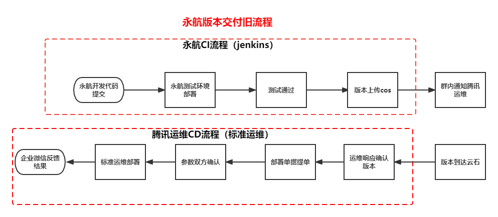
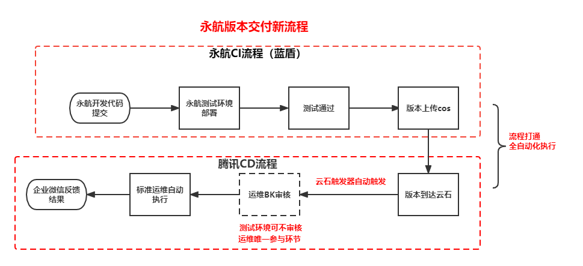

# **yonghang--Cross-Environment CICD Interoperability via BK BKCI**

 

||
|:-|
|**Products covered:** BKCI Pipeline; BK Standard O&M|
|**Scenario Tags:** CICD hitting across network environments; compilation automation|
|**Problems solved:** Low automation; versioning errors and missing changes|

yonghang, a subsidiary of Tencent, is a game development company based in Beijing. Since 2008, Yonghang has launched QQ Dazzle Dance, QQ Dazzle Dance 2, QQ Dazzle Dance Mobile and other popular game products on Tencent's game platform. Among them, QQ Dazzle Dance endgame is one of Tencent's "Four Greatest Hits" and an important six-star business, with rapid version iterations and constantly new gameplay, and still maintains year-on-year revenue growth.

In the past CI/CD process of yonghang, the low level of automation and reliance on manual communication and operational interventions led to the timeliness as well as accuracy of manual interventions, which became the decisive factor in the process of package out and release.

By using BK BKCI tools, yonghang achieved the following efficiency improvements in the CI/CD process.
1. analyzed and located the time-consuming steps in the CI process, and completed the construction of a series of automated pipelines, automating the processes of "automatic version packaging", "automatic version upload", "one-click deployment of internal development environment ", "automatic notification" and other processes automation, **release yonghang developers in the CI process about 3 development manpower.**
2. connect the gap between yonghang and the official release environment through YUNSHI trigger, **by automating the operation and reducing the cost of communication, the cross-environment deployment process time is reduced by 84%, and also completely avoid the occurrence of wrong changes and missed changes in the release phase.**

For the efficiency improvement achieved by BKCI, yonghang's game developer said: "BKCI has integrated multiple versions of multiple businesses into a unified system, and testing/art/planning can all participate in the implementation of their respective deployment links, reducing cross-part communication barriers. Now, through the BKCI pipeline, internal testing students can directly update Tencent's testing environment through the BKCI pipeline and give us direct feedback on the results. The linkage of Tencent's internal CD process through the YUNSHI trigger greatly reduces communication and waiting time, especially in the case of emergency versions on weekends, and improves the efficiency of the entire project version deployment. "

yonghang has opened up the whole CI/CD process through BK BKCI and realized comprehensive automation from CI to CD. A number of yonghang businesses have completed access to BK and BKCI, and as far as yonghang's feedback is concerned, the effect is remarkable, saving yonghang's manpower investment from development to release process involving different functional students such as art, front-end and back-end development, testing, and operation and maintenance. Currently, yonghang is exploring more deeply the scenarios of compilation acceleration and code checking, and continues to deepen the use of BKCI from the dimension of finding and fixing code defects as well as improving compilation speed.
