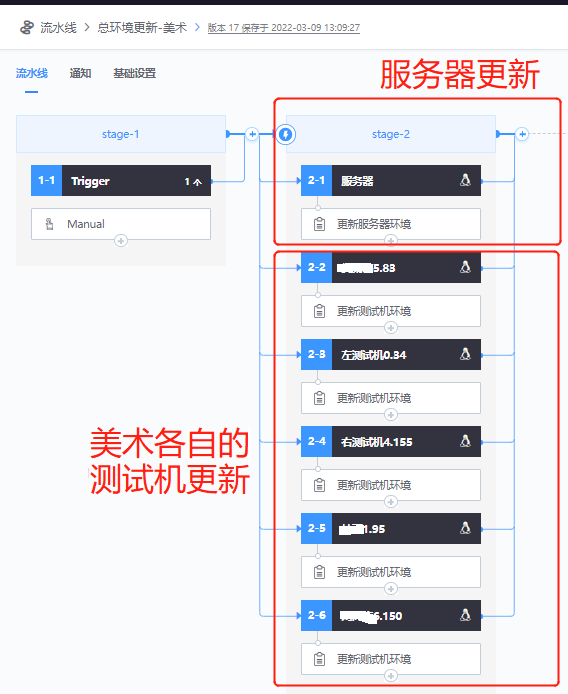
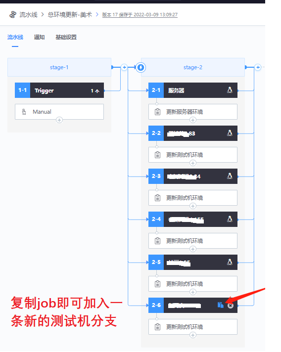

# The artists update the game resources themselves

## Key words: update resources, art design

## Business challenge

In the process of game development, artists need to test and accept the scene resources and the effect of art configuration, and frequently update the client and server of different test clothes. However, most artists do not have a linux technical background, so they need to manually update the content to P4, and then through cross-team communication, complete the linux server environment update with the cooperation of the server developers and even the technical center platform developers. The intermediate links of communication, collaboration and waiting may take 10-30 minutes, which makes it take more than 1 hour to complete a small function test and acceptance.

## BKCI advantage

BKCI helps artists update the server and client environments independently through a graphical interface. It can now be done by one artist without any additional communication.

## solution

First of all, developers configure pipeline. The main jobs are: pipeline trigger, server update, art test machine update

When artists visit the above pipeline, they only need to "fill in parameters", "select their own test machine" and click "Execute" to complete the entire resource update operation.

If someone new or a new art machine comes in, just copy the existing job. Less assembly line changes, simple maintenance;

