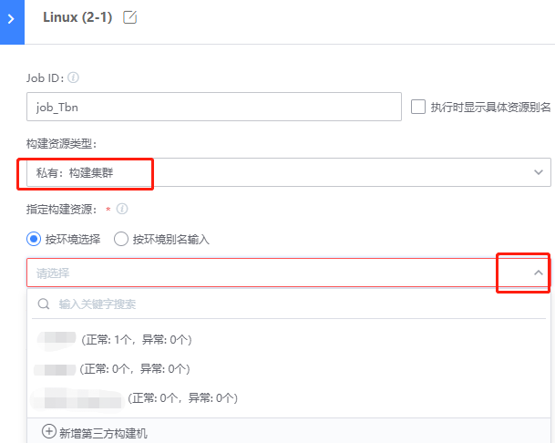

# Form a private build cluster

## Key words: private, cluster

## Business challenge

If multiple single construction machines are used all the time and different pipelines are allocated to different construction machines artificially, it will not only become a burden to maintain the construction machine itself, but more importantly, the efficiency of the construction machine is low.

## BKCI advantage

BKCI environmental management can integrate multiple single construction machines into construction clusters to improve overall resource utilization efficiency

## solution

1. Open BKCI and select "Environmental Management"

   

2. In the "Add" environment, select the build node

3. Select "Private: Build Cluster" in pipeline Stage configuration

   

After the Job is formed into a construction cluster, the algorithm for finding construction nodes is as follows:

