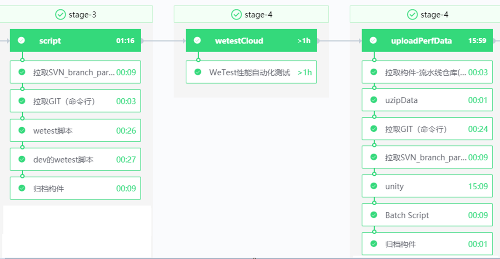

# Automated client performance testing

## Keywords: Automated test, PerfDog

## Business challenge

PerfDog is a performance tool for mobile platforms, available on Android and iOS. Automated performance testing can be customized through secondary development of PerfDogService, which is open to the public by PerfDog. All PerfDog data are collected by human beings, so the collection efficiency and accuracy are low. At the same time, the iteration speed of the test package is very fast, so the pressure of human testing is very great.

## BKCI Advantage

On BKCI, the performance automation interface of PerfDog Service is invoked through encapsulation to achieve the purpose of automatic data collection and labeling of different scene phases.

## solution

1. Instructions for PerfDog

The website of the PerfDog is https://perfdog.qq.com/

PerfDogService instructions: https://bbs.perfdog.qq.com/article-detail.html?id=54

2. Combination of client performance testing and PerfDog Service

Encapsulates the interface of PerfDog Service, adds functionality such as time update threads, and adds the ability to parse the full amount of PerfDog data to extract the desired content. (Please contact the customer service of PerDog official website for specific implementation methods and instructions)

3. Configure BKCI pipeline

Combined with BKCI pipeline and wetest cloud real machine to automate the construction and complete automatic data collection.

