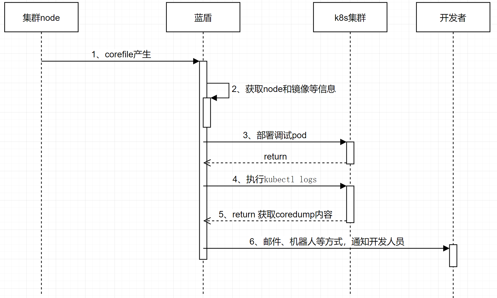
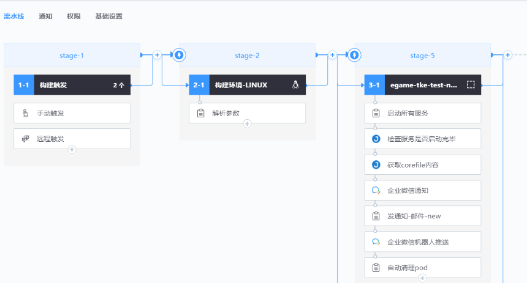

# The cloud environment is abnormal

## Keywords: cloud environment, corefile

## Business challenge

After the service is on the cloud, the game process occurs core. Due to pod node drift and other reasons, it is difficult to find corefile and debug breakpoints.

## BKCI advantage

BKCI automatically pulls up the debugging node and sends coredump content to background development by email. If there is a demand for breakpoints, log in to the debugging pod on the master node of the cluster for debugging and locating.

## solution

1. The overall process is as follows:

● node monitors whether corefile is generated

Idea: Write a corefile file monitoring script to remotely trigger the BKCI pipeline when corefile is added, using the BK "job platform" - timed task function.

Script core part sample, for reference only

file_list=`find /data/corefile -mmin -3 -name "core_*"`

● After the BKCI pipeline is triggered remotely, deploy the debug pod based on node ip address and image version

● After debugging pod starts, run the kubectl command to obtain the content of coredump

● Send emails or bots to notify developers

● Developers log in to debug pod and troubleshoot problems

2. BKCI pipeline configuration

● Parsing file names

By parsing the corefile File name, obtain the namespace, file name, image version number, and other information.

● Start the debug pod

Start the debugging pod based on parameters such as the node node and image version

● Get coredump content

Run the kubectl command to obtain the content of coredump

kubectl -n NAMESPACE logs POD_NAME -c corefile-debug

