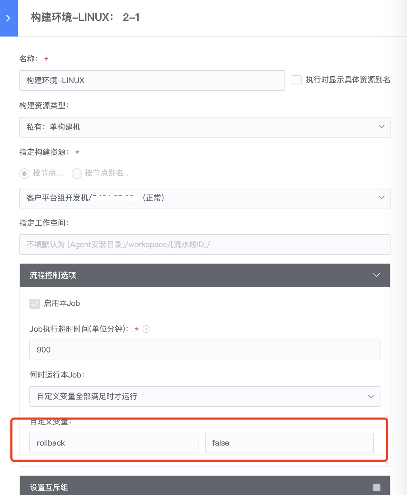

# 实现发布与回滚

## 关键词：发布、回滚 

对于业务运维来说，如果发现业务的发布流程比较机械固定, 那么可以尝试将这些重复的事情交给蓝盾流水线去完成。

## 实践如下： 

1、 配置如下流水线
仅供参考

2、   流水线配置
启动流水线时可以选择参数, 是发布或者回滚； 如果是回滚则需要指定回滚的版本号, 我们增加了流水线参数来控制版本号、回滚版本号以及控制回滚操作, 流水线执行时界面有如下选项（这里只是示例）

插件配置如下：

3、 编译打包归档
编译打包应该只在发布构建时执行, 而回滚时不需要执行；我们使用蓝盾的执行条件选项来控制是否执行本步骤, 红框的部分,这里会判断流水线参数rollback是否为true, 如果false则跳过编译打包步骤

4、  发布与回滚
通过流水线自定义变量来实现控制哪个分支执行

