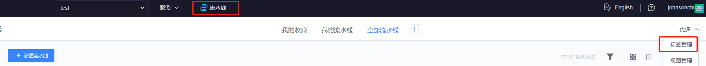
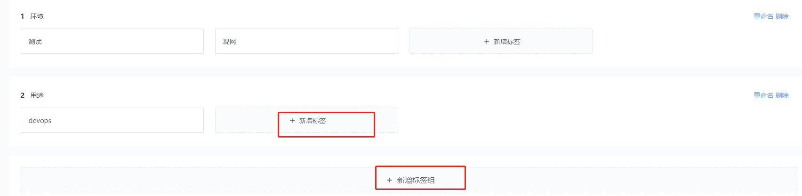
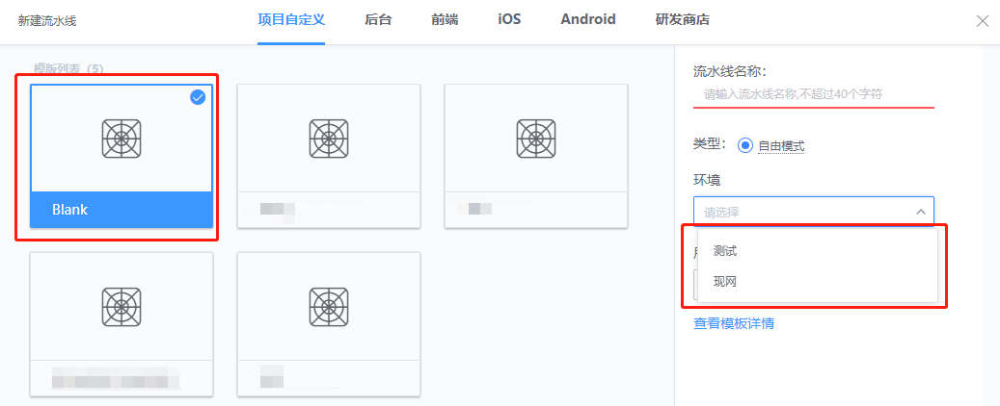
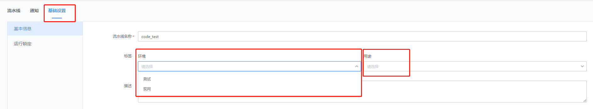
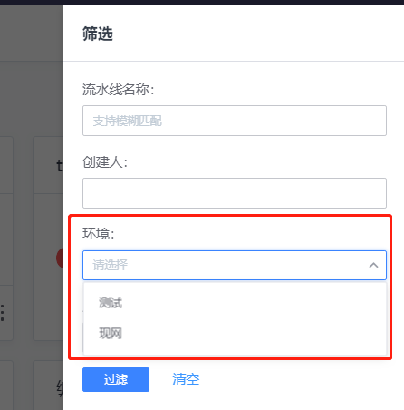

# Manage a large pipeline

## Key words: mass pipeline, label, classification management

## Business challenge

In the middle and later stages of game operation, a large project may have dozens or even hundreds of pipelines, which is a great burden for development, operation and maintenance search and maintenance.

## BKCI advantage

Developers can use the BKCI tagging function to label by environment, product category, etc., so that the number of individual categories is much smaller. At the same time, the filter function of BKCI can be used to achieve accurate positioning.

## solution

1. On the pipeline home page, click "More - Label Management", refer to the following figure

2. On the pop-up page, add groups and labels as required. Note that groups and labels have a one-to-many relationship. Refer to the figure below

3. Label the new assembly line

On the main page of the pipeline, when you create a new pipeline, you will see the environment and usage groups on the right side, which can be selected according to the actual situation. Refer to the figure below

4. Label the stock assembly line

Open the pipeline editing screen, select basic Settings, you can see the group and label Settings. Refer to the figure below

5, accurate filtration

Click the filter button on the main interface of the pipeline, and input the information of the corresponding item on the open interface to filter accurately.

