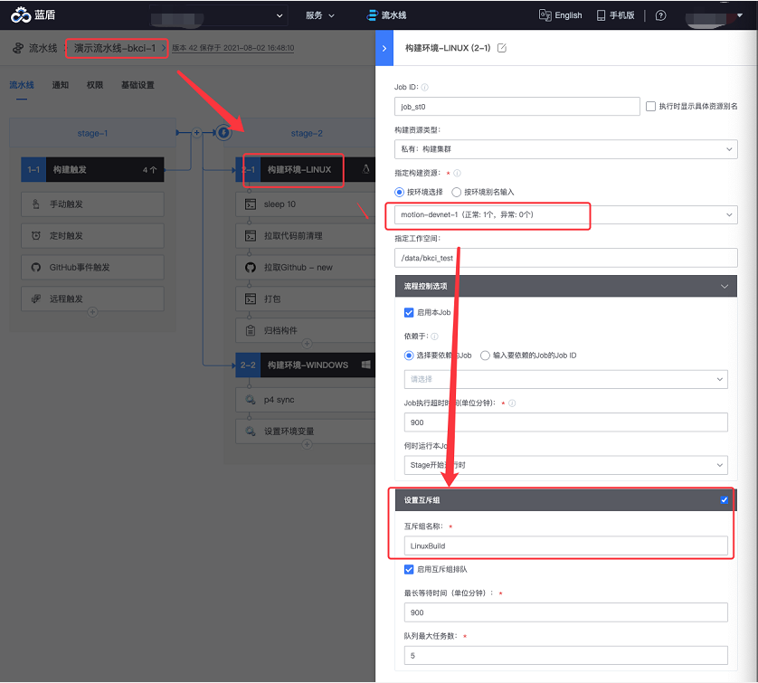
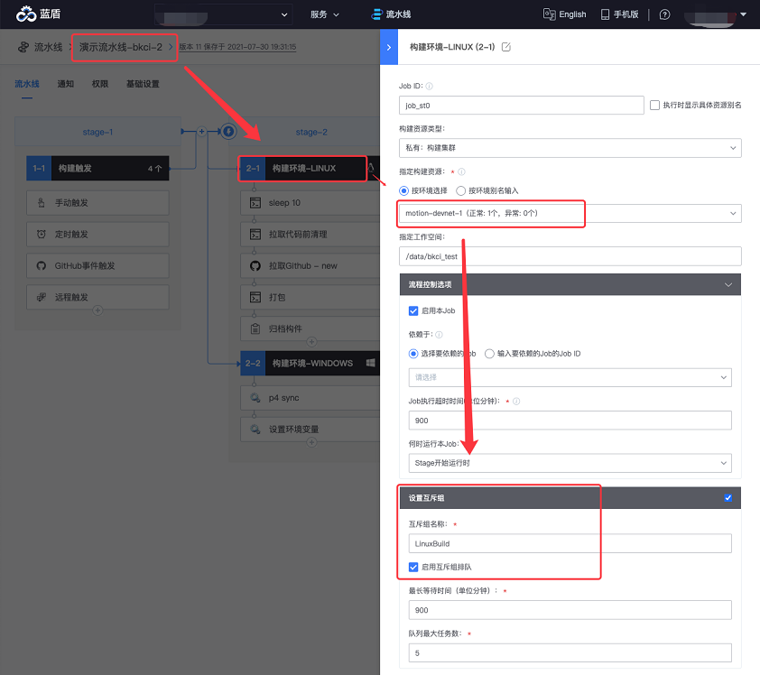

# Pipeline mutual exclusion and queue management

## Key words: mutual exclusion, queue

## Business challenge

When a business performs a build, it often encounters situations where different pipelines need to execute mutually exclusive. For example, a business has two pipelines-one for client packaging and one for server packaging. The two pipelines-must be mutually exclusive, otherwise an error will occur.

## BKCI advantage

The BKCI mutex function enables the queue to be started after the same mutex group is configured on the same construction machine.

## solution

1. Refer to the following figure. In two different pipeline Settings, select Set mutually Exclusive Group. The mutually exclusive group name must be the same.

