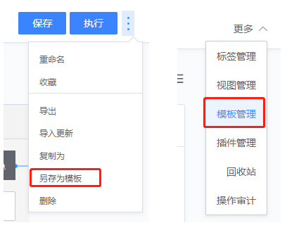
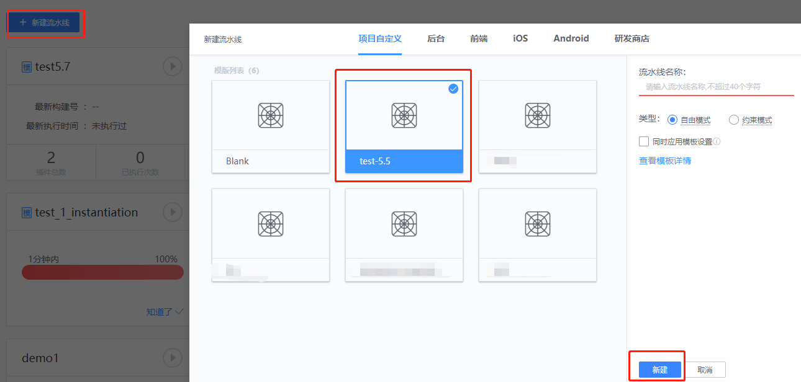
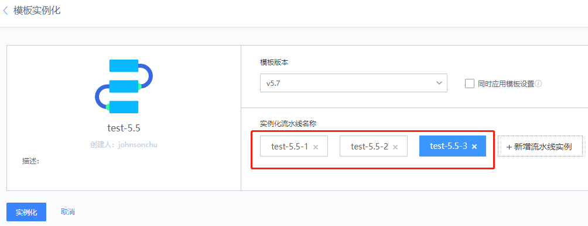
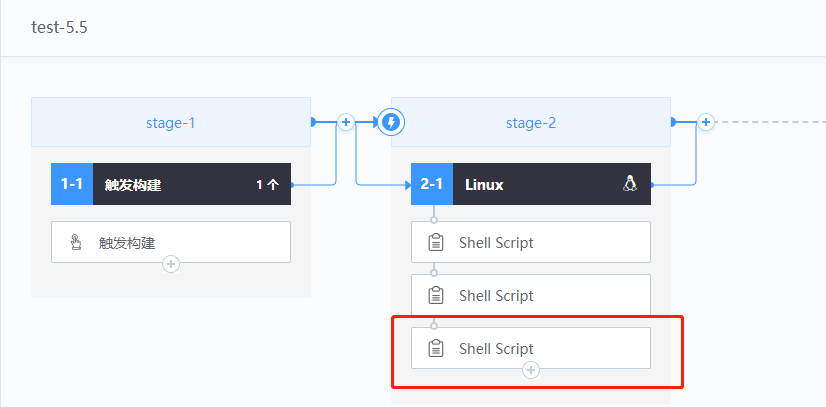
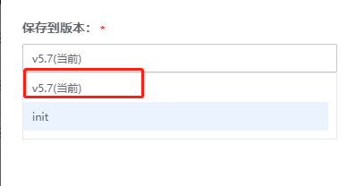
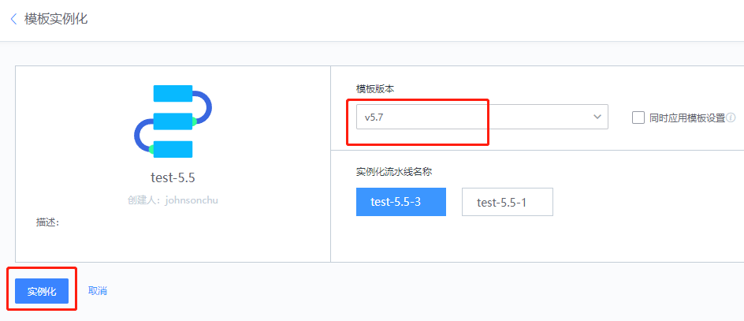
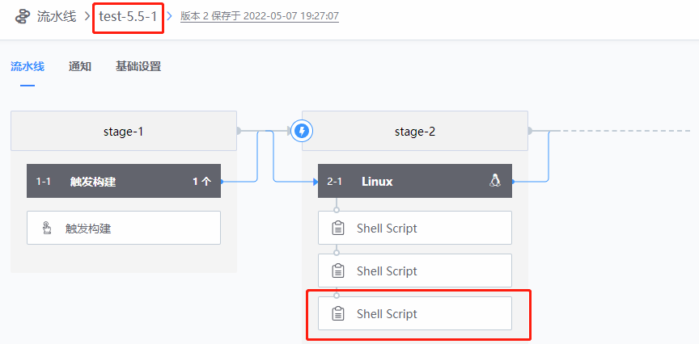

# Pipelining and copying

## Key words: pipeline template, copy

## Business challenge

Over time, there are multiple branching versions of the project; The core task of pipeline corresponding to each branch is similar, the difference may lie in: different builder, different branch name or different language directory, etc. When the core of the pipeline changes, it is usually necessary to modify each pipeline mechanically, which is very inefficient and prone to errors.

## BKCI advantage

Using the BKCI pipeline template and replication functions, users of the same project do not need to fill in a large number of public configurations when creating or maintaining the pipeline.

## solution

● Template creation

Templates can be obtained through the entry "Save as Template" in the upper right corner of the pipeline editing interface. The More - Template Management page on the pipeline main screen allows you to manage templates.

● Template maintenance

Version management: Used to save pipeline template versions of different periods for quick backfile and archiving.

To generate a new pipeline from this template, choose New Pipeline -> Select Template -> Free Mode

As shown in the figure below, it is particularly fast to build a new assembly line. After adjusting some differentiated parameters, the production can be put into the assembly line.

However, under the premise of multiple parallel pipelines at the same time, the maintenance will be more tiring. A common modification may lead to the manual operation of all pipelines under this template to maintain consistency. Instance management provides a relatively simple approach.

Click "Instantiate" to create multiple pipeline instances at the same time.

If we need to change two of the three pipelinesabove: to add a new task, just modify the template "test-5.5" and save it.

Then in the "Instance Management" page, select the pipeline that needs to be changed and click "Batch update" to complete the instance update operation;

It can be found that the total number of the two pipeline plug-ins that need to be changed is changed from "3" to "4".

This way, if common changes are made to multiple pipelinesthere is no need to mechanically make changes to each pipeline.
