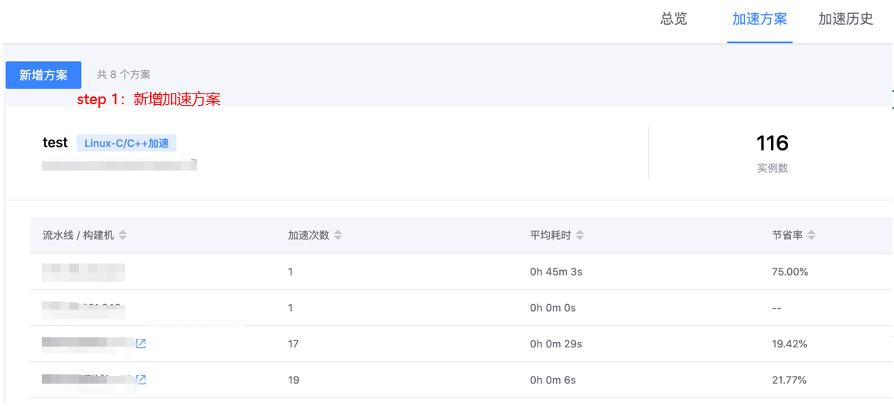
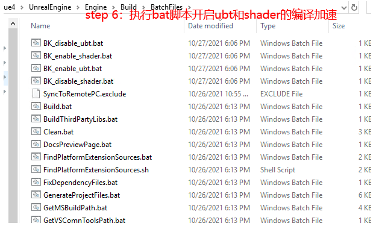

# UE4 engine compilation speed up

## Key words: UE engine, compilation acceleration

## Business challenge

A project based on UE4 game engine will consume a large amount of resources (cpu/ memory/disk) in the code compilation /shader compilation and other links of the project, and it will take dozens of minutes or even several hours to do a full construction, which seriously affects the research and development efficiency.

## BKCI advantage

BKCI applies the TBS (universal task acceleration system) system to some scenarios of UE4, where locally parallel tasks are executed using distributed resources to achieve overall acceleration

## solution

