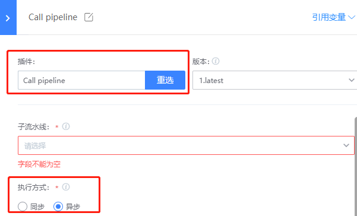

# Call between different pipelines

## Key words: sub-pipeline

## Business challenge

In our daily construction, in order to facilitate subsequent maintenance, we usually separate some public parts to form a "common pipeline" for other pipelines to call; Or, in some scenarios, pipeline execution is required to be in sequence. Pipeline A is executed, and then pipeline B is executed.

## BKCI advantage

BKCI implements call execution between different pipelines through the "subpipeline" plug-in

## solution

1. First create pipeline B as a sub-pipeline

2. Create pipeline A and invoke pipeline B in A

Select the call pipeline plug-in, while also executing synchronous and asynchronous calls, and fill in the variable parameters of the subpipeline

There are also synchronous and asynchronous call execution

● Synchronization

The plug-in that calls the subpipeline is considered successful after the subpipeline is completed. The result of the subpipeline execution is the same as that of the plug-in execution

● Asynchronous

The plug-in only executes the call subpipeline, and the plug-in executes when the call command is executed. If the subpipeline is successfully triggered, the plug-in executes successfully; if the trigger fails, the plug-in fails. The successful running result of the subpipeline does not affect the execution result of the plug-in.
