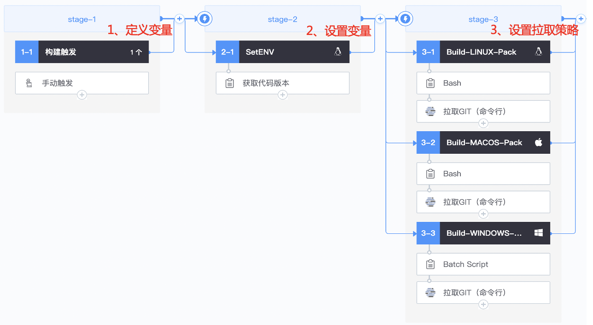
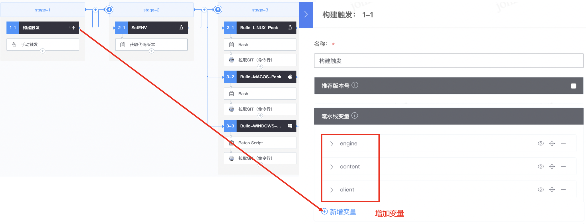
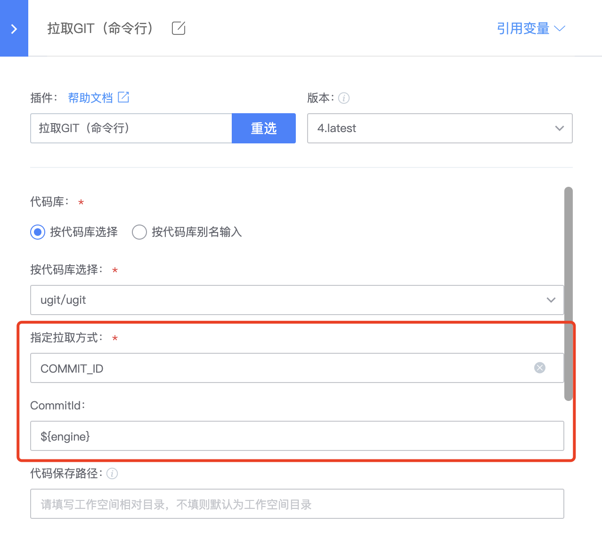
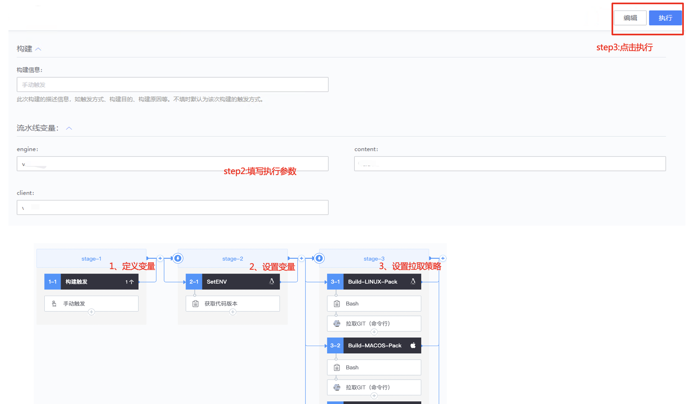

# Build the client consistently in multiple versions

## Key words: multiple versions, consistency

## Business challenge

Building a client may involve multiple code repositories, or building different versions (such as Linux, Windows, MacOS, and so on) on multiple build environments. When pulling the same codebase on different systems, different versions of the code may be pulled due to time differences. To solve this problem, commit information for multiple repositories involved needs to be recorded in a file for each build so that it can be used later; However, when problems are found, they have to be reworked, which greatly affects the efficiency of R&D.

## BKCI advantage

The BKCI pipeline has the ability to set common environment variables to ensure that different jobs (environments) pull the same version of code, reducing the multi-version build exception rate to zero.

## solution

Step 1: The developer configures the pipeline, focusing on defining & setting environment variables and setting code pull policies

Define environment variables. Suppose we build three repositories involving engine, content, and client, then we set three environment variables to correspond to the three repositories.

The pull code policy is set through the environment variable, which is used to pull the specified version code information

Step 2: Fill in the pipeline execution parameters and click "Execute"; Wait for execution to complete.

