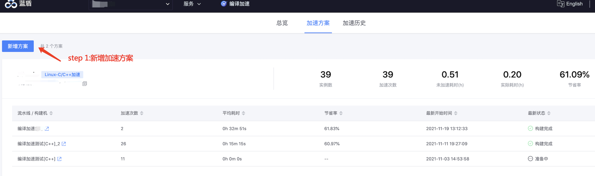
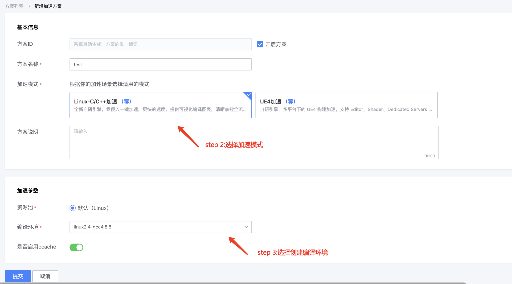
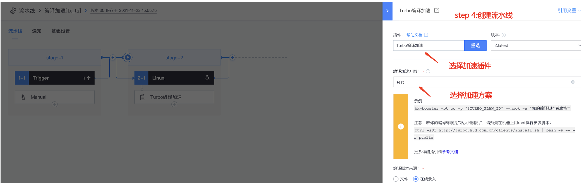
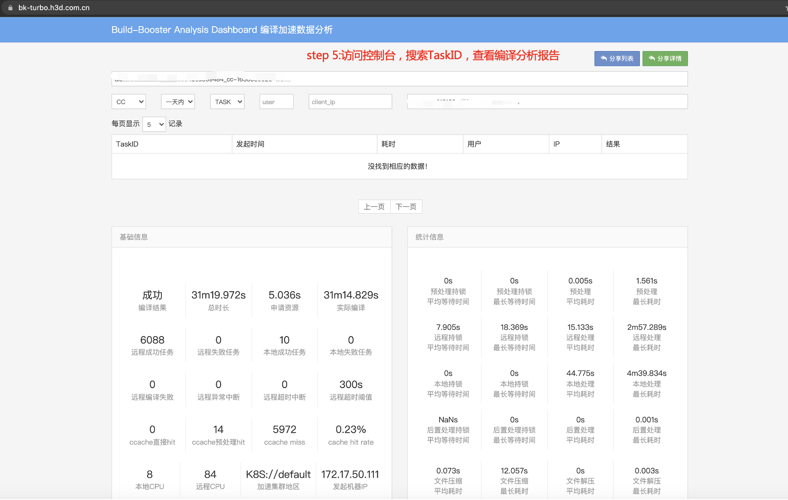

# c/c++ background code compilation acceleration

## Key words: c/c++, compiler acceleration

## Business challenge

After the game entered the test period, with the continuous increase of functions, the amount of code and complexity also increased sharply. Code compilation occupied a lot of time in the development of the program, especially for the programmer who uses the static language c++ as the main daily working language. Some large projects often take tens of minutes or even hours to complete the compilation process.

## BKCI advantage

BKCI provides a set of compilation solutions based on distributed compilation technology, cache technology and container technology, aiming to provide users with efficient, stable and convenient compilation acceleration services.

Tencent internal games, C/C++ compilation time from an average of 1h to about 15 minutes.

## solution

