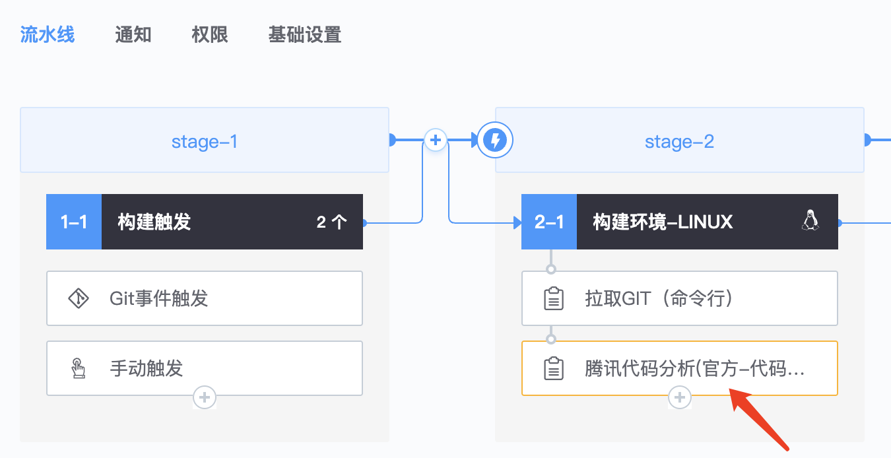
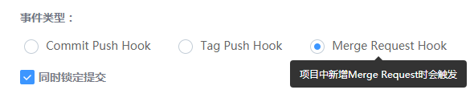
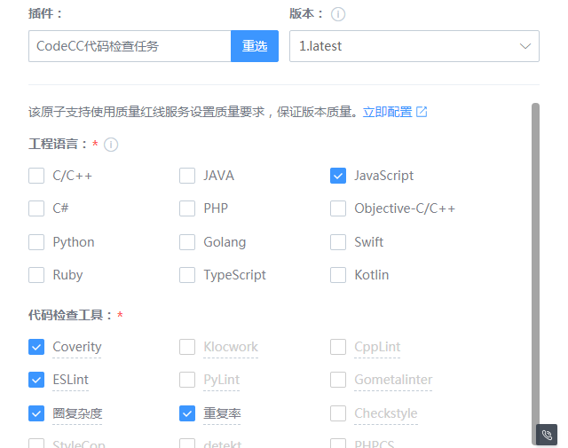
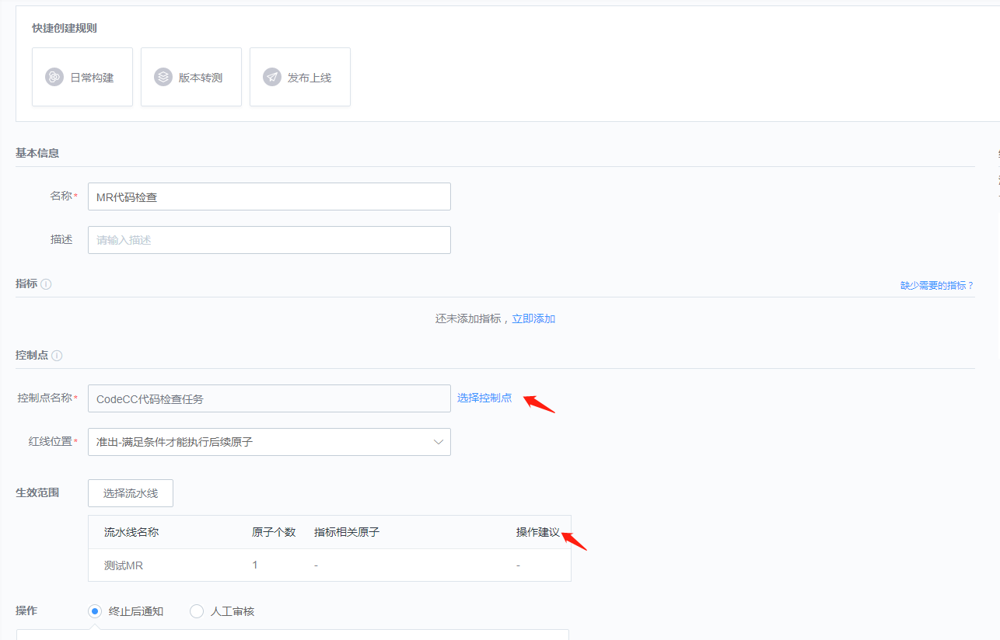
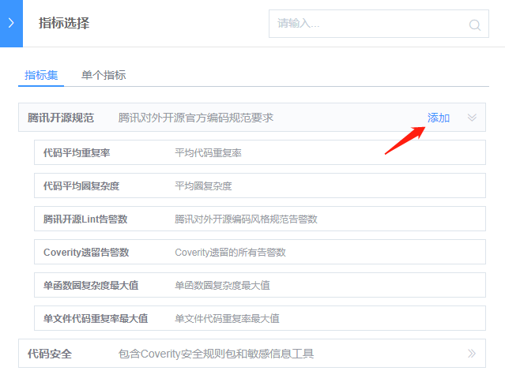
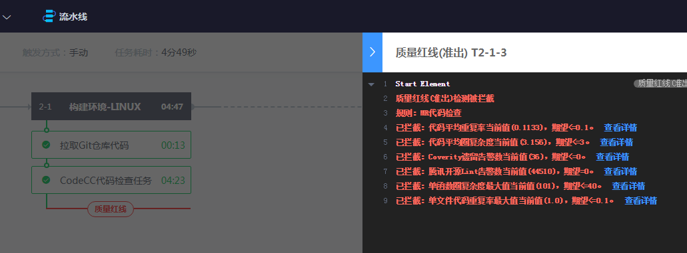

# Use quality red lines when merging requests

## Key words: MR, quality red line

## Business challenge

In the actual development, we carry out branch management as follows:

● The master branch is very stable, only used to release new versions, usually do not do development on it;

● All code is developed on the dev branch, which is unstable. At some point, such as when a version is released, the dev branch is merged into the master branch.

● Every developer does code development on the dev branch. Every developer has their own branch, and it's OK to merge to the dev branch from time to time.

When a developer's branch is merged into dev, a Merge Request and code review are initiated.

## BKCI advantage

BKCI quality red line controls the behavior of the pipeline by setting quality standards, so that its output must meet the requirements of quality standards. It can support Git Merge Request, daily construction, version transfer, version release and other scenarios to ensure the quality of software products.

## solution

1. Create a pipeline and add "Git event Trigger". Git event type is Merge Request Hook and check "Submit lock at the same time".

Figure 1

2. Atoms that can be configured as mass red line control points such as CodeCC will have a shortcut entry for quickly creating a mass red line rule.

Click "Back" to enter the interface for creating the quality red line. At this time, the control point and effective range are automatically selected.

Selecting the required indicators, for example, the indicator set of Tencent External Open Source code can be selected to ensure that the combined code conforms to Tencent external open source code standards.

At this time, MR And code view will be initiated, which will trigger pipeline scanning. If the code does not meet the requirements of the quality red line, pipeline execution will be displayed. You can click the details to see the specific reason.

