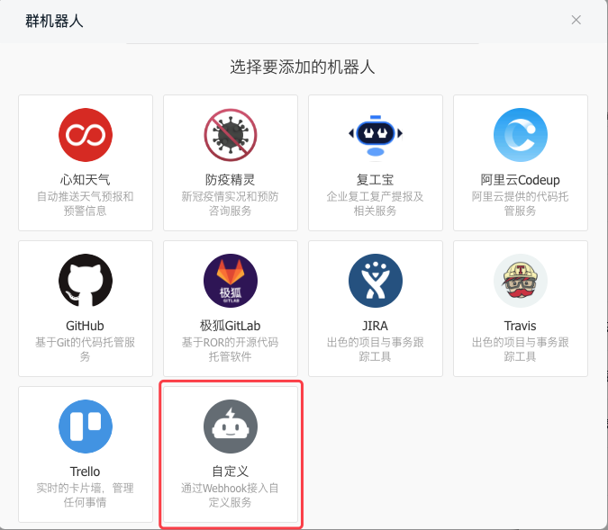
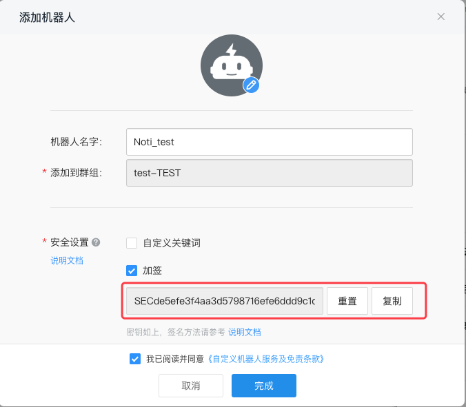
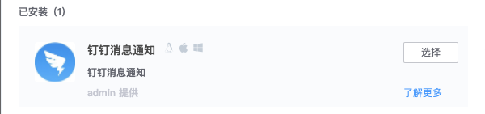
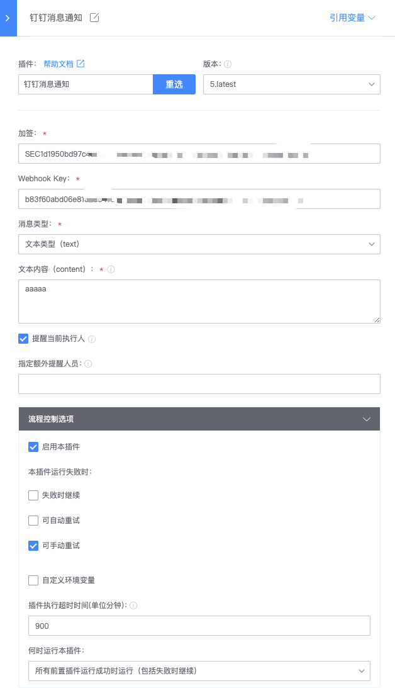
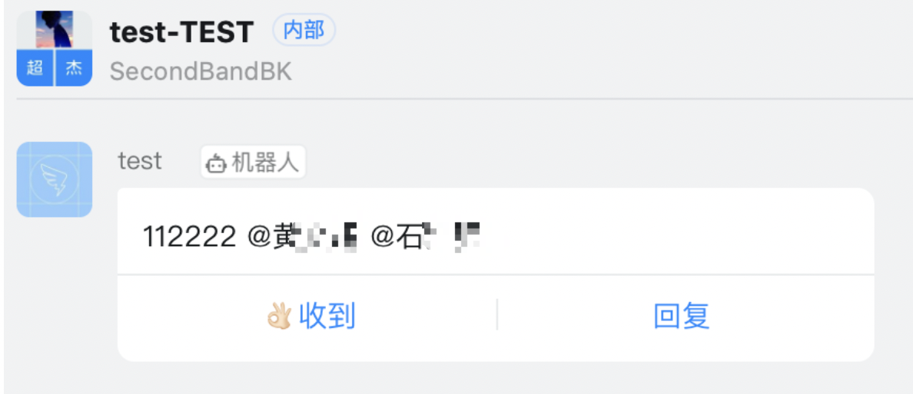

# Pipeline notification is sent to Nail Nail

## Key words: send notification, nail nail

## Business challenge

If the pipeline notification cannot be received in a timely manner, users cannot obtain the pipeline execution status in a timely manner and perform effective intervention in certain scenarios (such as task execution error)

## BKCI advantage

BKCI has added the Stud notification plugin to send message notifications via swarm bots.

## solution

1. Add custom robots on the page of Dingding Group management.

2. It is recommended to use the security setting of "Sign-up", and record the robot Webhook and sign-up information after completing the setting.

3. Add "Pin Message Notification" plug-in in BKCI pipeline. If not, please add it in BKCI App Market.

4. Configure plug-in information as follows:

5. Pipelined execution can see messages and values in the group

Note:

1. The message type supports ordinary text messages and MD information.

2. The function of @pipeline initiator only applies to the situation where the LDAP account system has a synchronous pin number for the time being. Other account systems have not been adapted for the time being.
