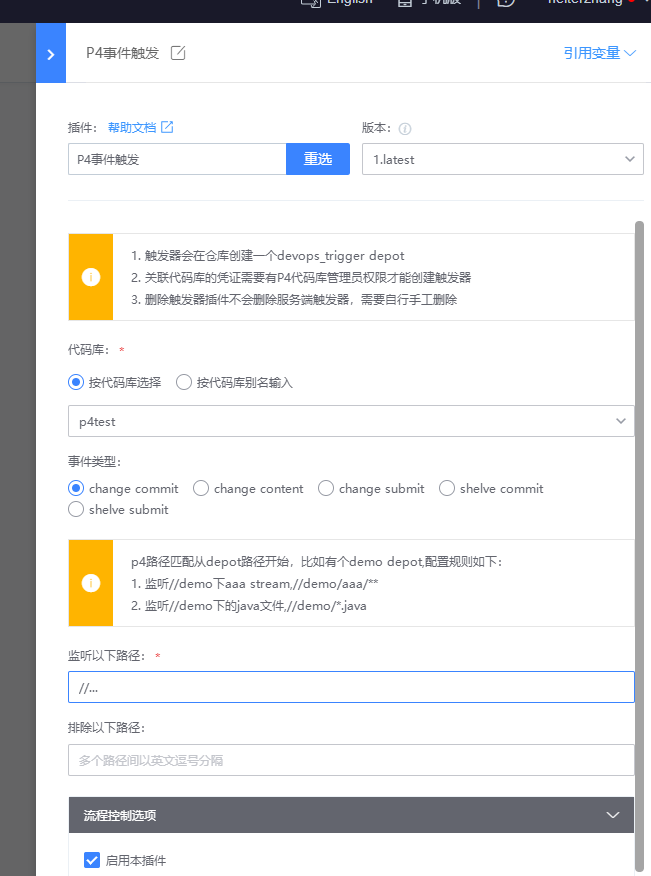
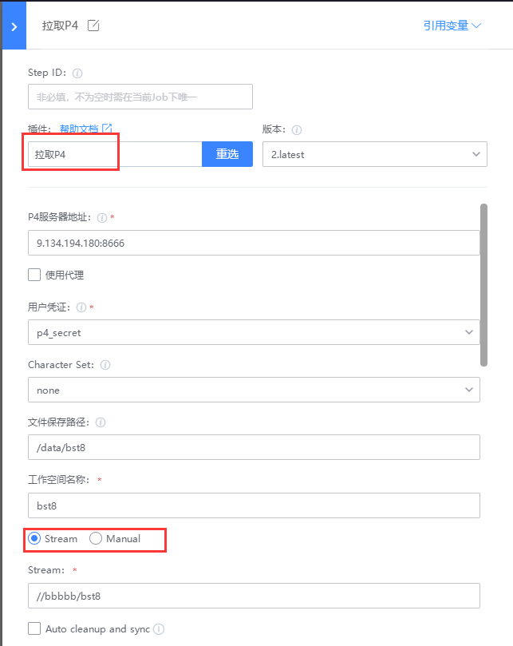

# Integrate the P4 code base

## Key words: P4, event trigger, code pull

## Business challenge

Perforce is a very good commercial version management tool, especially for large file management such as art resources, which has been used by many projects. Projects using P4 that do not connect to DevOps tools can greatly affect the efficiency of CI.

## BKCI advantage

Businesses that use P4 as a code repository can use BKCI's official P4 functional plug-in.

## solution

Event trigger:

Some businesses that use P4 as code warehouse hope to trigger the automatic execution of BKCI pipeline when certain P4 events occur. Currently BKCI supports "P4 event triggering". Can capture "change commit", "change content", "change submit", "shelve commit", "shelve submit" 5 events;

Code pull:

Event code automatic pull, this plug-in also supports Stream and Manual warehouse;

