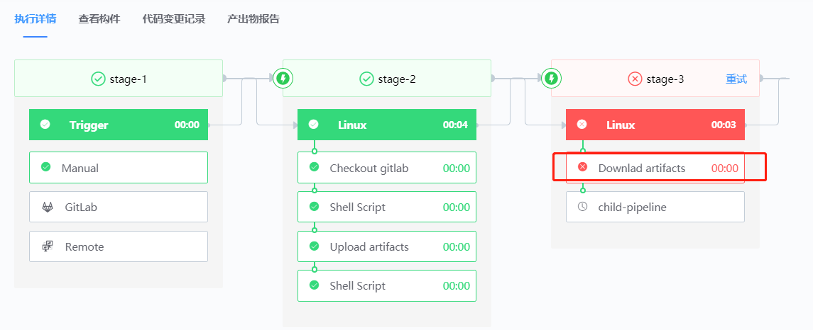
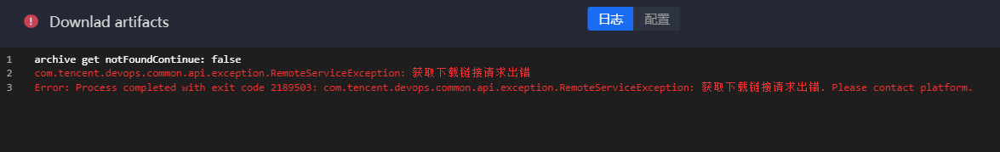

# Troubleshooting Pipeline failure

## Key words: problem location, visualization, manpower saving

## Business challenge

When the Pipeline fails and an error is reported, the development team needs to sort out the whole pipeline and locate the problem, which consumes development manpower.

## BKCI advantage

With BKCI's "TJS" (Task, Job, Stage) structure, complex pipelinescan be built by dragging, clicking, and other visual operations. With the red identifier of Task execution status, the team can quickly and intuitively locate pipeline failures and obtain execution logs, reducing the human investment in fault location and troubleshooting.

## solution

If the compilation fails, you only need to check the Task whose execution status is in red, not the entire compilation process.

Click the "red" area to enter the log details page and view the error log.

