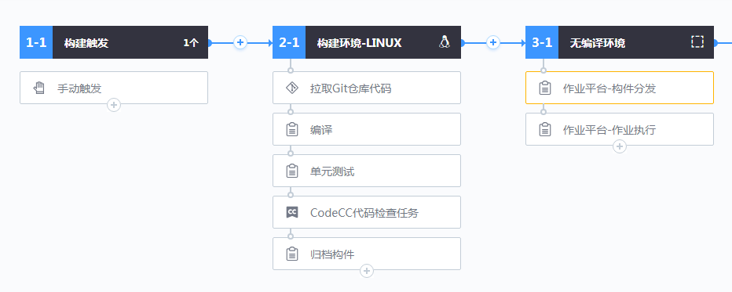
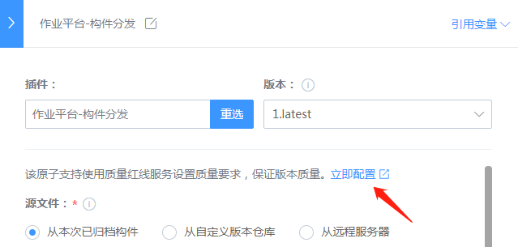
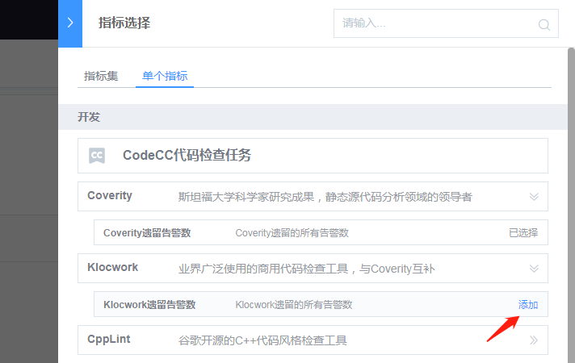
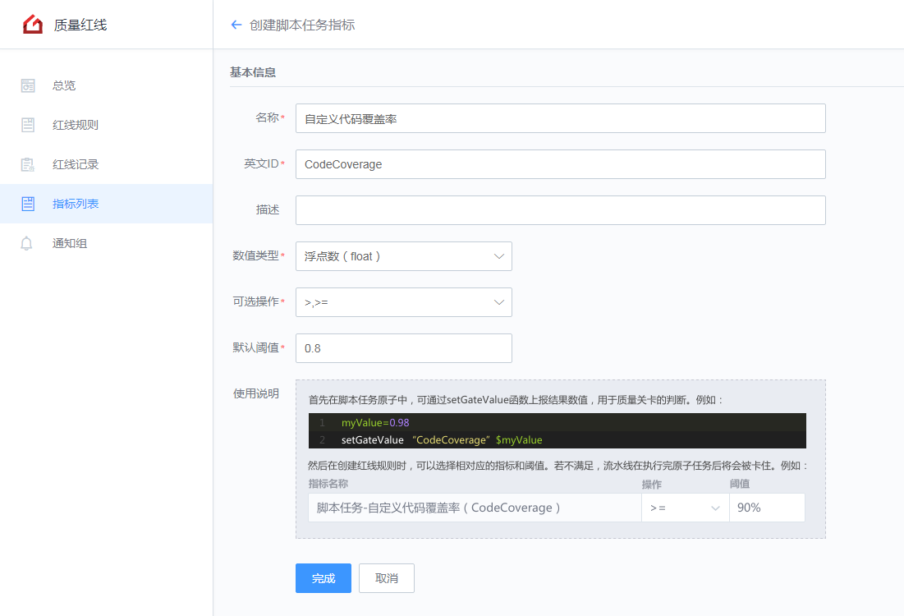
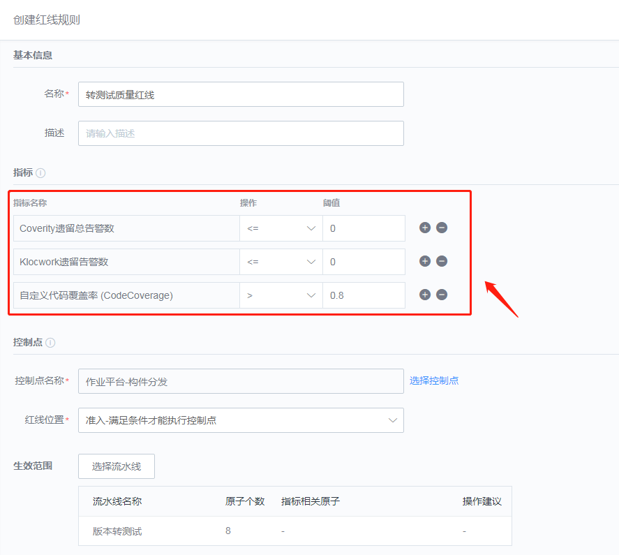
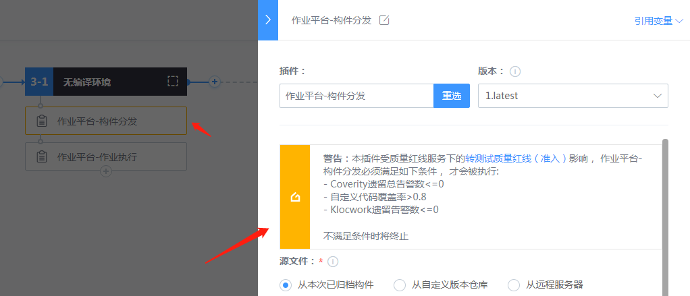
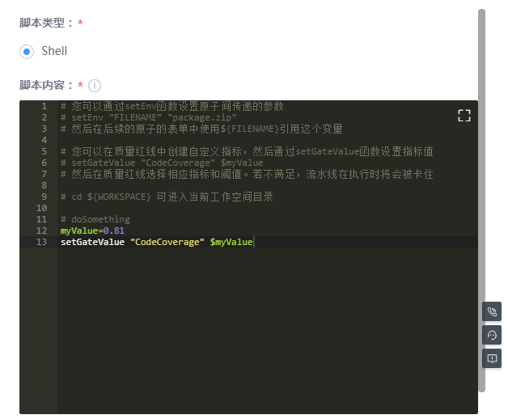
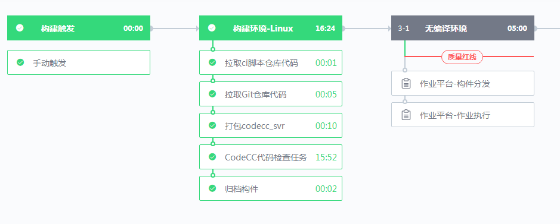

# Use a quality red line for transfer/release

## Key words: transfer test, release, quality red line

## Business challenge

Release transition/launch is a key point in the development process. Take transition testing, after which the lead role shifts from development to testing, and the code is generally not allowed to change at will. Therefore, quality control of this node is very important, typically unit testing, automated test cases, defect and security problem code checks, etc. If the code coverage rate is too low, automated use cases fail to be executed, or too many code check alarms are generated, the code quality is poor, and the code should not be retested.

## BKCI advantage

BKCI quality red line controls the behavior of the pipeline by setting quality standards, so that its output must meet the requirements of quality standards. It can support Git Merge Request, daily construction, version transfer, version release and other scenarios to ensure the quality of software products.

## solution

1. Create a new test pipeline, including compilation, unit testing, code inspection, job platform-component distribution and other atoms. Job platform-component distribution is key to test environment deployment, and a quality red line needs to be created here.

 

2. Select a code check indicator from the quality red line, for example, Clear the number of Coverity alarms or Klocwork alarms.

3. There is no existing metric for unit test code coverage. You can customize one. For example, the following defines a float indicator called CodeCoverage.

4. This index can be selected during the creation of the quality red line. Therefore, after adding other information, the quality red line can be created.

The specific quality red line requirements can also be seen in the assembly line

5. Since the script task indicator needs to be reported by the user, a line of code needs to be added to the corresponding script task in the pipeline to report the defined CodeCoverage value. As shown in the picture below:

6, finally execute the pipeline, you can view the red line effect. If the code does not meet the requirements, it cannot be released to the test environment. Click the "quality red line", you can see the specific aspects that do not meet the requirements.

