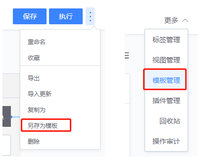
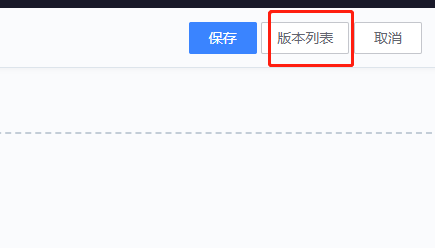
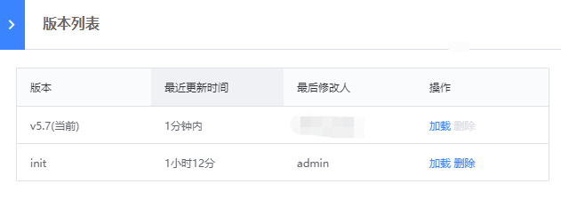
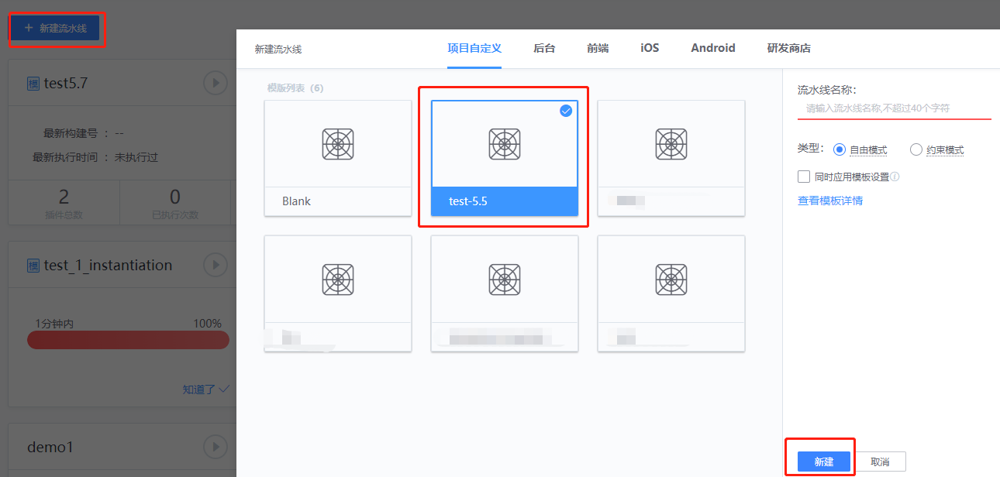
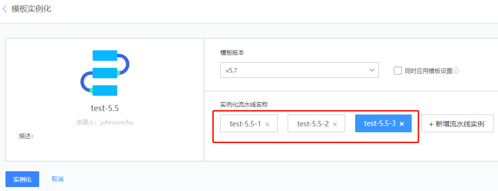
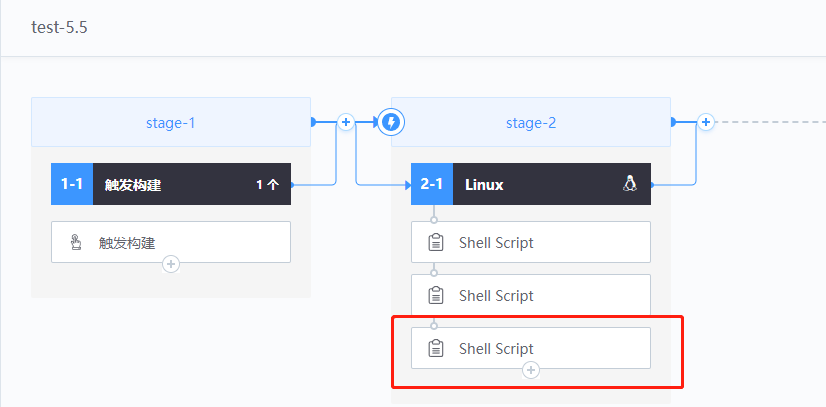
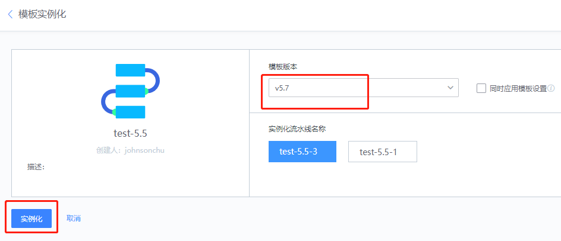
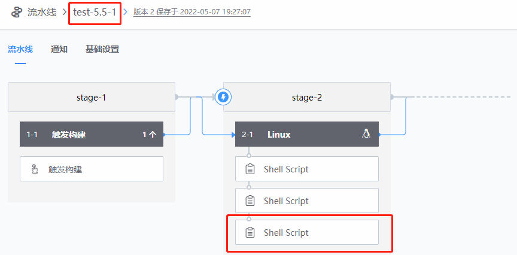

# 流水线的模版和复制

## 关键词：流水线模板、复制 

## 业务挑战 

随着时间的推移，项目会出现多个分支版本；每个分支所对应的流水线的核心任务都是类似的，区别可能在于：构建机的不同、分支名称的不同或语言目录的不同等；当流水线的核心发生变化时，通常需要机械得对每一条流水线去做修改操作，效率很低而且容易出错。

## 蓝盾优势 

利用蓝盾流水线模板和复制功能，同一项目的用户创建或维护流水线时，无需填写大量公共配置。

## 解决方案 

● 模板创建

模板可以通过流水线编辑界面右上角的入口，“另存为模板”而来；在流水线主界面，“更多-模板管理”界面，进行模板管理。

● 模板维护

版本管理：用于保存不同时期的流水线模板版本，方便快速回档、存档。

通过这个模板生成一个新的流水线时，采用了“新建流水线 -> 选择模板 -> 自由模式”的方式

如下图，对于新建一个流水线来说，特别快速，调整一些差异化的参数，就能投入流水线的生产了。

但是同时存在多个平行流水线的前提下，维护起来就会比较累了，一个共性的修改，可能导致这个模板下所有的流水线都要手动操作保持一致。实例管理提供了一种较为简易的方式。

点击“实例化”，我们可以同时创建多条流水线实例；

如果我们需要对上述3条流水线，其中的2条做变更：新增一个task，只需在模板"test-5.5"上做修改，并保存。

然后在“实例管理”页，勾选需要做变更的流水线，点击“批量更新”，完成实例更新操作；

可以发现，需要做变更的2条流水线插件总数由之前的“3”变成“4”。

这样，如果对多个流水线做共性的修改，就不用机械得每一条流水线去做变更操作。
