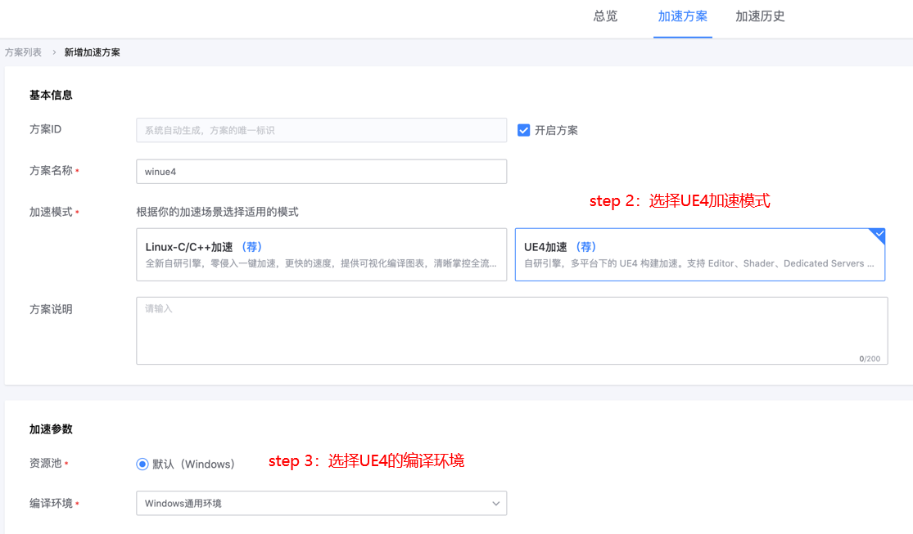
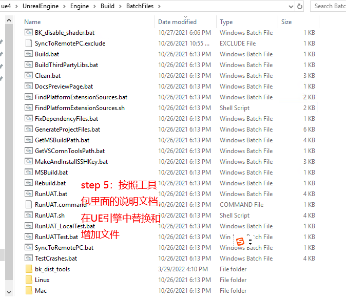
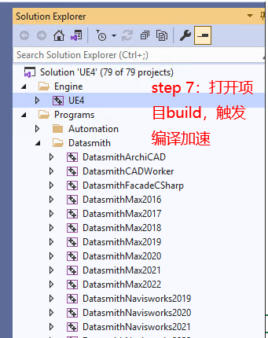

# UE引擎编译加速

## 关键词：UE引擎、编译加速 

## 业务挑战 

基于UE4游戏引擎开发的项目，在项目的代码编译/shader编译等环节，会消耗大量的资源（cpu/内存/磁盘），做一次全量构建需要消耗几十分钟甚至几个小时的时间，严重影响研发效率。

## 蓝盾优势 

蓝盾将TBS（通用的任务加速系统）系统应用到UE4的一些场景中，将本地可并行执行的任务利用分布式资源进行执行，实现整体加速

## 解决方案 

