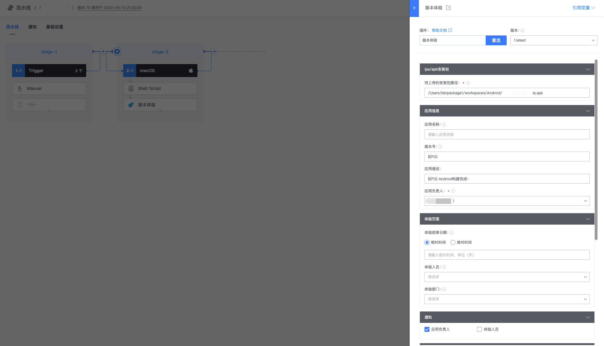
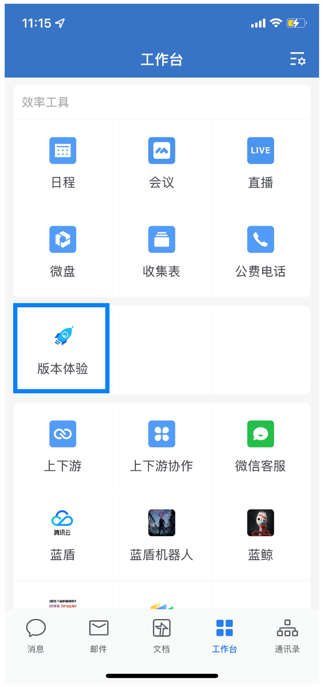
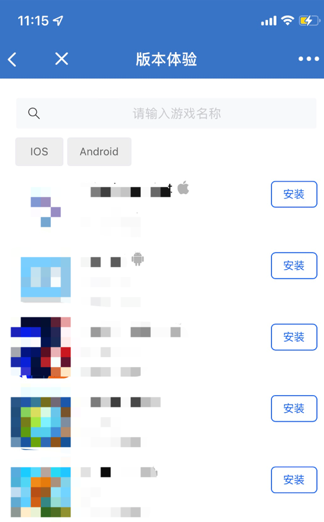

# Mobile terminal private test version release management

## Key words: mobile download, unified version management channel

## Business challenge

When the business enters the test stage, there will be a large number of new versions output from different branches, which requires students with different functions such as development, planning and art to conduct version tests. However, not only do various versions for internal testing rely on engineers to manually build and download and distribute, which is labor-intensive, but also client packages of different branches and versions are spread through large groups within the company, increasing information security and version management risks.

## BKCI advantage

With a "mobile Version experience" feature that can be embedded in all major IM tools, manual uploading and publishing operations are replaced by automated plug-ins and integrated into the pipeline. The new version package will be automatically updated to the enterprise wechat application after completion of construction, and the enterprise wechat notification will be sent to all the personnel who have the permission to test. In addition to saving manpower input, the unified version management approach also reduces the risk of version leakage and management cost during the test period. Its characteristics are:

● Have the right to protect the version package download and view, reduce the version security risk

● Planning, art can be operated within the enterprise wechat one button out of the package, reduce the input of engineers and communication costs

● Unified version management channels to avoid version confusion and misdelivery

● The notification of the construction process is sent to the enterprise wechat

## solution

Deployment prerequisite

● A completed domain name and certificate.

● A 2 core 4G server.

● One Tencent Cloud COS bucket to store applications and provide downloads.

● A Tencent Cloud CLB, providing front-end access, load balancing, DDoS protection and other capabilities.

● * Currently only support enterprise wechat

1. Configure BKCI pipeline

Configure the ipa/apk installation package

Path of the installation package to be uploaded:

● Select the installation package to be uploaded from the path of this build.

● Support ipa files, apk files and compressed packages.

Configuring application information

● Application name: The name of the application displayed on the version experience. If this configuration item is empty, the plug-in automatically obtains the application name built-in in the ipa/apk package.

● Version number: The version number displayed on the version experience. If the configuration item is empty, the plug-in automatically obtains the built-in version number of the ipa/apk package.

● Application Description: A detailed description of the experience version. It can be completely customized by the business side. Common descriptions are: introduction to the application; Version change log and so on.

● Product owner: Support to pull contacts from enterprise wechat, support multiple selection.

Configuration experience range

Experience end Date: After this date, the experience will automatically expire and cannot be downloaded.

Choose relative or absolute time

● Relative time: the current construction time of the pipeline plus the relative time, in days, is the end date of experience.

● Absolute time: The selected date is the end date of the experience.

Experience personnel:

● Support individual selection.

● Support the selection of experience personnel by part.

Configuring notification mode

● Send notifications through the app number after the experience is published.

● Notifying personnel can select application service personnel or experience personnel.

2. Select the "Version Experience" application from the enterprise's wechat workbench

3. Select the application you want to experience and click "Download" to quickly download the application. ipa will prompt you to jump to safari to download the application

