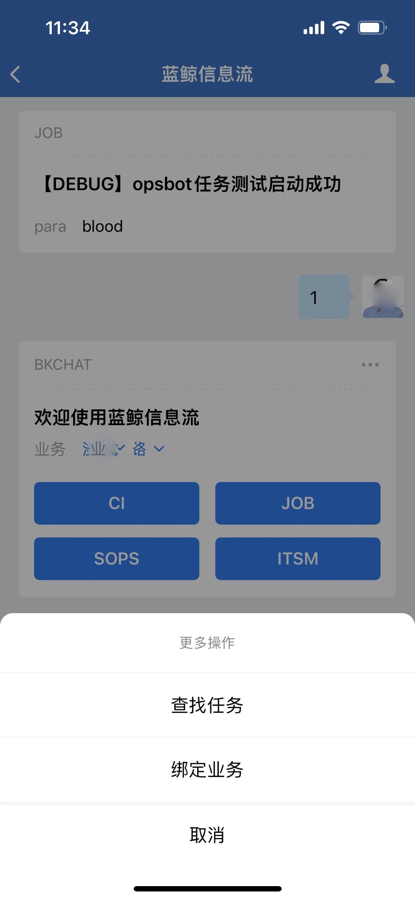
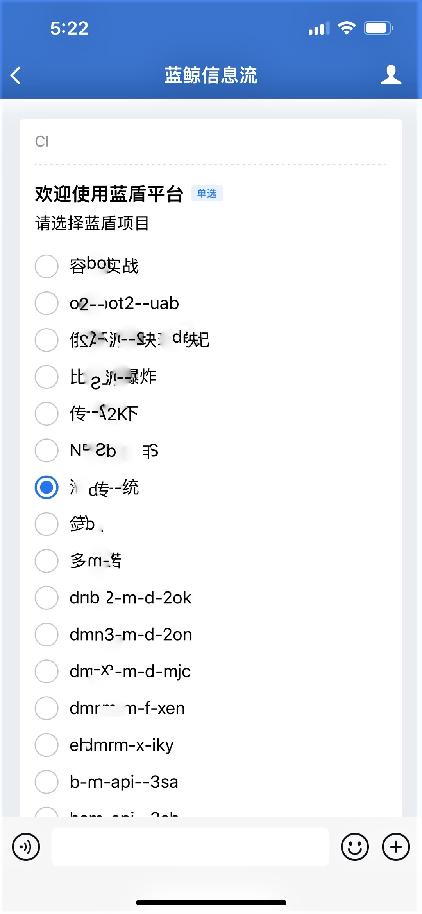
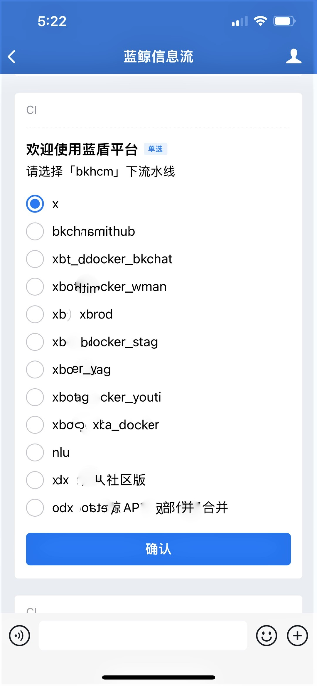

# Implement pipeline through enterprise wechat robot

## Key words: robot, execution

## Business challenge

When the project is in the external test period or formal operation period, various online emergencies will increase, and the rhythm of version iteration will accelerate obviously. At the same time, release builders can't be glued to their computers all the time.

## BKCI advantage

Through enterprise wechat robot, users can execute BKCI pipeline anytime and anywhere, so that CI is no longer limited by time, place and equipment

## solution

1. Open the configured application number, enter 1 or help, and click in the upper right corner of the message. The corresponding operation is displayed to bind services

2. BKCI CI execution, click "CI", pop up to select "BKCI Project", then continue to select BKCI's "pipeline", to the final execution

